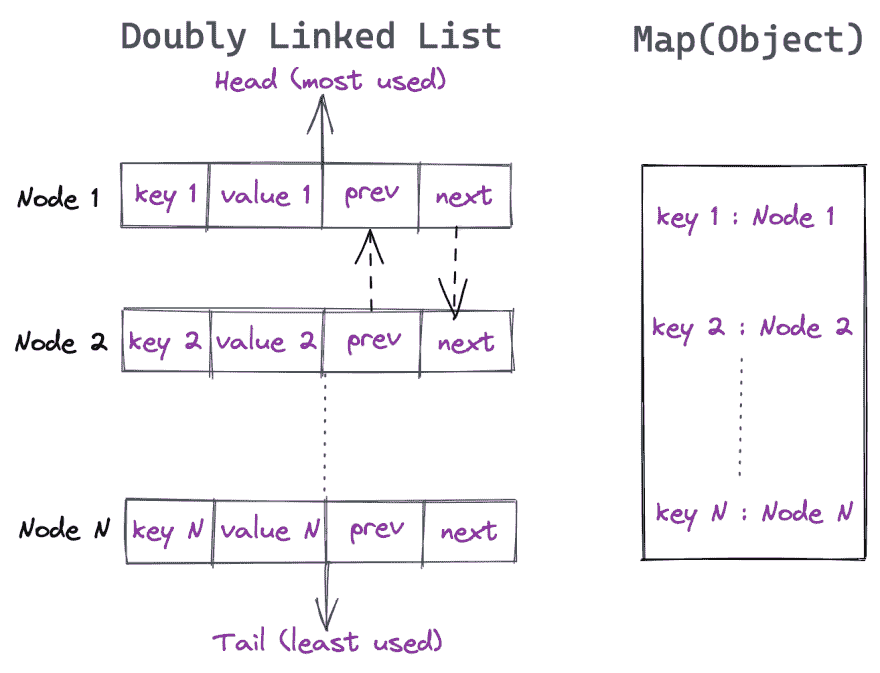

# 用 JavaScript 实现 LRU 缓存

> 原文：<https://dev.to/udayvunnam/implementing-lru-cache-in-javascript-3c8g>

**LRU** 是*最近最少使用缓存*的首字母缩写。缓存无处不在，让我们试着用 Javascript 实现它。简单的步骤-

*   创建一个数据结构来保存具有初始限制的缓存数据。
*   提供添加到缓存、从缓存中获取元素、从缓存中移除最少使用的元素以及遍历缓存的功能。
*   我们通过模仿`Doubly LinkedList`和`Map(Object)`来实现功能

* * *

读写操作的时间复杂度必须为 O(1)。
写/删除**的双链接列表**和读操作的**映射(对象)**使这成为可能。

## 从缓存中识别 LRU 项:

在一个双向链表中，头部是最近使用的，尾部是最近最少使用的。

1)每次插入都在头部进行。

2)在每次读取或更新操作时，将节点从其位置分离并附加在 LinkedList 的头部。请记住，LRU 是指对缓存的读写操作。

3)当超过高速缓存限制时，从尾部移除一个节点

4)将`key: Node`关系存储在缓存映射中。因此在 O(1)中检索是可能的。

## LRU 实现