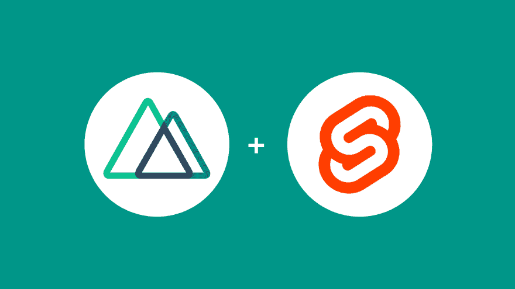
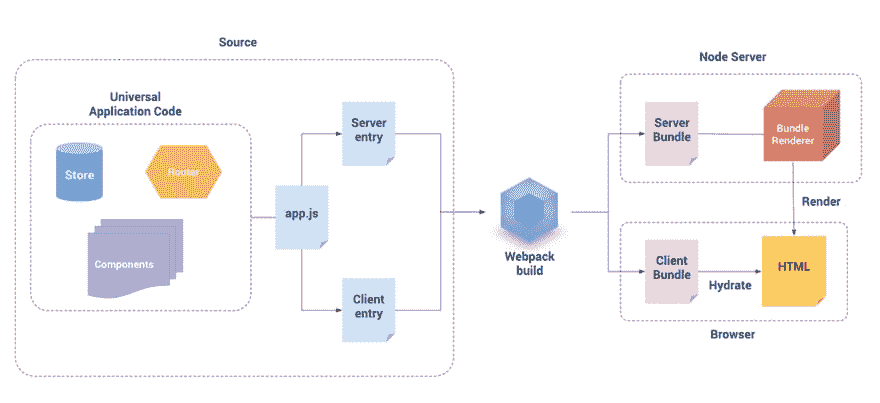
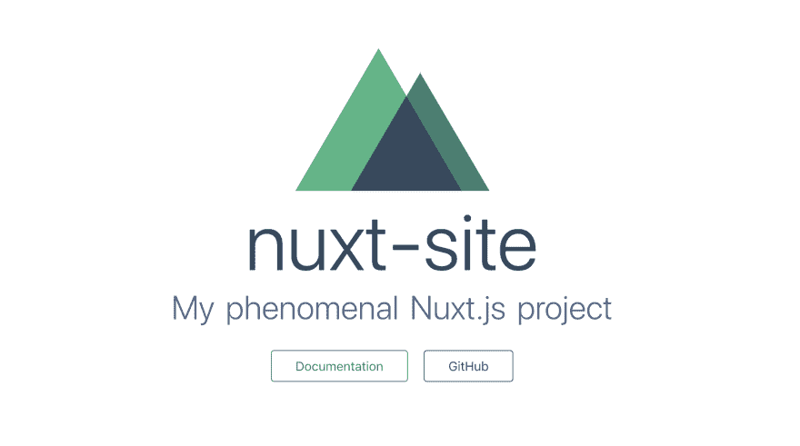
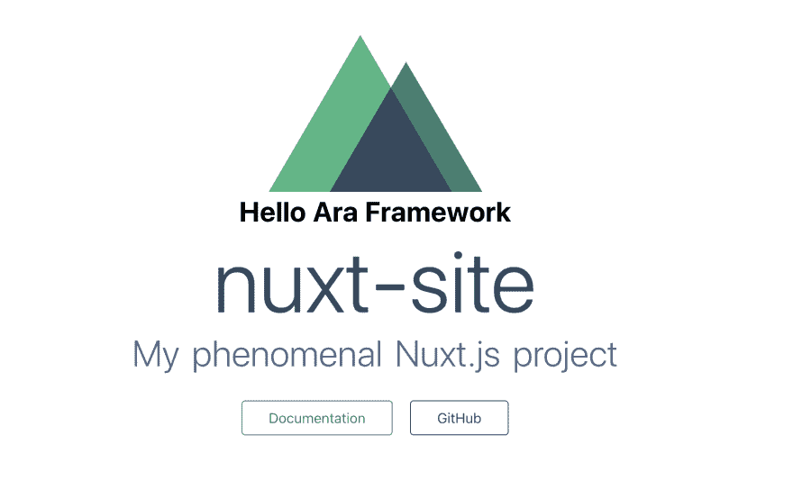
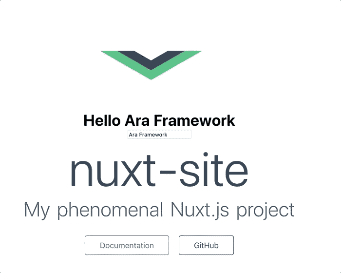

# 使用 Svelte 和 Ara 框架在 Nuxt.js 中实现微前端

> 原文：<https://dev.to/phillipgd1992/implementing-microfrontends-in-nuxt-js-using-svelte-and-ara-framework-1b65>

[](https://res.cloudinary.com/practicaldev/image/fetch/s--t2G2rMDv--/c_limit%2Cf_auto%2Cfl_progressive%2Cq_auto%2Cw_880/https://ara-framework.github.io/website/img/blog/nuxt-svelte.png)

演示代码[此处](https://github.com/marconi1992/ara-nuxtjs-demo)

本文原载于 [Ara 博客](https://ara-framework.github.io/website/blog/2019/08/27/nuxt-js)。

Nuxt.js 是使用 Vue.js 轻松开发通用应用程序的最流行的框架。它还支持静态网站、单页、移动和桌面应用程序。

## 什么是通用应用？

[](https://res.cloudinary.com/practicaldev/image/fetch/s--wcioAp26--/c_limit%2Cf_auto%2Cfl_progressive%2Cq_auto%2Cw_880/https://ara-framework.github.io/website/img/blog/vue-ssr.png)

通用应用程序的主要特点是它在服务器和浏览器上使用相同的 JavaScript 代码。因此，我们可以使用相同的 Vue.js 组件进行服务器端和客户端渲染，从而获得两个世界的优势。

本课程[视频](https://www.vuemastery.com/courses/scaling-vue-with-nuxt-js/why-use-nuxt/)讲解了更多关于 Nuxt.js 的通用应用。

## 微前端在这里起什么作用？

我们知道前端技术发展非常快。如今， [Svelte](https://svelte.dev) 已经变得非常流行，更多的开发者开始使用它。

Sapper 是使用 Svelte 开发通用应用程序的一种替代方案。但是，Sapper 并没有像 Nuxt.js 或者 Next.js 那样成熟太多，如果我们可以在 Nuxt.js 中使用 Svelte 呢？。

这是一个完美的场景，我们可以利用微前端的技术不可知原则。那么，为什么我们需要等到 Sapper 像其他框架一样成熟呢？我们不应该。我们可以重新利用已经存在的东西。

## 设置 Nuxt 项目

创建一个名为`ara-nuxt`的文件夹，在文件夹
中运行 nuxt 应用生成器`create-nuxt-app`

```
npx create-nuxt-app nuxt-site 
```

该命令要求进行一些配置，选择默认选项。

最后，运行`nuxt-site`文件夹中的 Nuxt 应用程序:

```
PORT=8000 yarn dev 
```

Nuxt 应用程序运行在 [http://localhost:8000](http://localhost:8000) 上。

浏览器:

[](https://res.cloudinary.com/practicaldev/image/fetch/s--Ik6JTFpu--/c_limit%2Cf_auto%2Cfl_progressive%2Cq_auto%2Cw_880/https://ara-framework.github.io/website/img/blog/nuxt-default-page.png)

## 设置 Nova 服务

创建一个 Nova 服务，使用[svelite](https://svelte.org)来呈现 Nova 视图。

安装 [Ara CLI](https://github.com/ara-framework/ara-cli) :

```
npm i -g ara-cli 
```

创建 Nova 服务:

```
ara new:nova -t svelte nova 
```

转到 Nova 服务文件夹:

```
cd nova 
```

运行 Nova 服务:

```
npm run dev 
```

Nova 服务运行在 [http://localhost:3000](http://localhost:3000) 上。

### 测试 Nova 服务。

一旦 Nova 服务开始运行，您就可以使用有效负载向[http://localhost:3000/batch](http://localhost:3000/batch)发出一个`POST`请求，比如:

```
{  "uuid":  {  "name":  "Example",  "data":  {  "title":  "Ara Framework"  }  }  } 
```

响应中的`results`属性包含由 Nova 服务呈现的视图的`html`。

示例:

```
{  "success":  true,  "error":  null,  "results":  {  "uuid":  {  "name":  "Example",  "html":  "<div data-hypernova-key=\"Example\" data-hypernova-id=\"4c08ba37-4b1a-4387-a883-99726e6b4617\"><h1>Hello Ara Framework</h1></div>\n<script type=\"application/json\" data-hypernova-key=\"Example\" data-hypernova-id=\"4c08ba37-4b1a-4387-a883-99726e6b4617\"><!--{\"title\":\"Ara Framework\"}--></script>",  "meta":  {},  "duration":  1.210146,  "statusCode":  200,  "success":  true,  "error":  null  }  }  } 
```

## 在 Nuxt.js 中设置 Nova 桥

Nova Bridge 使我们能够在 React、Vue.js 等任何视图库上使用 Nova 视图。点击阅读更多关于新星桥[的信息。](https://ara-framework.github.io/website/docs/nova-bridge)

进入`nuxt-site`文件夹，在 Nuxt.js:
中安装 [nova-vue-bridge](https://www.npmjs.com/package/nova-vue-bridge)

```
yarn add nova-vue-bridge 
```

在`nuxt.config.js`文件中为巴别塔添加`@babel/plugin-transform-modules-commonjs`插件。

`nuxt.config.js`

```
{
  ...    
  build: {
    /*
    ** You can extend webpack config here
    */
    babel: {
      plugins: [
        '@babel/plugin-transform-modules-commonjs'
      ],
    },
    ...
  }
} 
```

## 在 Nuxt.js 中实现 Nova 视图(Svelte)

使用 Nova 组件进入 Nuxt 页面`pages/index.vue`。

导入 Nova 组件:

```
<script>
import Nova from 'nova-vue-bridge'
import Logo from '~/components/Logo.vue'

export default {
  components: {
    Logo,
    Nova
  }
}
</script> 
```

在页面中使用 Nova 组件:

```
<template>
  <div class="container">
    <div>
      <logo />
      <!-- Nova component starts -->
      <nova name="Example" :data="{ title: 'Ara Framework' }" /> 
      <!-- Nova component ends -->
      <h1 class="title">
        nuxt-site
      </h1>
      ...
    </div>
  </div>
</template> 
```

## 客户端渲染

更新客户端入口点，以便在由 Nova Bridge 呈现的占位符上呈现和装载视图。

`nova/src/client.js`

```
import { renderInPlaceholder } from 'hypernova-svelte'

import Example from './components/Example.svelte'

const { document } = global

document.addEventListener('NovaMount', (event) => {
  const { detail: { name, id } } = event
  if (name === 'Example') {
    return renderInPlaceholder(name, Example, id)
  }
}) 
```

在页面上添加客户端脚本:

`pages/index.vue`

```
export default {
  components: {
    Logo,
    Nova
  },
  head: {
    script: [
      { src: 'http://localhost:3000/public/client.js' }
    ]
  }
} 
```

再次运行 Nuxt 应用程序:

```
PORT=8000 yarn dev 
```

最后，Nova 视图被正确渲染和安装，显示标题文本“Hello Ara Framework”

浏览器:

[](https://res.cloudinary.com/practicaldev/image/fetch/s--84VU3L4N--/c_limit%2Cf_auto%2Cfl_progressive%2Cq_auto%2Cw_880/https://ara-framework.github.io/website/img/blog/nuxt-csr-nova-vue.png)

## 服务器端渲染

Nova 视图还不是服务器端渲染，所以如果我们禁用客户端脚本，什么都不会显示。我们需要实现 Nova 代理，以便在服务器端渲染并包含 Nova 视图。点击阅读更多关于 Nova 架构的信息[。](https://ara-framework.github.io/website/docs/nova-architecture)

### 设置 Nova 代理

在根文件夹中创建 Nova 代理的配置文件:

```
touch nova-proxy.json 
```

在`nova-proxy.json`文件中添加以下配置，以代理对 Nuxt 应用程序的传入请求。

```
{  "locations":  [  {  "path":  "/",  "host":  "http://localhost:8000",  "modifyResponse":  true  }  ]  } 
```

### 运行 Nova 代理

在运行命令之前，我们需要使用 Nova 服务端点设置`HYPERNOVA_BATCH`变量。

```
export HYPERNOVA_BATCH=http://localhost:3000/batch 
```

在创建了`noxa-proxy.json`文件的地方运行下面的命令，或者传递带有配置文件路径的`--config`参数。

```
ara run:proxy --config ./nova-proxy.json 
```

该命令在 http://localhost:8080 上运行 Nova 代理。

现在，看看 Nova 视图是如何显示的，即使客户端脚本被禁用，这是因为来自 web 服务器的页面包含 Nova 视图的渲染 HTML。

## 更新示例视图

`Example`视图只是显示一个标题。我们可以添加一个改变标题文本的输入来更新它。

`nova/src/components/Example.svelte`

```
<script>
  export let title;
</script>

<div>
  <h1>Hello {title}</h1>
  <input type="text" bind:value={title}>
</div> 
```

浏览器:

[](https://res.cloudinary.com/practicaldev/image/fetch/s--xTbjSU8e--/c_limit%2Cf_auto%2Cfl_progressive%2Cq_66%2Cw_880/https://ara-framework.github.io/website/img/blog/nuxt-ara-input-change.gif)

## 结论

微前端使我们能够将不同的框架集成到同一个页面中，但这并不意味着我们应该任意混合框架。我们应该在整个公司范围内定义标准框架和库。

然而，这种隔离级别使我们能够灵活地随着 web 技术发展我们的 web 应用程序。