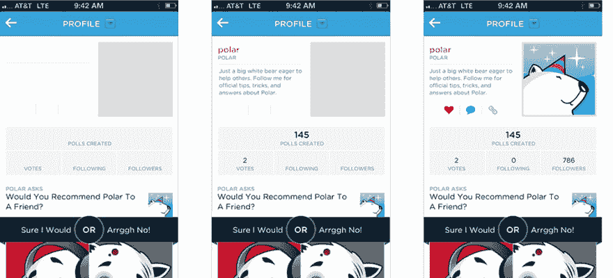
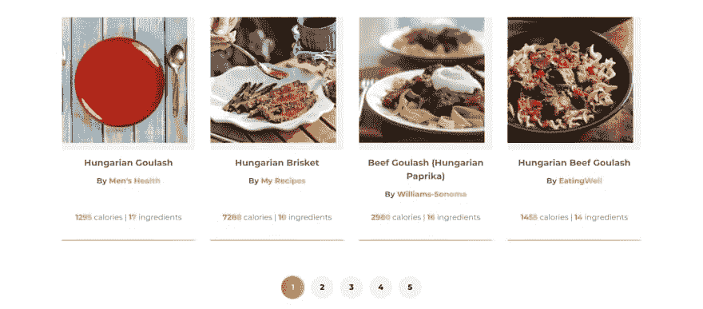
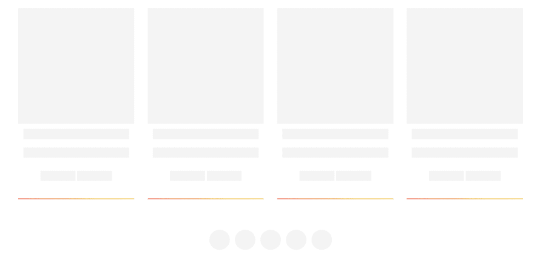

# 在 React 中实现骨架加载

> 原文：<https://dev.to/prototyp/implementing-skeleton-loading-in-react-kia>

**骨架加载**或**骨架筛选**的想法和概念于 2013 年提出。在卢克·乌鲁布莱夫斯基的这篇[博客文章中。它描述了一个空白屏幕的概念，动态内容被样式化的块(框架)所取代，并且在加载完成后被真正的内容所取代。](https://www.lukew.com/ff/entry.asp?1797)

[](https://res.cloudinary.com/practicaldev/image/fetch/s--3rRTwwy7--/c_limit%2Cf_auto%2Cfl_progressive%2Cq_auto%2Cw_880/https://thepracticaldev.s3.amazonaws.com/i/pfjcpg2xsfqwfpx5agy6.png)

## 骨架加载胜过旋转器

当用户用标准的加载微调器查看页面时，他们会想**“我在等它加载”**。我们让用户观看一个**沉闷重复的动画**，用户感觉它在盯着时钟。

当用户看到框架加载或框架屏幕的页面时，他们会想**“差不多加载完了，有事发生了”**。用户正在看一个看起来像是**的页面，好像它马上就要完成加载**。即使我们还没有加载任何内容，用户看到的也不是空的或者单调的页面。它给人一种速度的错觉。

但是关于骨骼加载，有一些事情需要记住...

## 当最终加载状态可预测时，使用骨架加载

我们不能简单地用框架加载替换页面上每个动态加载的元素。在某些情况下，我们无法预测页面的**最终加载状态**会是什么样子。

例如，如果我们试图假设一个页面的最终状态(假设我们从 4 个完全不同的可能状态中选择了 1 个)，并基于我们的假设创建一个框架屏幕。当用户查看框架时，加载的内容与框架相差很大，过渡看起来很不协调。这可能会损害 UX，让你的应用程序感觉混乱。

让我们假设我们正在看一个电子商务网站，我们正在看主页。电子商务主页通常会根据正在进行的活动或销售改变其外观和布局。**在这里装骷髅不是个好主意**。

查看**目录页面**，其中产品以 4 列布局显示，每页 24 个项目。我们可以有把握地假设这个**状态不会改变**。即使我们最终装载了 12 或 15 个产品，而不是假设的 24 个，过渡仍然是平稳的。目录页面加载也是非常负载密集型的(如果使用分页、排序和过滤器的话)，因此**框架加载也可能有助于保持用户在页面上**，即使在加载时间比预期长的情况下。

## 在 React 中实现骨架加载

在下面的例子中，我们实现了食物食谱卡组件的框架加载。这是组件的外观。

[](https://res.cloudinary.com/practicaldev/image/fetch/s--ZBwpwrhS--/c_limit%2Cf_auto%2Cfl_progressive%2Cq_auto%2Cw_880/https://thepracticaldev.s3.amazonaws.com/i/v5jnm0frgws3sib92psc.png)T3】

```
import * as React from 'react';
import { Link } from 'react-router-dom';
import { LazyImage } from 'components';
import { getUri } from 'util/getUri';

export const RecipeCard = ({
  calories,
  ingredients,
  image,
  label,
  source,
  uri
}) => {
  return (
    <li className="recipeCard">
      <Link className="recipeCard__link" to={`/recipes/recipe/${getUri(uri)}`}>
        <LazyImage className="recipeCard__image" src={image} alt={label} />
        <div className="recipeCard__wrapper">
          <div>
            <h3 className="recipeCard__title">{label}</h3>
            <p className="paragraph">
              <strong>
                By <span className="gradient--text">{source}</span>
              </strong>
            </p>
          </div>

          <div className="recipeCard__info">
            <strong className="gradient--text">{Math.ceil(calories)}</strong>{'  '}
            calories |{'  '}
            <strong className="gradient--text">{ingredients.length}</strong>{'  '}
            ingredients
          </div>
        </div>
      </Link>
    </li>
  );
}; 
```

Enter fullscreen mode Exit fullscreen mode

这是一个简单的骨架，没有使用任何动画，只是一个简单的颜色，看起来也很好。你可以通过动画**背景渐变**轻松添加动画。

首先，我们需要为我们的骨架组件设置**样式**。我们正在`.recipeCard__skeleton`类中设置我们的基本框架样式。我们设置`inline-block`来模仿内容行为(比如对齐)，我们使用`padding`来增加元素的高度(在本例中等于 **1 个行高单位**)。我们还有两个改变内容宽度的修改器类和一个纵横比为 1:1 的图像的附加类(这就是为什么`padding`被设置为`100%`)。

```
.recipeCard__skeleton {
    display: inline-block;
    background-color: var(--color__gray--lighter);
    padding-bottom: var(--spacing__vertical--1);
}

.recipeCard__skeleton--medium {
    width: 33%;
}

.recipeCard__skeleton--large {
    width: 100%;
}
.recipeCard__image--skeleton {
    padding-bottom: 100%;
    background-color: var(--color__gray--lighter);
} 
```

Enter fullscreen mode Exit fullscreen mode

让我们创建我们的骨架组件:

1.  复制“真实”组件的内容并将其粘贴到骨架组件中。更改常量名称并导出。
2.  将所有动态内容(来自道具)替换为骨架元素。跨度工作良好，因为它们没有任何默认样式。让布局样式和网格来处理其他事情，并保持框架在适当的位置。
3.  有条件地在主构件中加载骨架

```
import * as React from 'react';
import { Link } from 'react-router-dom';

export const Skeleton = () => {
  return (
    <li className="recipeCard">
      <div className="recipeCard__link">
        <div className="recipeCard__image--skeleton" />
        <div className="recipeCard__wrapper">
          <div>
            <h3 className="recipeCard__title">
              <span className="recipeCard__skeleton recipeCard__skeleton--large"></span>
            </h3>
            <p className="paragraph">
              <span className="recipeCard__skeleton recipeCard__skeleton--large"></span>
            </p>
          </div>

          <div className="recipeCard__info">
            <span className="recipeCard__skeleton recipeCard__skeleton--medium"></span>{'  '}
            <span className="recipeCard__skeleton recipeCard__skeleton--medium"></span>
          </div>
        </div>
      </div>
    </li>
  );
}; 
```

Enter fullscreen mode Exit fullscreen mode

这是最终组件的样子。

[](https://res.cloudinary.com/practicaldev/image/fetch/s--U911sPb8--/c_limit%2Cf_auto%2Cfl_progressive%2Cq_auto%2Cw_880/https://thepracticaldev.s3.amazonaws.com/i/qnn3eavyjtus37djvub7.png)

很简单，对吧？一旦你掌握了用框架替换内容的诀窍，你就可以建立一个非常通用的类库来替换框架内容，并且非常快速地创建框架屏幕。

* * *

这些文章以咖啡为燃料。所以，如果你喜欢我的工作，觉得它很有用，请考虑给我买杯咖啡吧！我真的很感激。

[](https://www.buymeacoffee.com/ubnZ8GgDJ)

感谢你花时间阅读这篇文章。如果你觉得这很有用，请给它一个❤️或🦄，分享评论。