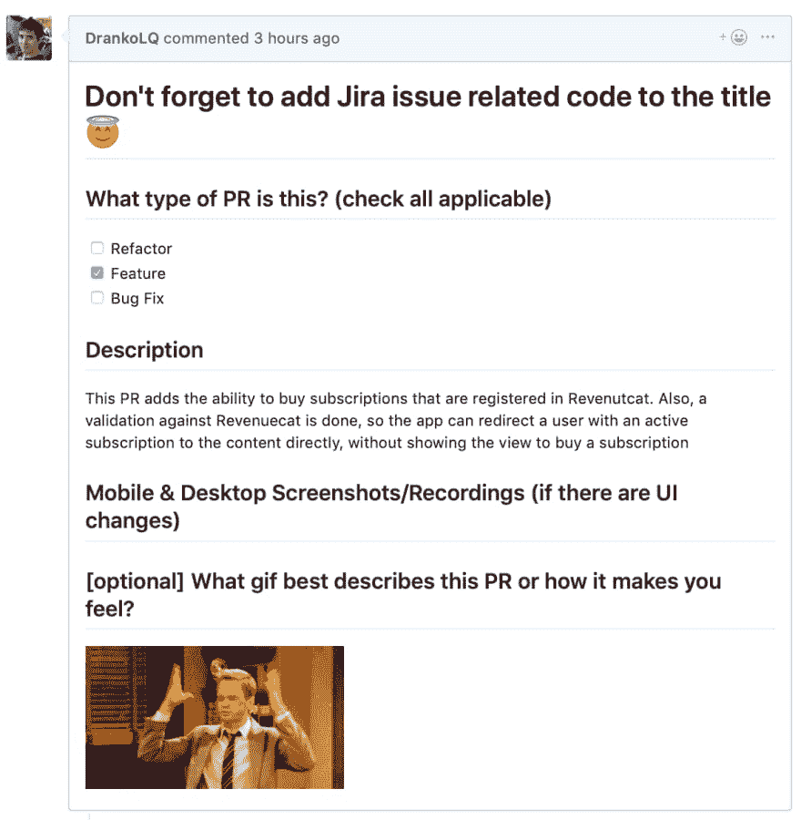

# 使用拉请求模板改进代码评审

> 原文：<https://dev.to/wealize/improve-code-reviews-using-pull-request-templates-10he>

在 Neon 项目中，我们关心我们的内部流程:我们相信它们是重要的，我们精心设计它们，我们使用它们，当我们从它们在现实世界中的表现中学习时，我们改进它们。

开发软件时最重要的过程之一是代码评审，至少有一个团队成员会评审你的代码。这个过程提高了代码的质量，因为很多时候，对作者来说似乎容易理解的代码对团队的其他成员来说并不清楚。参与代码评审的每个人都要学习:学习如何给出反馈，学习你的伙伴如何思考和编写代码&学习技术细节。

为了使代码审查过程尽可能的简单和快速，我们给我们的同事的关于我们做了什么和为什么做的上下文越多越好。在查看了 [Dev.to Github repository](https://github.com/thepracticaldev/dev.to) 并看到一些 pull 请求后，我认为有一种方法可以改进我们在 Neon 项目中的代码审查过程:为 pull 请求使用模板。

拉式请求模板基本上是一个包含降价文本的文件，在创建时会自动添加到拉式请求描述中。

该文件的名称必须为 **pull_request_template.md** 。在我们的例子中，这个文件位于一个名为。github，但是你可以把它放在任何你想放的地方(更多关于 Github 拉请求模板的信息[这里](https://help.github.com/en/articles/creating-a-pull-request-template-for-your-repository)

我们的模板由以下部分组成:

*   **提醒**:当我们使用吉拉进行项目管理时，一个非常有用的功能是通过将问题代码添加到 PR 标题来将 PR 链接到吉拉问题。这样我们可以从吉拉看到它的地位

*   **PR 类型**:由 3 个复选框组成，表示 pull 请求是 bugfix、新特性还是重构。

*   **描述**:对我们可以从 PR 中期待什么的简要描述。这一部分对于审查代码的人来说是必不可少的，可以让他们一目了然地了解代码中的内容。

*   **截图(如果有 UI 的变化)**:有视觉变化的 PR 的问题之一就是要知道变化了什么或者最后的结果是什么。一般来说，在本地执行代码并查看它的过程不会很快，人们必须在他们的机器上下载代码更改，配置环境，等等。一些简单的照片和/或视频将节省大量时间来查看新内容。我个人用 [macOS 截图](https://support.apple.com/en-us/HT201361)和 [Imgur](http://imgur.com) 上传。

*   **(可选)一个 gif，描述它给你的感觉**:因为总有一个好的理由放 gif，对吧？🤓

通过这种简单的方式，我们改进了代码审查过程:更多的信息和上下文，这样代码审查者可以快速理解他们将要审查的内容，从而能够更频繁地部署代码🚀

### 还有一件事...

在宣布 [Github 已经收购 Pull Panda](https://github.blog/2019-06-17-github-acquires-pull-panda/) 之后，我们已经将其整合到我们的流程中，我们非常满意！对于那些不知道它的人来说，Pull Panda 允许你通过 Slack 记住一个贡献者何时需要检查 PR，可以自动分配一个审阅者，并提供一系列非常有趣的分析来了解，例如，进行审阅所需的平均时间或有多少花费了 8 个小时以上。而且是免费的！

就这样了，伙计们。那么，你的代码审查过程如何？对如何改进我们的有什么建议吗？