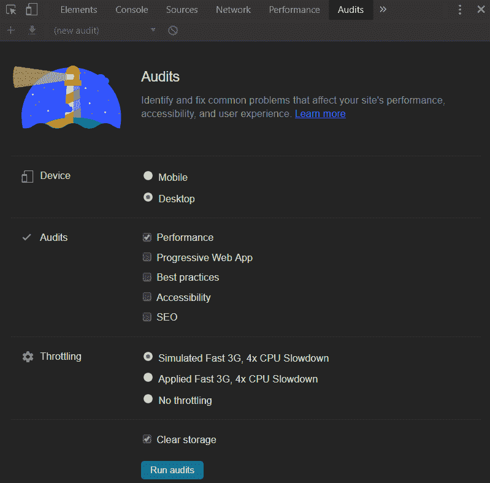
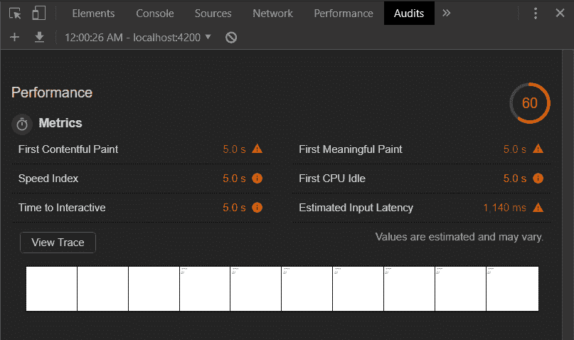
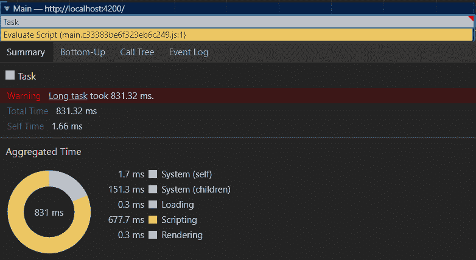
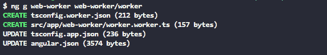

# 提高 Web Workers 的性能

> 原文：<https://dev.to/erxk/improve-performance-with-web-workers-186g>

#### 使用角形 8 CLI

### 简介

本文将说明如何使用 Web Workers 来提高启动性能。我们的例子将是一个角度为 8°的应用。使用 Angular 8 CLI 简化了 Web Workers 的入门。然而，使用 Web Workers 并不是 Angular 特有的，这些概念中的大多数都可以在任何 Javascript 或 Typescript 应用程序中使用。

[下载源代码🚀](https://github.com/Everduin94/Web-Worker-Demo)

我们会掩护

*   在 Lighthouse 中测量性能
*   Angular 8[【1】](https://angular.io/guide/web-worker)Web worker 入门
*   衡量网络工作者的绩效
*   网络工作者的局限性和陷阱

### 用灯塔测量性能

首先，我们需要一个基线测量来衡量我们的应用程序在没有 Web Worker 的情况下启动时的性能。请注意，我们正在生产模式下运行我们的 Angular 应用程序，这会影响启动性能。

在谷歌 Chrome 开发者工具🛠中，使用 Lighthouse，我们可以测量网页在启动时的性能[【2】](https://developers.google.com/web/tools/lighthouse/)。我在应用程序的启动阶段添加了一个长时间运行的任务/计算(for-loop 构建一个巨大的字符串)。

<figure> 

<figcaption>表现无 Web 工作者</figcaption>

</figure>

当我们在主线程上执行一个长时间运行的任务时，我们的应用程序似乎被锁住了。这是因为主线程被我们长期运行的任务中的所有计算阻塞了。因此，在流程完成之前，用户无法与我们的应用程序进行交互。

通过单击“查看跟踪”，我们可以看到启动时 CPU 时间的可视化。在我们的例子中，大部分时间花在评估/运行我们的脚本/任务上。我们还可以在跟踪中验证我们的代码是否在主线程中运行。

<figure> 

<figcaption>表现无 Web 工作者</figcaption>

</figure>

### 网络工作者入门

Angular 8 CLI 简化了 Web Workers 的入门。要创建一个 Web Worker，我们只需运行 Angular 8 Web Worker 示意图。

<figure> 

<figcaption>生成 Web Worker</figcaption>

</figure>

工人的名字和位置大多是随意的。一个警告，如果你的 Web Worker 和你的组件有相同的名字和文件夹，Angular 会自动把下面的代码添加到你的组件中。如果没有，请将这段代码添加到您希望使用 worker 的地方。