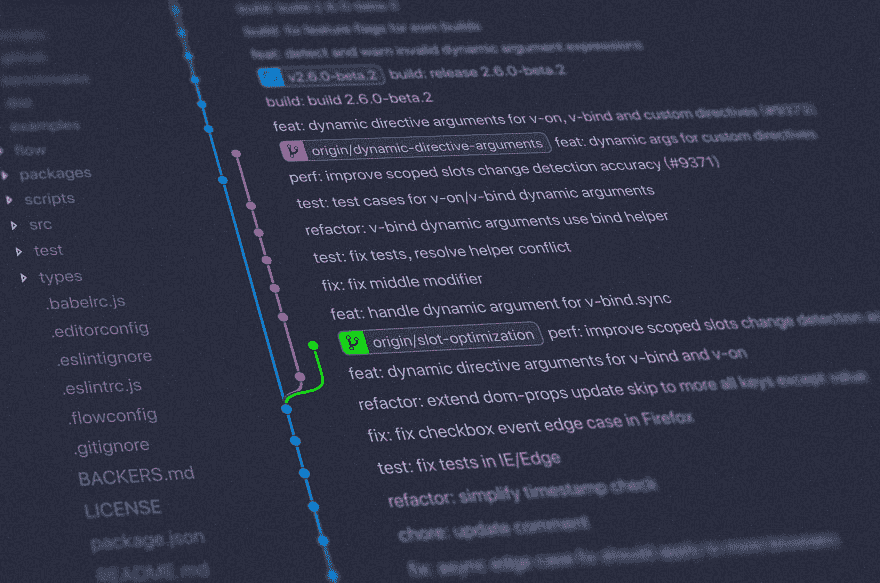
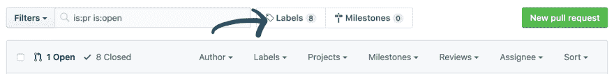
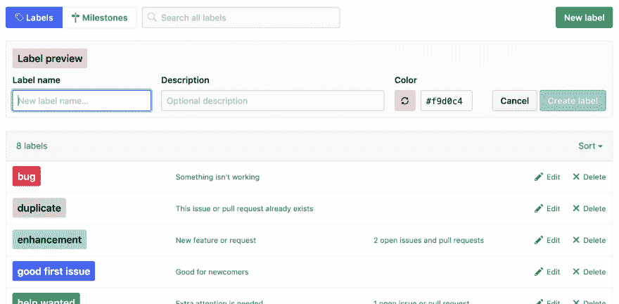

# 改进您的 Git 工作流程

> 原文：<https://dev.to/christopherkade/improving-your-git-workflow-176j>

无论您是独自工作还是与团队一起工作，拥有一个高效的 Git 工作流都可以大大提高您的工作效率。在过去的一个月里，我一直在咨询一个真正重视我今天将与大家分享的观点的团队，我已经能够看到他们对一个大规模项目的积极影响。

## 命名约定

Git 命名约定是**的关键**。它们可以让你在几秒钟内了解某人工作的背景，如果执行得好，还可以帮助你过滤团队的工作。

没有完美的命名约定，但是其中一些，像 [Vincent Driessen 的](https://nvie.com/posts/a-successful-git-branching-model/)很有意义，可以澄清命名 Git 分支的混乱。

简而言之，除了你通常的`master`和`dev`分支之外，你的*支持*分支可以是以下类型:

*   **特性分支** ( `feature-*`):采用用户故事的形式，或者稍后将被合并的特性
*   **发布分支** ( `release-*`):支持新产品发布的准备工作，比如你网站的未来品牌重塑，准备好了最终会合并
*   热修复分支 ( `hotfix-*`):你典型的错误修复。例如，您可以为了修复产品中的一个 bug 而进行分支

但是命名约定也适用于**提交消息**。我真心推荐 Chris Beam 的[“如何编写 Git 提交消息”](https://chris.beams.io/posts/git-commit/)，以便理解谨慎命名提交的重要性。但我认为以下准则是一个很好的总结:

*   用一个空行将主题和正文分开
*   将主题行限制在 50 个字符以内
*   大写主题行
*   不要以句号结束主题行
*   在主题行中使用祈使语气
*   在 72 个字符处换行
*   用身体来解释什么和为什么以及如何

一个很好的经验法则是使用句子:*如果应用，这个提交将...*以你提交的标题结束。如果没有意义，你可能要重新考虑一下。

例如:*如果应用，这个提交将删除所有不推荐的方法*听起来不错，而*如果应用，这个提交将修复 123 号 bug*没有。

> 注意:如果你使用的是吉拉这样的工具，你可以在你的分支机构名称和提交信息中加入你的票据编号，以便于交叉检查。此外，不要忘记这些只是提示，最终你总是可以走自己的路。我们最终都会得到一些“请工作”的承诺信息。😄

## Github 标签

Github 标签是过滤拉取请求的另一个好方法。所以这里有一些我在过去发现有用的标签和它们的含义(当它不明显的时候):

*   **好的第一期**:当你的项目是开源的，并且正在寻找新的贡献者时，这是非常好的。对于那些不敢伸出援手的人来说，这是一个很好的切入点
*   **功能**
*   **Bug**
*   **技术**:意味着相关的拉请求与面向客户的功能无关。例如，它可以是关于您项目的`eslint`或`storybook`配置
*   关键的:帮助你的团队知道哪些 PRs 值得首先评审，尤其是在时间紧迫的时候
*   **求援**
*   **进行中**
*   **XS** 、 **S** 、 **M** 、 **L** 和 **XL** :代表 PR 的大小一目了然。很难确定有多少行更改将弥补这些大小，这完全取决于您
*   **需要审查**
*   **已审核**

通过单击您的拉式请求页面中的以下链接，可以更改标签:

现在只需点击“新标签”，设置名称、可选描述和颜色。

## 保护 Git 分支

您可以限制分支操作，例如，在合并给定的分支之前强制要求某个状态。当您已经设置了代码审查规则，并且不希望任何人错误地合并一个分支时，这是非常好的。

作为一个项目的管理员，进入`Settings` = > `Branches` = > `Add rule`，输入你希望保护的分支的名称。

您可以从许多规则中进行选择，包括:

*   合并前需要 X 拉请求审查
*   要求在合并前通过状态检查，当您有一个健壮的 CI 流程时，这很好

## 创建 Git 挂钩

这一条我引用[官方文件](https://githooks.com/):

> Git 钩子是 Git 在**提交**、**推送**和**接收**等事件之前或之后执行的脚本。Git 挂钩是一个内置特性——不需要下载任何东西。
> 
> 每个 Git 存储库都有一个. git/hooks 文件夹，其中包含每个可以绑定的钩子的脚本。您可以根据需要随意更改或更新这些脚本，当这些事件发生时，Git 会执行它们。

我建议使用一些很棒的工具，比如 [Husky](https://github.com/typicode/husky) 来轻松创建它们。

自动执行测试并在测试失败时阻止推送将会对避免污染您的 git 历史大有帮助。

## 优秀奖

我想提一下我在个人项目中经常用到的一些东西，比如 [Foodpicker](https://github.com/christopherkade/foodpicker) 、[横幅生成器](https://github.com/christopherkade/banner-generator)或 [Gitignore It](https://github.com/christopherkade/gitignore-it) (如果你好奇，可以看看他们的 Git 历史):🎨⚡️ [Gitmoji](https://gitmoji.carloscuesta.me/) 🔥 🐛！这是一种用表情符号整理提交信息的方式，这样你一眼就能理解提交的**上下文**。由于它丰富多彩的性质，有些人可能会马上拒绝它，但我发现它非常有用，例如生成变更日志。

一些很棒的工具，如 [gitmoji-cli](https://github.com/carloscuesta/gitmoji-cli) 和 [gitmoji-changelog](https://github.com/frinyvonnick/gitmoji-changelog) 让我每天的 Git 体验更加顺畅，所以如果你感兴趣的话，一定要看看它们！

我希望你在阅读这篇文章的时候学到了一些东西！和往常一样，如果你有任何问题，我很乐意你给我发推特 [@christo_kade](https://twitter.com/christo_kade) 😄小心点，别忘了:总是在❤️当地调整基数