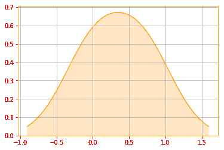
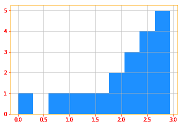

# Tensorflow 2.0 信息论

> 原文：<https://dev.to/mmithrakumar/information-theory-with-tensorflow-2-0-29ao>

信息论是应用数学的一个分支，围绕量化信号中存在多少信息展开。在机器学习的背景下，我们也可以将信息论应用于连续变量，其中一些消息长度解释不适用。

信息论背后的基本直觉是，可能的事件应该具有低信息量，不太可能的事件应该具有较高信息量，而独立事件应该具有附加信息。

让我给你一个简单的例子，假设你有一个男性朋友，他深深地爱上了这个女孩，所以他几乎每周都约这个女孩出去，有 99%的可能性她说不，所以你是他最好的朋友，他每次约女孩出去后都给你发短信让你知道发生了什么，他发短信，“嘿，猜猜她说什么，不😭😭😭“，这当然是浪费， 考虑到他的机会很小，所以你的朋友发送更有意义”😭“但如果她同意了，他当然可以发一条更长的短信，这样一来，用来传达信息的比特数(以及你相应的数据账单)就会减到最少。 附注:不要告诉你的朋友他的机会很小，那会让你失去朋友😬。

为了满足这些性质，我们将事件**的**自我信息**x**= x 定义为:

I(x)=-log P(x)

在本书中，我们总是使用 log 来表示以 e 为底的自然对数。因此，我们对 **I(x)** 的定义是以 **nats** 为单位编写的。一个 nat 是通过观察概率为 1/e 的事件获得的信息量。其他文本使用以 2 为底的对数和称为**位**或 **shannons** 的单位；用比特计量的信息只是用 NAT 计量的信息的重新标度。

```
"""
No matter what combination of toss you get the Entropy remains the same but if you change the probability of the
trial, the entropy changes, play around with the probs and see how the entropy is changing and see if the increase
or decrease makes sense.
"""

import tensorflow_probability as tfp
tfd = tfp.distributions

coin_entropy = [0]                                                                     # creating the coin entropy list 
for i in range(10, 11):
    coin = tfd.Bernoulli(probs=0.5)                                                    # Bernoulli distribution
    coin_sample = coin.sample(i)                                                       # we take 1 sample
    coin_entropy.append(coin.entropy())                                                # append the coin entropy
    sns.distplot(coin_entropy, color=color_o, hist=False, kde_kws={"shade": True})     # Plot of the entropy 
print("Entropy of 10 coin tosses in nats: {} \nFor tosses: {}".format(coin_entropy[1], coin_sample))
plt.grid()

Entropy of 10 coin tosses in nats: 0.6931471824645996
For tosses: [0 1 1 1 0 1 1 1 0 1] 
```

Enter fullscreen mode Exit fullscreen mode

[](https://res.cloudinary.com/practicaldev/image/fetch/s--TpiGr54k--/c_limit%2Cf_auto%2Cfl_progressive%2Cq_auto%2Cw_880/https://raw.githubusercontent.com/adhiraiyan/DeepLearningWithTF2.0/master/notebooks/figures/ch03/output_104_1.png)

自我信息只处理单一的结果。我们可以使用**香农熵**来量化整个概率分布中的不确定性:

h(x)= E _(x∞P)[I(x)]= E _(x∞P)[log P(x)]

也表示为 **H(P)** 。

分布的香农熵是从该分布中提取的事件中的预期信息量。它给出了对从分布 p 中提取的符号进行编码平均所需的比特数的下限。接近确定性的分布(其中结果几乎是确定的)具有低熵；更接近均匀的分布具有高熵。当 **x** 连续时，香农熵被称为**差熵**。

```
"""
Note here since we are using the Bernoulli distribution to find the expectation we simply use mean,
if you change the distribution, you need to find the Expectation accordingly
"""

def shannon_entropy_func(p):
    """Calculates the shannon entropy.
    Arguments:
        p (int)        : probability of event.
    Returns:
        shannon entropy.
    """

    return -tf.math.log(p.mean())

# Create a Bernoulli distribution bernoulli_distribution = tfd.Bernoulli(probs=.5)

# Use TFPs entropy method to calculate the entropy of the distribution shannon_entropy = bernoulli_distribution.entropy()

print("TFPs entropy: {} matches with the Shannon Entropy Function we wrote: {}".format(shannon_entropy,
                                                                                       shannon_entropy_func(bernoulli_distribution)))

TFPs entropy: 0.6931471824645996 matches with the Shannon Entropy Function we wrote: 0.6931471824645996 
```

Enter fullscreen mode Exit fullscreen mode

熵不在于它的解释，而在于它的性质。例如，熵并不关心像方差这样的实际 *x* 值，它只考虑它们的概率。因此，如果我们增加取值的数量 *x* ，那么熵将增加，概率将变得不那么集中。

```
# You can see below by changing the values of x we increase the entropy 
shannon_list = []

for i in range(1, 20):
    uniform_distribution = tfd.Uniform(low=0.0, high=i)    # We create a uniform distribution
    shannon_entropy = uniform_distribution.entropy()       # Calculate the entropy of the uniform distribution
    shannon_list.append(shannon_entropy)                   # Append the results to the list 
# Plot of Shannon Entropy plt.hist(shannon_list, color=color_b)
plt.grid() 
```

Enter fullscreen mode Exit fullscreen mode

[](https://res.cloudinary.com/practicaldev/image/fetch/s--CUYKSsdJ--/c_limit%2Cf_auto%2Cfl_progressive%2Cq_auto%2Cw_880/https://raw.githubusercontent.com/adhiraiyan/DeepLearningWithTF2.0/master/notebooks/figures/ch03/output_108_0.png)

如果我们在同一个随机变量 x 上有两个独立的概率分布 P(x)和 Q(x ),我们可以使用 **Kullback-Leibler (KL)散度**来测量这两个分布的差异:

d _(KL)(P∨Q)= E _(x∾P)[log P(x)/Q(x)]= E _(x∾P)[log P(x)-log Q(x)]

在离散变量的情况下，当我们使用被设计为最小化从概率分布 q 中提取的消息长度的代码时，它是发送包含从概率分布 P 中提取的符号的消息所需的额外信息量

```
def kl_func(p, q):
    """Calculates the KL divergence of two distributions.
    Arguments:
        p    : Distribution p.
        q    : Distribution q.
    Returns:
        the divergence value.
    """

    r = p.loc - q.loc
    return (tf.math.log(q.scale) - tf.math.log(p.scale) -.5 * (1. - (p.scale**2 + r**2) / q.scale**2))

# We create two normal distributions p = tfd.Normal(loc=1., scale=1.)
q = tfd.Normal(loc=0., scale=2.)

# Using TFPs KL Divergence kl = tfd.kl_divergence(p, q)

print("TFPs KL_Divergence: {} matches with the KL Function we wrote: {}".format(kl, kl_func(p, q)))

TFPs KL_Divergence: 0.4431471824645996 matches with the KL Function we wrote: 0.4431471824645996 
```

Enter fullscreen mode Exit fullscreen mode

KL 散度有许多有用的性质，最明显的是非负的。当且仅当 P 和 Q 在离散变量的情况下是相同的分布，或者在连续变量的情况下“几乎处处”相等时，KL 散度为 0。

与 KL 散度密切相关的一个量是**交叉熵** H(P，Q)= H(P)+D _(KL)(P∨Q)，它类似于 KL 散度，但缺少左边的项:

H(P，Q)=-E _(x∞P)log Q(x)

最小化关于 Q 的交叉熵等价于最小化 KL 散度，因为 Q 不参与被省略的项。

```
"""
The cross_entropy computes the Shannons cross entropy defined as:
H[P, Q] = E_p[-log q(X)] = -int_F p(x) log q(x) dr(x)
"""

# We create two normal distributions p = tfd.Normal(loc=1., scale=1.)
q = tfd.Normal(loc=0., scale=2.)

# Calculating the cross entropy cross_entropy = q.cross_entropy(p)

print("TFPs cross entropy: {}".format(cross_entropy))

TFPs cross entropy: 3.418938636779785 
```

Enter fullscreen mode Exit fullscreen mode

* * *

这是《用 Tensorflow 2.0 进行深度学习》一书《用 Tensorflow 2.0 进行概率和信息论》一章的第十三节。

您可以阅读本节和以下主题:

03.00 -概率与信息论
03.01 -为什么是概率？
03.02 -随机变量
03.03 -概率分布
03.04 -边际概率
03.05 -条件概率
03.06 -条件概率的链式法则
03.07 -独立性和条件独立性
03.08 -期望、方差和协方差
03.09 -常见概率分布
03.10 -常用函数的有用性质
03.11 -贝叶斯' 1

在[用 TF 2.0 深度学习:03.00-概率论与信息论](https://www.adhiraiyan.org/deeplearning/03.00-Probability-and-Information-Theory)。你可以在这里获得这篇文章和本章[其余部分的代码。Google Colab 和 Jupyter Binder 中笔记本的链接在](https://github.com/adhiraiyan/DeepLearningWithTF2.0)[笔记本](https://www.adhiraiyan.org/deeplearning/03.00-Probability-and-Information-Theory)的末尾。