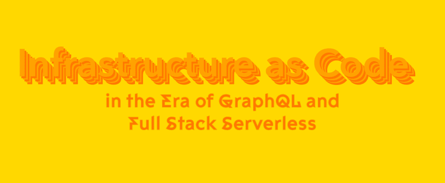

# GraphQL 和全栈无服务器时代的基础设施代码

> 原文：<https://dev.to/dabit3/infrastructure-as-code-in-the-era-of-graphql-and-full-stack-serverless-11bc>

[](https://res.cloudinary.com/practicaldev/image/fetch/s--O3A6L3fs--/c_limit%2Cf_auto%2Cfl_progressive%2Cq_auto%2Cw_880/https://thepracticaldev.s3.amazonaws.com/i/aqltq0zmtozsvq1e75my.jpg)

> 过去，我们可以克隆一个客户端应用，然后在浏览器或移动模拟器中启动它。如今，我们可以利用一种新的基础设施模式作为代码来克隆和部署全栈应用，这种模式允许我们部署前端和后端代码。

GraphQL 正在改变应用程序的构建方式。作为代码的基础设施特别适合 GraphQL 应用程序，因为我们可以随着时间的推移塑造和发展我们的数据模型，允许开发人员以新的令人兴奋的方式构建、协作和部署应用程序。在本文中，我将向您展示前端开发人员和初涉云计算的开发人员如何开始利用这种范式。

> 要查看放大 IAC 的示例，请查看视频。

* * *

云计算最强大的优势之一是基于配置文件部署云和无服务器资源的能力，在业内称为基础设施代码(IAC)。

作为一名传统的前端开发人员，我只是偶尔会构建和部署后端资源(如数据库、服务器和认证机制)，我总是习惯于点击管理面板，研究 SSH，并编写一堆样板文件来设置我的 API(并且通常花费大量时间这样做)。

当我得知开发人员能够在几分钟内部署整个技术堆栈时，我感到震惊，并想知道为什么这在前端开发人员社区中不是一件大事。

事实证明这并不容易。一旦配置完成，以这种方式部署的能力很容易，但是编写和管理这种配置通常需要至少对云计算有所了解的人来完成。像我这样刚接触云计算的前端人员和开发人员会在尝试部署哪怕是最简单的资源时迷失方向。现在情况不再是这样了。

## 现代工装

[](https://res.cloudinary.com/practicaldev/image/fetch/s--qPJlmZrJ--/c_limit%2Cf_auto%2Cfl_progressive%2Cq_auto%2Cw_880/https://thepracticaldev.s3.amazonaws.com/i/7zz3fykiwr3istek6rco.jpg)

好消息是工具已经得到了改进，前端开发人员和不熟悉云计算的开发人员开始使用这种类型的基础设施变得越来越容易。

无服务器技术尤其适合这种模式，因为我们首先需要部署的基础设施要少得多。这导致整体复杂性降低，因此创造了降低学习曲线的机会，并使更大的开发人员社区能够利用云计算提供的规模和机会。

### 无服务器框架

以无服务器框架为例。无服务器框架引入了比传统 IAC 工具(如 AWS CloudFormation)更简单的抽象，允许开发人员只需担心最必要的配置，然后框架将通过使用 CloudFormation 部署基础设施来处理其余的事情。

如果您曾经创建过一个无服务器项目，您可能会得到一个像这样的基本`serverless.yml`文件，它是作为样板文件的一部分创建的:

```
service: testproj
provider:
  name: aws
  runtime: nodejs10.x
functions:
  hello:
    handler: handler.hello 
```

最棒的是，您可以从命令行通过几个步骤部署一个无服务器功能。一旦您熟悉了框架和您选择的云提供商，您还可以部署其他资源，如数据库、身份验证和存储。

唯一的缺点是，一旦你完成了一个“hello world”类型的项目，你必须更深入地研究或熟悉 AWS / Azure / GCP，以便理解事情是如何工作的。

### AWS 云开发套件(CDK)

虽然 YAML 或 JSON 形式的配置肯定被认为是基础设施代码，但随着 [CDK](https://docs.aws.amazon.com/cdk/) 推出了一种新形式的基础设施代码。CDK 允许你用实际的编程语言如 Typescript、Python、Java 或. NET 来声明你的基础设施

例如，如果您想要部署一个 S3 存储桶，您可以编写以下代码并进行部署:

```
import core = require('@aws-cdk/core');
import s3 = require('@aws-cdk/aws-s3');

export class HelloCdkStack extends core.Stack {
  constructor(scope: core.App, id: string, props?: core.StackProps) {
    super(scope, id, props);

    new s3.Bucket(this, 'MyFirstBucket', {
      versioned: true
    });
  }
} 
```

CDK 正在迅速获得采用，并有一个非常光明的未来。同样，像许多其他 IAC 工具一样，缺点是一旦你掌握了一些基本知识，你就必须对 AWS 有所了解。

## 基础设施作为代码的演变

[](https://res.cloudinary.com/practicaldev/image/fetch/s---5Q5joB4--/c_limit%2Cf_auto%2Cfl_progressive%2Cq_auto%2Cw_880/https://thepracticaldev.s3.amazonaws.com/i/940aam1fvyux5amj5j2k.jpg)

[行业继续见证托管服务和工具的爆炸式增长，这些服务和工具促进了支持云的无服务器计算](https://medium.com/@dabit3/full-stack-development-in-the-era-of-serverless-computing-c1e49bba8580)。这个新工具变得越来越容易使用，并且面向新开发人员和那些认为自己是前端开发人员的人。

这是有意义的，考虑到开发人员已经了解并使用云，可能没有兴趣学习“另一种方式”来做他们已经习惯做的事情。这有意义的另一个原因是，有大量的开发人员认为自己是前端甚至全栈开发人员，他们还没有采用云。

这些开发人员如何开始采用和利用 IAC？在软件工程的大多数领域，随着时间的推移，事情会被更好、更复杂的抽象所简化。

在移动开发中，我们现在可以使用单一编程语言和 React Native、Flutter 和 Xamarin 等工具和框架来构建跨平台应用程序。有了 React、Vue 和 Angular，我们不再需要直接处理 DOM，可以直接在浏览器中构建复杂的应用。云计算使开发人员能够在不离开座位的情况下供应和拆除无数的服务器。

同样的事情也发生在基础设施代码上。有了像 [AWS Amplify](https://aws-amplify.github.io/) 、*这样的工具，IAC 会在你构建应用程序*时自动为你提供，无需你做任何额外的工作。在任何时候，您都可以自己共享和重新部署这些资源，或者与其他开发人员共享这些资源，以部署到他们的帐户中。

这为许多有趣的机会打开了大门，包括代码共享和重用的新范式，以及前端开发人员和云计算新手开发分布式系统的切入点。

### 基于类别的方法&放大 IAC

[](https://res.cloudinary.com/practicaldev/image/fetch/s--CNNzH7SW--/c_limit%2Cf_auto%2Cfl_progressive%2Cq_auto%2Cw_880/https://thepracticaldev.s3.amazonaws.com/i/bwvm4jvnmjvz89q3xcgy.jpg)

AWS Amplify 的目标之一是，它允许开发人员开发和构建云应用程序，而不需要它所创建的底层基础设施的高级知识。Amplify 使用基于类别的方法工作:需要认证吗？`amplify add auth`。需要 API 吗？`amplify add api`。

在设置或使用这些服务的过程中，您不需要知道或说任何关于底层服务名称的事情。你可能不知道什么？一旦你的项目被创建，当你在构建它的时候，Amplify 就在幕后生成这个基础设施作为代码。您项目中的`amplify`文件夹是您的云资源在应用程序生命周期的任何给定时间的当前和可再现的快照。您可以随时共享和重新部署正在工作的当前堆栈(无论是您的帐户，还是在其他人的帐户中共享)。

在过去的一年里，我们一直在开发开源项目，允许开发人员部署利用 Amplify IAC 的预构建全栈无服务器应用。像盒子里的[会议应用](https://dev.to/dabit3/introducing-conference-app-in-a-box-kgj)、 [AWS AppSync 聊天](https://www.google.com/search?q=aws+appsync+chat&oq=aws+appsync+chat&aqs=chrome..69i57j69i60j0l3j69i60.2063j0j7&sourceid=chrome&ie=UTF-8)、 [Hype Beats](https://github.com/dabit3/hype-beats) 和 [Speaker Chat](https://github.com/dabit3/speakerchat) 这样的项目可以通过单击(web)或来自(Mobile / React Native)等命令的几个命令来部署。

使用预配置的 Amplify IAC 项目，您可以从聊天应用程序、复杂的路由认证和仪表板等实时应用程序的实施开始。

许多 Amplify 项目使用 GraphQL 作为数据提供者，允许您通过更新 GraphQL 模式并使用单个命令重新部署来轻松修改数据结构。

一旦你完成了你的应用程序，你就有了所有可用资源的代码表示。然后，您可以测试、共享、开源或使用您认为合适的代码创业。

### [T1】graph QL&IAC](#graphql-amp-iac)

以我最近发布的一个应用为例，[盒子里的会议应用](https://github.com/dabit3/conference-app-in-a-box)。这是一个可配置的、主题化的、生产就绪的移动应用程序，可以为事件和会议部署。

让我们来看看基本的 GraphQL 模式:

```
type  Talk  @model  {  id:  ID!  name:  String!  speakerName:  String!  speakerBio:  String!  time:  String  timeStamp:  String  date:  String  location:  String  summary:  String!  twitter:  String  github:  String  speakerAvatar:  String  comments:  [Comment]  @connection(name:  "TalkComments")  } 
```

当您克隆和部署这个应用程序时，它假设数据结构看起来如上。但是考虑到你可能也想为一个设计会议添加一个 Dribbble profile？

您可以用两行代码轻松地修改整个应用程序:一行代码更新模式以添加 Dribbble 字段，另一行代码在移动应用程序中呈现该字段。

该模式也可以发展到匹配其他应用程序，这意味着您可以将该基础架构从应用程序中取出，并将其部署到另一个平台或另一个应用程序。

我已经和几十个会议组织者谈过了，他们将采用这个应用程序，因为它是一个省时省钱的工具。许多组织者已经花费了数千美元和数百美元来复制他们从这个应用程序中获得的功能，这些功能可以在几分钟内部署完毕。

### 试探一下

如果您有兴趣尝试一下，请查看以下项目之一，并按照文档中的步骤操作:

1.  [盒子里的会议应用](https://github.com/dabit3/conference-app-in-a-box#deploy-the-back-end-and-run-the-app)
2.  [AWS AppSync 聊天](https://github.com/aws-samples/aws-appsync-chat)
3.  [AWS Amplify Auth Starters](https://github.com/aws-samples/aws-amplify-auth-starters)
4.  [SpeakerChat](https://github.com/dabit3/speakerchat)

### 未来

在未来，我设想一种新的全栈无服务器应用程序存储库，它利用这种类型的 IAC，不仅来自 AWS，而且我预测其他云提供商和公司也会效仿。

随着前端和后端开发之间的界限越来越模糊，我们将会看到越来越多的工具出现，这些工具将过去复杂的后端和云技术抽象化。

> 我的名字是纳德·达比特 T2。我是亚马逊网络服务的开发者倡导者，负责类似 [AWS AppSync](https://aws.amazon.com/appsync/) 和 [AWS Amplify](https://aws-amplify.github.io/) 这样的项目。我专攻跨平台&云应用开发。