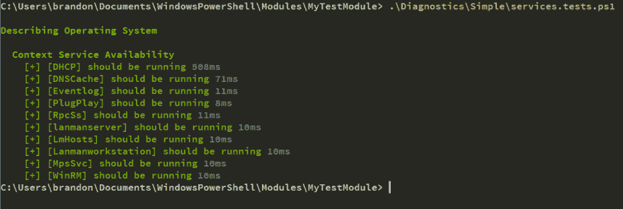
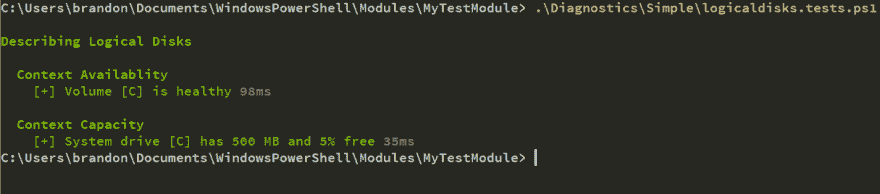
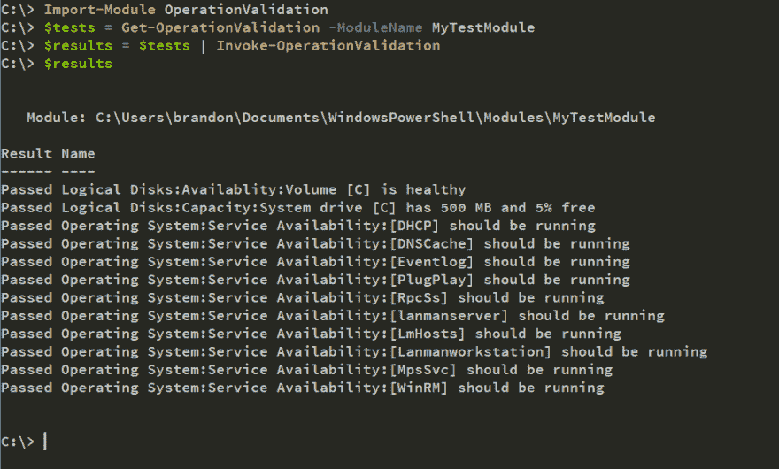
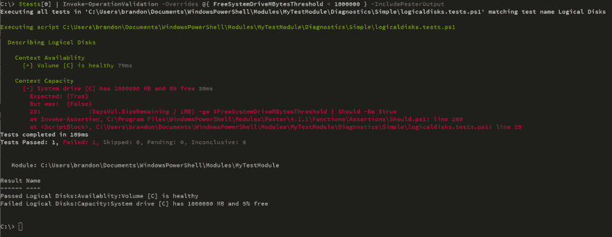

# 使用 Pester 和操作验证框架进行基础设施测试

> 原文：<https://dev.to/devblackops/infrastructure-testing-with-pester-and-the-operation-validation-framework-1a5p>

如果你在过去几年中使用过 PowerShell，那么你一定听说过 Pester。如果不是，那么你可能生活在一个奇怪的平行宇宙中，Zune 仍然是一个东西。无论如何，Pester 是 PowerShell 的测试框架，是基础设施开发人员工具箱中的必备工具。

我说基础设施开发商是因为这就是我们。如果你编写生产代码来自动化你的基础设施，那么你不是系统工程师或管理员，SharePoint 工程师或其他任何人，你是一个开发人员。**完全停止**。

事实上，我们编写定义或运行 IT 基础设施的 PowerShell 代码与使用 CSS、JavaScript 和 HTML 的 web 开发人员没有任何不同，或者与用 Go on [Kubernetes](https://kubernetes.io/) 编写的全栈 ninja rockstar slinging 微服务没有任何不同。

> 一切都与代码有关，因此**每个人**都是开发者。
> 
> ——孙子

使用 C#或 Java 的传统开发人员测试他们的代码。您的传统 Windows 管理员使用 PowerShell 自动化他们的工作(您不会)**应该**测试他们的代码。即使你没有在[perste](https://github.com/pester/Pester)、 [RSpec](http://rspec.info/) 、 [SpecFlow](http://specflow.org/) 等中编写测试，你也在测试你的代码。或者我应该说，你的**用户正在为你**测试你的代码。

## 你的基础设施怎么样？

您是否测试过您的基础设施，以验证它是否按您预期的方式运行？您的服务是根据您的规范配置的吗？您的基础结构不是静态对象；永不改变，永远处于你期望的状态。

**如果您没有主动测试您的基础设施，不要担心，当它不工作时，您的用户会让您知道::**

> 事情变了。一直都是。
> 
> ——林肯

服务器被调配或取消调配，新的应用程序上线，或者旧的应用程序逐渐消失。那些啃咬电线导致服务间延迟或错误代码(咳...当然不是你的)导致应用程序崩溃？上周你手动调整了一个设置，但是忘了把它移植到你的 DSC 配置中，这是怎么回事？所有这些都创造了一个活生生的、呼吸的、动态的环境。必须对该环境进行测试，以确保您的基础设施与您期望的状态相匹配。

这就是像 percept 和操作验证框架这样的工具可以提供帮助的地方。

## 运算验证？

您知道什么是 Pester，并且知道您使用它来测试您的 PowerShell 脚本/模块的功能。您知道您还可以用它来测试您的基础设施吗？当你思考这个问题时，所有的 percept 在一天结束时所做的就是将左边的值(**你的实际状态**)与右边的值(**你的期望状态**)进行比较，并在这些不匹配时发出警报。

#### Get-Answer.ps1

```
function  Get-Answer  {  param(  [parameter(Mandatory)]  [string]$Question  )  if  ($Question  -eq  'Answer to the Ultimate Question of Life, the Universe, and Everything')  {  42  }  } 
```

#### Get-Answer.tests.ps1

```
describe  'Get-Answer'  {  context  'Correct output'  {  it  'Returns the correct value'  {  Get-Answer  -Question  'Answer to the Ultimate Question of Life, the Universe, and Everything'  |  Should  -Be  42  }  }  } 
```

上面的测试验证了我们的`Get-Answer`函数的输出。现在来看一个基础设施测试:

#### os.services.tests.ps1

```
describe  'Operating System'  {  context  'Service Availability'  {  it  'Eventlog is running'  {  $svc  =  Get-Service  -Name  Eventlog  $svc.Status  |  Should  -Be  running  }  }  } 
```

看起来和我很像😊

## 操作验证框架

既然我们知道我们可以使用 Pester 来测试我们的基础设施，那么我们该如何处理这些测试以及如何执行它们呢？如果我们想要**发布**这些测试并且**发布**它们会怎么样？**嘿，听起来像 PowerShell 模块！**

> 你的想法很吸引我，我想订阅你的时事通讯。
> 
> ——艾萨克·牛顿爵士

这就是[操作验证框架](https://github.com/PowerShell/Operation-Validation-Framework)发挥作用的地方。它是一个 PowerShell 模块，用于搜索包含在其他 PowerShell 模块中已定义的文件夹结构中的 Pester 测试...(要说出令人吃惊或高兴的事情)听着...用纠缠执行它们。就是这样。只需将我们的 Pester 测试放在一个模块中，我们现在就可以对它们进行版本化、发布和执行了！

### 文件夹结构

操作验证框架，或简称 OVF，期望在你的模块中的一个已知位置进行纠缠测试。如果你把纠缠测试放在模块下的一个`Diagnostics\Simple`或`Diagnostics\Comprehensive`文件夹中，OVF 可以找到并执行它们。`Simple`文件夹是为快速且非侵入性执行的测试而设计的。这些测试可以每隔几分钟执行一次，几乎没有影响。`Comprehensive`测试将会更加复杂，需要更长的时间来执行。你可能每隔几个小时或者一天运行一次。

*   MyTestModule\
    *   神话测试模组. psd1
    *   诊断\
    *   简单\
        *   services.tests.ps1
        *   逻辑磁盘.测试. ps1
    *   全面\
        *   性能.测试. ps1

例如，假设我们有一个具有上述结构的 PowerShell 模块。本模块包括下面的纠缠测试。请注意，两个 Pester 测试脚本都有定义一些默认值的参数。Pester 有一个漂亮的特性，你可以调用一个测试脚本并向其中注入参数。这允许您为您的测试提供一些合理的默认值，同时允许用户在需要时覆盖它们。OVF 也支持这一功能。这意味着您可以编写用于测试特定产品或操作系统功能的通用 OVF 模块，并将它们发布到 PowerShell Gallery！然后，用户可以下载并执行它们，如果需要的话，可以覆盖默认参数以适应他们的环境。我们会有整个社区都可以使用的公共基础设施测试！

我和其他人已经在 PowerShell 画廊发布了一些 OVF 模块。查看这些简单的 OVF 模块，测试 Windows Server、Active Directory、SharePoint 和 Citrix ShareFile。

*   [OVF。Windows.Server](https://www.powershellgallery.com/packages/OVF.Windows.Server/)
*   [OVF。活动目录](https://www.powershellgallery.com/packages/OVF.Active.Directory/)
*   [OVF。SharePoint](https://www.powershellgallery.com/packages/OVF.SharePoint/)
*   [OVF。共享文件](https://www.powershellgallery.com/packages/OVF.ShareFile)

[](https://res.cloudinary.com/practicaldev/image/fetch/s--sL-OFWlc--/c_limit%2Cf_auto%2Cfl_progressive%2Cq_auto%2Cw_880/https://thepracticaldev.s3.amazonaws.com/i/xphvb6pi743w6wf01532.jpg)

#### services.tests.ps1

```
param(  $Services  =  @(  'DHCP',  'DNSCache','Eventlog',  'PlugPlay',  'RpcSs',  'lanmanserver',  'LmHosts',  'Lanmanworkstation',  'MpsSvc',  'WinRM'  )  )  describe  'Operating System'  {  context  'Service Availability'  {  $Services  |  ForEach-Object  {  it  "[$_] should be running"  {  (Get-Service  $_).Status  |  Should  -Be  running  }  }  }  } 
```

[](https://res.cloudinary.com/practicaldev/image/fetch/s--U9AEjqKp--/c_limit%2Cf_auto%2Cfl_progressive%2Cq_auto%2Cw_880/https://thepracticaldev.s3.amazonaws.com/i/ck2zoquwi5bplognose9.png)

#### [T1】logical disk . tests . PS1](#logicaldisktestsps1)

```
param(  $FreeSystemDriveMBytesThreshold  =  500,  $FreeSystemDrivePctThreshold  =  .05,  $FreeNonSystemDriveMBytesThreshold  =  1000,  $FreeNonSystemDrivePctThreshold  =  .05  )  describe  'Logical Disks'  {  $vols  =  Get-Volume  |  Where-Object  {  $_.DriveType  -eq  'Fixed'  -and  -not  [string]::IsNullOrEmpty($_.DriveLetter)}  context  'Availablity'  {  $vols  |  ForEach-Object  {  it  "Volume [$($_.DriveLetter)] is healthy"  {  $_.HealthStatus  |  Should  -Be  'Healthy'  }  }  }  context  'Capacity'  {  $systemDriveLetter  =  $env:SystemDrive.Substring(0,  1)  $sysVol  =  $vols  |  Where-Object  DriveLetter  -eq  $systemDriveLetter  $nonSysVols  =  $vols  |  Where-Object  DriveLetter  -ne  $systemDriveLetter  it  "System drive [$systemDriveLetter] has $FreeSystemDriveMBytesThreshold MB and $('{0:p0}'  -f  $FreeSystemDrivePctThreshold) free"  {  ($sysVol.SizeRemaining  /  1MB)  -ge  $FreeSystemDriveMBytesThreshold  |  Should  -Be  $true  ($sysVol.SizeRemaining  /  $sysVol.Size)  -ge  $FreeSystemDriveThresholdPct  |  Should  -Be  $true  }  foreach  ($volume  in  $nonSysVols)  {  $driveLetter  =  $volume.DriveLetter  it  "Non-System drive [$driveLetter] has greater than $FreeNonSystemDriveMBytesThreshold MB and $('{0:p0}'  -f  $FreeNonSystemDrivePctThreshold) free"  {  ($volume.SizeRemaining  /  1MB)  -ge  $FreeNonSystemDriveThreshold  |  Should  -Be  $true  ($volume.SizeRemaining  /  $volume.Size)  -ge  $FreeNonSystemDriveThresholdPct  |  Should  -Be  $true  }  }  }  } 
```

[](https://res.cloudinary.com/practicaldev/image/fetch/s--NpawauA7--/c_limit%2Cf_auto%2Cfl_progressive%2Cq_auto%2Cw_880/https://thepracticaldev.s3.amazonaws.com/i/c51mwidwyhpu5q53829v.png)

> 永远记住，你绝对是独一无二的。就像其他人一样。罗杰斯先生

现在让我们看看如何使用 OVF 来执行这些相同的测试。由于我们的测试模块已经安装到了`$env:PSModulePath`中，OVF 将找到它，检查它，并返回一组测试。然后可以用`Invoke-OperationValidation`执行这些测试。想象一下，让您的监控系统运行下面的简单脚本，并在任何一个 Pester 测试失败时抛出警报。

```
Import-Module  OperationValidation  $tests  =  Get-OperationValidation  -ModuleName  MyTestModule  $results  =  $tests  |  Invoke-OperationValidation  $results 
```

[](https://res.cloudinary.com/practicaldev/image/fetch/s--tjxPfi3D--/c_limit%2Cf_auto%2Cfl_progressive%2Cq_auto%2Cw_880/https://thepracticaldev.s3.amazonaws.com/i/sysc3z1g4jbsgajlpqvi.png)

要执行 OVF 测试并覆盖默认参数，我们可以使用`-Overrides`参数。我们也可以显示纠缠输出。这个框架很酷的一点是，你可以开发一个通用模块来测试某项技术，然后根据环境定制设置。

[](https://res.cloudinary.com/practicaldev/image/fetch/s--6zV3NOyl--/c_limit%2Cf_auto%2Cfl_progressive%2Cq_auto%2Cw_880/https://thepracticaldev.s3.amazonaws.com/i/i9po1h59oss97miw7taz.png)

## 包装完毕

使用 Pester 测试您的基础设施应该成为 IT 管理员的一种常见做法。一切都开始用代码来定义，就像我在开始所说的，我们现在都是开发人员。我们可能正在编码基础设施，但是软件开发的基础仍然适用。难道我们不应该像开发人员一样进行测试吗？

## 进一步阅读

*   [https://sysnetdevops . com/2017/06/05/testing-infra structure-with-pester/](https://sysnetdevops.com/2017/06/05/testing-infrastructure-with-pester/)

*   [https://4 sys ops . com/archives/an-introduction-to-infra structure-testing-with-powershell-pester/](https://4sysops.com/archives/an-introduction-to-infrastructure-testing-with-powershell-pester/)

*   [http://www . bryce Matthew . net/powershell/Pester/2017/04/13/Pester-infra structure-testing . html](http://www.brycematthew.net/powershell/pester/2017/04/13/Pester-Infrastructure-Testing.html)

*   [http://wragg . io/getting-started-with-pester-for-operational-testing/](http://wragg.io/getting-started-with-pester-for-operational-testing/)

顺便说一句，这篇文章中引用的定语可能不准确。我不能确定。我没有测试它们。；)

干杯