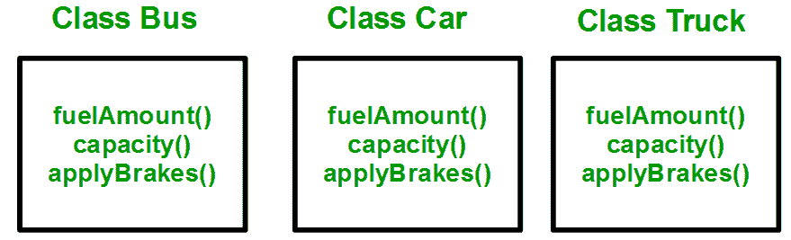
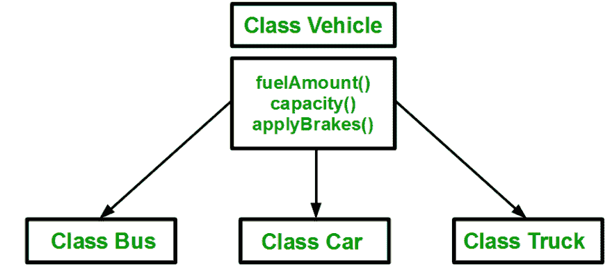
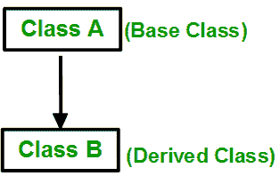
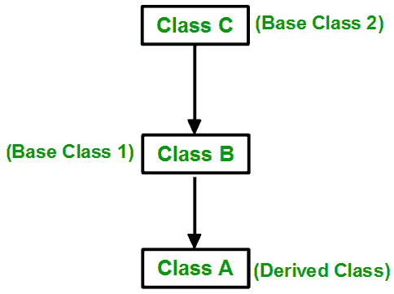

# Dart 中的继承

> 原文：<https://dev.to/jay_tillu/inheritance-in-dart-7mi>

一个类从另一个类派生属性和特征的能力被称为**继承**。程序能够从现有的类中创建新的类。

*   **父类-** 属性被子类继承的类称为父类。父类又称为 ***基类*** 或 ***超类*** 。

*   **子类-** 从另一个类继承属性的类称为子类。子类又称为 ***派生类*** 或 ***基类*** 。

*   考虑一组车辆。你需要为公共汽车、小汽车和卡车创建类。这三个类的方法 fuelAmount()、capacity()、applyBrakes()都是相同的。如果我们创建这些避免继承的类，那么我们必须在三个类的每一个中编写所有这些函数，如下图所示:

[](https://res.cloudinary.com/practicaldev/image/fetch/s--zeULpX6J--/c_limit%2Cf_auto%2Cfl_progressive%2Cq_auto%2Cw_880/https://miro.medium.com/max/879/1%2AqoCOtaoHHRutXCupS3TruA.png)

*   您可以清楚地看到，上述过程导致相同的代码重复 3 次。这增加了出错和数据冗余的机会。为了避免这种情况，使用了继承。

*   如果我们创建一个 vehicle 类，并在其中编写这三个函数，然后从 Vehicle 类继承其余的类，那么我们就可以简单地避免数据的重复并增加可重用性。请看下图，其中三个类是从 vehicle 类继承而来的:

[](https://res.cloudinary.com/practicaldev/image/fetch/s--T0IKXmqQ--/c_limit%2Cf_auto%2Cfl_progressive%2Cq_auto%2Cw_880/https://miro.medium.com/max/942/1%2AsZAbHf60I7tzz0Az7wTJ6Q.png)

*   使用继承，我们只需要编写一次函数，而不是三次，因为我们已经从基类(Vehicle)继承了其余的三个类。

#### 语法

```
class child_class extends parent_class {
  //body of child class
} 
```

Enter fullscreen mode Exit fullscreen mode

*   子类从父类继承除构造函数之外的所有属性和方法。

## 继承的类型

* * *

主要有三种类型的继承:

1.  单一的
2.  Multiple - Dart 不支持多重继承。
3.  多层次

### 单级继承

*   在单一继承中，一个类只允许从一个类继承。即一个子类仅由一个基类继承。

[](https://res.cloudinary.com/practicaldev/image/fetch/s--8UTj07_N--/c_limit%2Cf_auto%2Cfl_progressive%2Cq_auto%2Cw_880/https://miro.medium.com/max/314/1%2AQU6OtMgKoFG5dHKpkfuaVg.png)T3】

```
class Person{
  void showName(String name){
    print(name);
  }

  void showAge(int age){
    print(age);
  }
}

class Jay extends Person {}

main(){
  var jay = new Jay();

  jay.showName("JD");
  jay.showAge(20);
}

Output
JD
20 
```

Enter fullscreen mode Exit fullscreen mode

*   这里还要记住，子类也可以有自己独特的属性和方法。

### 多级继承

*   在这种类型的继承中，派生类是从另一个派生类创建的。

[](https://res.cloudinary.com/practicaldev/image/fetch/s--yHXylQ-g--/c_limit%2Cf_auto%2Cfl_progressive%2Cq_auto%2Cw_880/https://miro.medium.com/max/484/1%2A7Zijjh4nJl6_6G6RWaCffA.png)T3】

```
class Person {
  void showName(String name) {
    print(name);
  }

  void showAge(int age) {
    print(age);
  }
}

class Jay extends Person {
  void showProfession(String profession) {
    print(profession);
  }

  void showNationality(String nationality) {
    print(nationality);
  }
}
//Derived class created from another derived class.
class Sanket extends Jay {} 

main() {
  var sanket = new Sanket();

  sanket.showName("Sanket");
  sanket.showAge(20);
  sanket.showNationality("Indian");
  sanket.showProfession("Engineer");
}

Output

Sanket
20
Indian
Engineer 
```

Enter fullscreen mode Exit fullscreen mode

这篇文章的作者是来自 geeksforgeeks.com 的 Harsh Agrawal。他写了一篇关于 C++继承的精彩文章。在这里，我只是试着用飞镖的方式来解释同样的事情。😉

对继承遗产的人来说就是这样。这是面向对象编程最重要的概念之一。请实践它，并对它有清晰的认识。如果我错过了什么，请随时告诉我，我很乐意向你学习。直到那时，继续爱，继续编码。我一定会在下一篇文章中介绍您。

记住没有老师，没有书，没有视频教程，也没有博客能教会你一切。有人说，学习是一个旅程，旅程永无止境。只是从这里那里收集一些数据，读一读，学一学，练一练，试着去应用。不要因为做不到或者不知道这个概念或者那个概念而犹豫。记住，每个程序员都是从你现在走的这条路上走过的。记住每个大师都曾经是初学者。努力工作，全力以赴。

### 欲了解更多信息，请访问以下链接

*   [Fuchsia OS 官方网站](https://fuchsia.dev/)
*   [Dart 官方网站](https://dart.dev/)
*   [颤振官方网站](https://flutter.dev/)

> 想和我联系吗？以下是链接。我很乐意成为你的朋友。😊
> [Twitter](https://twitter.com/jay_tillu)
> [脸书](https://www.facebook.com/jaytillu.1314/)
> [insta gram](https://www.instagram.com/jay.tillu/)
> [Medium](https://medium.com/jay-tillu)
> 或者直接在[developerj13@gmail.com](mailto:developerj13@gmail.com)给我发邮件