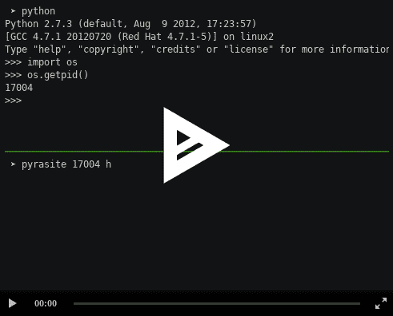

# 在 Python 进程中注入代码

> 原文：<https://dev.to/petercour/inject-code-in-python-process-3cfh>

Python 被广泛用于软件开发。大学、公司等等。那么 Python 是不是会解决所有计算机问题的乌托邦？

您知道可以将代码注入到正在运行的 Python 进程中吗？你可以用[吡喃矿](http://pyrasite.com)来做这个。这需要 Python 2.4 或更高版本。

你可以在这里看一个演示:[演示](https://asciinema.org/a/1148/embed?)

[](https://asciinema.org/a/1148/embed?)

它附带了几个程序，包括一个外壳

```
$ pyrasite-shell
Usage: pyrasite-shell <PID> 
```

所以你可以注入一个有效载荷

```
$ pyrasite <PID> payload.py 
```

你可以在这里找到一些[示例载荷](https://pyrasite.readthedocs.io/en/latest/Payloads.html)。

所以如果你有了进程 id，你就可以把任何东西注入到正在运行的程序中。

[](https://camo.githubusercontent.com/c83384d57d36599ec73d501067b08e3c883b9252/687474703a2f2f6c65776b2e6f72672f696d672f70797261736974652f70797261736974652d696e666f2e706e67)

还有一个 [GUI](https://github.com/lmacken/pyrasite-gui) 。它让您可以轻松地监控、分析、自省和修改正在运行的 Python 程序。

相关链接:

*   [Pyrasite 项目](https://github.com/lmacken/pyrasite)
*   [学习 Python](https://pythonbasics.org/)
*   [Python 练习](https://pythonbasics.org/exercises/)