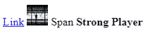
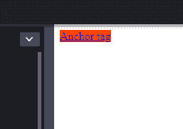
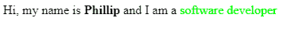
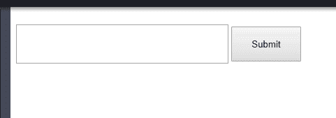
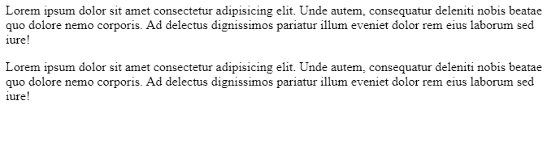
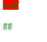
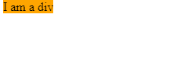

# 内联与内联-块与块

> 原文：<https://dev.to/shimphillip/inline-vs-inline-block-vs-block-280h>

每个 HTML 元素都是一个矩形或正方形的块，并拥有显示属性。除非明确指定，否则它们都设置了 inline、inline-block 或 block 值，只有*表*及其相关元素除外。认识到这些 HTML 元素的行为是很重要的，因为它们是我们布局的组成部分。

## 内嵌

以下是常见内联元素的列表

*   `<a>`
*   `<span>`
*   ``
*   `<strong>`

内联元素与不同的内联或内联块元素并排放在一行中。把它们想象成上面封面照片中的石头。只有当同一行没有足够的空间容纳更多的行内元素时，它们才会从新行开始。

我将多个内联元素堆叠在一起。

```
<a href="#">Link</a>

<span>Span</span>
<strong>Strong Player</strong> 
```

[](https://res.cloudinary.com/practicaldev/image/fetch/s--eGFiLbR8--/c_limit%2Cf_auto%2Cfl_progressive%2Cq_auto%2Cw_880/https://thepracticaldev.s3.amazonaws.com/i/2uu9axnhv0tyc5m5dw38.PNG)

* * *

使用行内元素时有一个注意事项。不能应用特定的高度或宽度以及上边距或下边距属性。因此，如果没有任何填充或侧边空白，行内元素将只和它们内部的内容一样大。

您可以看到这些 CSS 属性并不影响行内元素。

```
<a href="#">Anchor tag</a> 
```

```
a {
  background: orangered;
  width: 300px;
  height: 300px;
  margin-top: 100px;
  margin-bottom: 100px;
} 
```

[](https://res.cloudinary.com/practicaldev/image/fetch/s--x6dIfyBp--/c_limit%2Cf_auto%2Cfl_progressive%2Cq_auto%2Cw_880/https://thepracticaldev.s3.amazonaws.com/i/ugnyrulk4zuuo0yx44to.PNG)

* * *

除了直接使用内联元素之外，一个非常常见的例子是当您想要突破并赋予特定元素一种样式时。

```
<p>
  Hi, my name is <strong>Phillip</strong> and I am a
  <span>software developer</span>
</p> 
```

```
span {
  color: lime;
} 
```

[](https://res.cloudinary.com/practicaldev/image/fetch/s--AT7j5sqR--/c_limit%2Cf_auto%2Cfl_progressive%2Cq_auto%2Cw_880/https://thepracticaldev.s3.amazonaws.com/i/pvyyscj4dybznjn1bntx.PNG)

* * *

## 内嵌块

以下是常见内联块元素的列表

*   `<input>`
*   `<button>`
*   `<select>`
*   `<textarea>`

有趣的是，您会注意到这些元素中的大多数都与`<form>`元素相关。内联块本质上与内联元素非常相似。他们可以做内联所做的一切，但也可以设置一些宽度，高度和垂直边距！

使用内联块元素创建简单的表单很容易。内联块的一个缺点是它们在自身周围创造了空间。(注意输入和按钮之间)。

```
<input type="text" /> <button>Submit</button> 
```

```
input {
  width: 300px;
  height: 50px;
}

button {
  width: 100px;
  height: 50px;
  margin-top: 20px;
} 
```

[](https://res.cloudinary.com/practicaldev/image/fetch/s---ti-eWp5--/c_limit%2Cf_auto%2Cfl_progressive%2Cq_auto%2Cw_880/https://thepracticaldev.s3.amazonaws.com/i/m6soaebcouiknom9qrda.PNG)

* * *

## 块

以下是常见块元素的列表

*   `<p>`
*   `<h1>`
*   `<div>`
*   `<header>`

块元素总是从新行开始。它们也会占据一整行或一整宽的空间。这意味着不可能有其他 HTML 元素可以与块级元素并存。您还可以设置宽度/高度和垂直边距。

一个常见的场景是博客中的一系列段落。

```
<p>
  Lorem ipsum dolor sit amet consectetur adipisicing elit. Unde autem,
  consequatur deleniti nobis beatae quo dolore nemo corporis. Ad delectus
  dignissimos pariatur illum eveniet dolor rem eius laborum sed iure!
</p>

<p>
  Lorem ipsum dolor sit amet consectetur adipisicing elit. Unde autem,
  consequatur deleniti nobis beatae quo dolore nemo corporis. Ad delectus
  dignissimos pariatur illum eveniet dolor rem eius laborum sed iure!
</p> 
```

[](https://res.cloudinary.com/practicaldev/image/fetch/s--2g7aqZiV--/c_limit%2Cf_auto%2Cfl_progressive%2Cq_auto%2Cw_880/https://thepracticaldev.s3.amazonaws.com/i/o284mli50tp4pq39jwi7.PNG)

* * *

### 可容纳且灵活

有些元素能够包含其他元素，有些则不能。一般的经验法则是遵循从大到小的层次结构。在 div 中嵌套内联或内联块元素没有问题。样式将按预期工作。然而，如果你试图把一个块元素放在一个 span 里面，就会导致一些奇怪的问题。

这是你看到的非常奇怪的行为。跨度内的段落没有红色背景但有绿色？

```
<span>asdf<p>gg</p></span> 
```

```
span {
  background: red;
  color: green;
} 
```

[](https://res.cloudinary.com/practicaldev/image/fetch/s--g8Vm3YVS--/c_limit%2Cf_auto%2Cfl_progressive%2Cq_auto%2Cw_880/https://thepracticaldev.s3.amazonaws.com/i/z18c36g5uwkahgzb2vhr.PNG)

* * *

到目前为止，我只展示了它们本来的样子。但是您可以手动操作 CSS 显示属性来满足您想要的布局。您可以很容易地给出一个 inline 的 div 显示，它将表现为一个 inline 元素。例如:

请注意，div 的背景颜色没有延伸到它的全部宽度！

```
<div>I am a div</div> 
```

```
div {
  display: inline;
  background: orange;
} 
```

[](https://res.cloudinary.com/practicaldev/image/fetch/s--Gj8YOGRG--/c_limit%2Cf_auto%2Cfl_progressive%2Cq_auto%2Cw_880/https://thepracticaldev.s3.amazonaws.com/i/ksb1zqei8zte4v4w9c88.PNG)

* * *

## 重述

我创建了一个表格来涵盖我在文章中提出的要点。

|  | 在一条直线上的 | 内嵌块 | 街区 |
| --- | --- | --- | --- |
| 换行 | 不 | 不 | 是 |
| 一起 | 是 | 是 | 不 |
| 宽度/高度和边距 | 不 | 是 | 是 |
| 可以包含 | 不 | 在一条直线上的 | 内嵌，内嵌块 |
|  |  |  | adblock |

这里有一些有用的参考。

[块级元素的完整列表。](https://developer.mozilla.org/en-US/docs/Web/HTML/Block-level_elements#Elements)

内联级别元素的完整列表:包括内联块元素。

感谢您的阅读！希望这篇文章能帮助你在下一个 css 布局中使用构建模块。