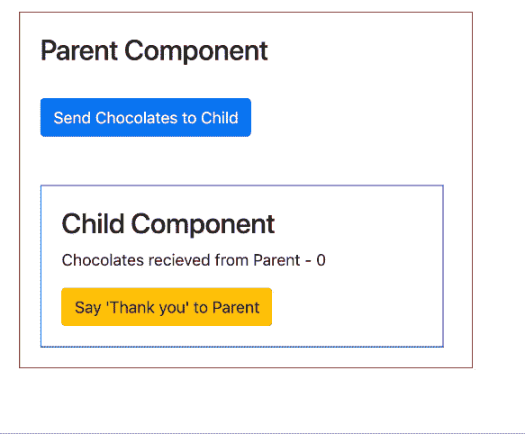

# Angular 中的@Input @Output 装饰器

> 原文：<https://dev.to/chilupa/input-output-decorators-in-angular-3hfa>

## 装饰工

装饰器只是一个修改类定义或类内部属性的函数。这些装饰器也被称为注释，主要分为两种类型- *类装饰器*和*类字段装饰器*。

## 类装饰器

紧接在类定义之前出现的装饰器。
例如，在类定义之前提到的`@Component()` decorator 有元数据帮助 Angular 知道那些类或属性应该如何工作。

```
@Component({
 selector: 'app-root',
 templateUrl: './app.component.html',
 styleUrls: ['./app.component.css']
})
export class AppComponent {
 title = 'app';
} 
```

Enter fullscreen mode Exit fullscreen mode

其他一些类装饰器的例子有`@Injectable()`、`@NgModule()`、`@Directive()`、`@Pipe()`

## 类字段装饰器

在类定义中紧接在字段之前出现的装饰符。
比如说，`@Input()`和`@Output()`。

```
@Component({
  selector: 'app-root',
  templateUrl: './app.component.html',
  styleUrls: ['./app.component.css'],
})
export class AppComponent {
  @Input() count;
  // code
} 
```

Enter fullscreen mode Exit fullscreen mode

为了详细了解`@Input()`、`@Output()`装饰者，我以一个简单的父子关系为例。比方说，我们有一个父母给他们的孩子巧克力，孩子收到巧克力后感谢他们的父母。

<figure>

[](https://res.cloudinary.com/practicaldev/image/fetch/s--Z7TcIyZA--/c_limit%2Cf_auto%2Cfl_progressive%2Cq_66%2Cw_880/https://cdn-images-1.medium.com/max/1600/1%2AtUL26MF1SXGQnRjNLSSgQA.gif)

<figcaption>Parent to Child & Child to Parent Components Communication</figcaption>

</figure>

从上面的 GIF 中，栗色块表示父组件，蓝色块表示`ChildComponent`。

## 亲子沟通，使用@Input()

首先将巧克力计数设置为 0。当用户点击 UI 上的发送巧克力按钮时，巧克力数量增加。

*parent.component.html*T2】

```
<button (click)="sendToChild()">Send Chocolates to Child</button>
<app-child [chocolateCount]="chocolate"></app-child>
parent.component.ts
export class ParentComponent { 
  chocolate = 0;  
  sendToChild() { 
    this.chocolate++; 
  }
} 
```

Enter fullscreen mode Exit fullscreen mode

当父母给孩子送巧克力时，孩子应该能够收到。因此，我们将使用 chocolatesCount 变量获取巧克力，并用@Input() decorator 修饰它，因为它来自 ParentComponent。

*child.component.html*T2】

```
<p>Chocolates recieved from Parent - {{chocolateCount}}</p>
child.component.ts
export class ChildComponent {
  @Input() chocolateCount;
} 
```

Enter fullscreen mode Exit fullscreen mode

## 子对父通信，使用@Output()

既然孩子收到了父母送的巧克力，他应该感谢父母。

*child.component.html*T2】

```
<button (click)='sayThanks($event)'>Say 'Thank you' to Parent</button> 
```

Enter fullscreen mode Exit fullscreen mode

使用`@Output()`有点棘手，但是当你正确理解它的时候很容易。让我们用`@Output()`来修饰感谢变量。使用 thanks 变量，我们将从子组件向父组件发出值(' Thank you ')。此外，我们需要一个`EventEmitter`实例，在那里我们指定我们发出的值的类型。

*child.component.ts*

```
export class ChildComponent {
@Output() thanks: EventEmitter<string> = new EventEmitter<string>();

sayThanks($event) { 
    this.thanks.emit('Thank you'); 
  }
} 
```

Enter fullscreen mode Exit fullscreen mode

现在听一下 ParentComponent 中的这个事件。事件参数将为您提供来自 ChildComponent 的“感谢”文本。

*parent.component.html*T2】

```
<app-child [chocolateCount]="chocolate" (thanks)="sayThanks($event)"></app-child> 
```

Enter fullscreen mode Exit fullscreen mode

*parent . component . ts*T2】

```
export class ParentComponent {
  chocolate = 0; 
  thankYouText = '';
  sendToChild() { 
    this.chocolate++; 
  }
  sayThanks(event) { 
    this.thankYouText = event; 
  }
} 
```

Enter fullscreen mode Exit fullscreen mode

至此，您看到了在 Angular 中使用`@Input()`和`@Output()`装饰器的父到子和子到父组件的通信。希望你喜欢阅读这篇文章。你可以参考完整的代码[这里](https://github.com/chilupa/angular-input-output-decorators)。