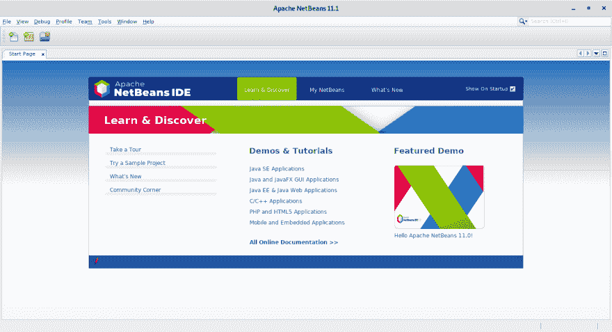

# 在 Fedora 30 上安装 Apache Netbeans 11

> 原文：<https://dev.to/robbinespu/installing-apache-netbeans-11-on-fedora-30-3bob>

[](https://res.cloudinary.com/practicaldev/image/fetch/s--Y3oJB40b--/c_limit%2Cf_auto%2Cfl_progressive%2Cq_auto%2Cw_880/https://i.imgur.com/8x2yFwu.png%23center)*Apache NetBeans 11*

我目前正在阅读 Packt 出版公司的 Nisheeth Joshi 的**“面向初学者的 Java 人工智能实践”**，这本书要求我在计算机上安装 Apache NetBeans IDE。

缺乏安装教程，所以我创建了这个帖子🤘

首先，让我们检查一下当前安装的 java JRE 和 JDK:

```
$ java -version
openjdk version "1.8.0_222"
OpenJDK Runtime Environment (build 1.8.0_222-b10)
OpenJDK 64-Bit Server VM (build 25.222-b10, mixed mode)

$ javac -version
bash: javac: command not found... 
```

我现在没有 java 编译器，我想忽略当前的 Java 8 运行时并从 OpenJDK 安装 JDK 11，如果你想使用 Oracle JRE 和 JDK，请阅读[使用替代实用程序和 JRE & JDK](https://robbinespu.github.io/eng/2018/03/21/Updating_java_with_alternative.html) 作为解决方案。我将使用为 Fedora 库发布的 openJDK。

```
$ sudo dnf install java-11-openjdk java-11-openjdk-devel
Last metadata expiration check: 0:25:43 ago on Fri 30 Aug 2019 02:17:06 PM +08.
Dependencies resolved.
=================================================================================================================================================================================================
 Package Architecture Version Repository Size
=================================================================================================================================================================================================
Installing:
 java-11-openjdk x86_64 1:11.0.4.11-0.fc30 updates 227 k
 java-11-openjdk-devel x86_64 1:11.0.4.11-0.fc30 updates 3.4 M
Installing dependencies:
 java-11-openjdk-headless x86_64 1:11.0.4.11-0.fc30 updates 39 M
 ttmkfdir x86_64 3.0.9-56.fc30 fedora 51 k
 xorg-x11-fonts-Type1 noarch 7.5-21.fc30 fedora 517 k

Transaction Summary
=================================================================================================================================================================================================
Install 5 Packages

Total download size: 43 M
Installed size: 182 M
Is this ok [y/N]: y 
```

在安装了 java-11-openjdk 和 java-11-openjdk-devel 之后，我的运行时仍然使用旧的 java 运行时。我们需要激活新安装的 java。

```
$ sudo alternatives --config java

There are 2 programs which provide 'java'.

  Selection Command
-----------------------------------------------
*+ 1 java-1.8.0-openjdk.x86_64 (/usr/lib/jvm/java-1.8.0-openjdk-1.8.0.222.b10-0.fc30.x86_64/jre/bin/java)
   2 java-11-openjdk.x86_64 (/usr/lib/jvm/java-11-openjdk-11.0.4.11-0.fc30.x86_64/bin/java)

Enter to keep the current selection[+], or type selection number: 2 
```

让我们(再)检查一下

```
$ java -version
openjdk version "11.0.4" 2019-07-16
OpenJDK Runtime Environment 18.9 (build 11.0.4+11)
OpenJDK 64-Bit Server VM 18.9 (build 11.0.4+11, mixed mode, sharing)

$ javac -version
javac 11.0.4 
```

现在，让我们将 NetBeans IDE 下载到我们的计算机上。

从[这里](https://netbeans.apache.org/download/index.html)查看并下载 NetBeans IDE(当前版本是 NB 11.1 和 NT 11.0 LTS)，Apache NetBeans 一年发布四次。长期支持(LTS)版本和早期访问版本。我将使用提供的 _ **二进制文件** _ 在我的计算机上安装 Apache NetBeans 11.1。

```
$ curl -c -L -O https://www-us.apache.org/dist/netbeans/netbeans/11.1/netbeans-11.1-bin.zip
  % Total % Received % Xferd Average Speed Time Time Time Current
                                 Dload Upload Total Spent Left Speed
100 319M 100 319M 0 0 2453k 0 0:02:13 0:02:13 --:--:-- 3428k 
```

下载二进制文件后，让我们提取到`/opt/`

```
$ sudo unzip -d /opt/ ~/Downloads/netbeans-11.1-bin.zip 
```

我不喜欢以超级用户(root)的身份运行二进制文件，所以让我们更改并将当前用户设置为所有者

```
$ sudo chown -R $USER:$USER /opt/netbeans 
```

使符号链接便于从终端
访问

```
$ sudo ln -s /opt/netbeans/bin/netbeans /usr/local/bin/netbeans 
```

我们已经完成了，现在只需从您的终端运行`netbeans`，Apache NetBeans IDE 将会启动。

如果需要，您可能需要通过在`/usr/share/applications/`目录下创建新文件来创建桌面条目(菜单)。

```
$ sudo vim /usr/share/applications/netbeans.desktop 
```

在下面添加文本并保存。

```
[Desktop Entry]
Name=Apache NetBeans
Comment=Code Editing Java.
GenericName=IDE
Exec=/opt/netbeans/bin/netbeans
Icon=/opt/netbeans/nb/netbeans.icns
Type=Application
StartupNotify=true
Categories=Utility;Development;IDE;
MimeType=text/plain;inode/directory;
Keywords=Java; 
```

现在您已经下载并安装了 Netbeans IDE，您可以从应用程序启动菜单或终端启动它。一旦应用程序启动，您应该会看到默认的欢迎页面☕