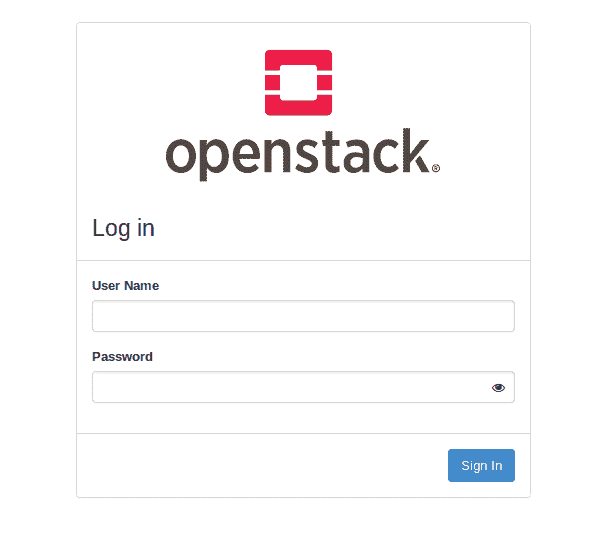

# 在 Unbuntu 18.04 LTS 和上安装 OpenStack...

> 原文：<https://dev.to/ai101gh/installing-openstack-on-unbuntu-18-04-lts-and-33hd>

我只是不断地想出更多失败的 OpenStack 安装！我非常沮丧的经历记录在这里之后，出于某种未知的原因，我继续前进，但到了这个阶段，我感到被诅咒了。

```
$ juju list-machines 
```

Enter fullscreen mode Exit fullscreen mode

我选择了一台 juju 机器并运行了

```
$ juju ssh 3
$ sudo less /var/log/juju/machine-3.log 
```

Enter fullscreen mode Exit fullscreen mode

这告诉我

> 2019-09-15 04:55:50 警告 juju.cmd.jujud machine.go:826 确定 kvm 支持:信息:/dev/kvm 不存在
> 
> 提示:sudo modprobe kvm_intel
> 
> modprobe:错误:../libk mod/libk mod . c:586 kmod _ search _ moddep()无法打开 moddep 文件“/lib/modules/5 . 0 . 0-27-generic/modules . dep . bin”
> 
> modprobe:致命错误:在目录/lib/modules/5.0.0-27 中找不到模块 msr 一般错误:退出状态 1
> 
> 不可能有 kvm 容器

所以在 **/lib/modules**
中确实什么都没有

```
$ ls /lib/modules/*/modules.dep.bin
ls: cannot access '/lib/modules/*/modules.dep.bin': No such file or directory 
```

Enter fullscreen mode Exit fullscreen mode

我尝试重新安装内核，一切正常:

```
$ sudo apt-get install --reinstall linux-image-5.0.0-27
$ sudo modprobe kvm_intel
$ echo $?
0 
```

Enter fullscreen mode Exit fullscreen mode

我坚持了一段时间，但是各种容器都没有上线，我不知道为什么。还有一些模糊的错误信息，比如“必须不受限制地安装从属应用程序”。我甚至不知道如何在合理的时间内为各种虚拟机设置默认的内核和内存数量。

在最后一次尝试中，我移除了所有的巫毒并遵循了这些指示:[https://www . journal dev . com/30037/install-open stack-Ubuntu-dev stack](https://www.journaldev.com/30037/install-openstack-ubuntu-devstack)。

[](https://res.cloudinary.com/practicaldev/image/fetch/s--DKS2LizN--/c_limit%2Cf_auto%2Cfl_progressive%2Cq_auto%2Cw_880/https://thepracticaldev.s3.amazonaws.com/i/w9o4gzadgwz7ihdjb1zx.png)

这并不是完全没有问题。它安装的比我想要的多。安装花了 1 个多小时。有一个用错误的权限创建的目录和一个丢失文件的目录被卡住了。但是因为它输出所有正在执行的命令，所以很容易修复错误。

我想如果我再不得不面对**变戏法**的话，我会呕吐。当魔法得到适当的维护时，一切都是阳光和光明，但当事情开始出错时，却是一场噩梦。