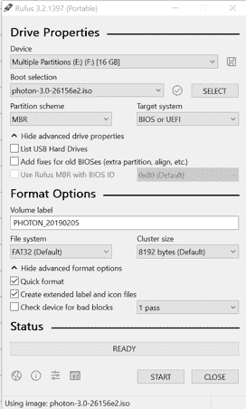

# 在 Dell Edge Gateway 3001/3002 上安装 Photon OS

> 原文：<https://dev.to/solacedevs/installing-photon-os-on-a-dell-edge-gateway-3001-3002-50dd>

在 Dell Edge Gateway 300x 系列上安装 Photon 操作系统(实际上是任何操作系统)通常非常棘手，因为 3001 和 3002 都不提供显示端口。因此，任何操作系统安装都必须是无头和自动化的。
在最近尝试安装 Photon OS 的过程中，我发现 Photon OS 网站上为 Edge Gateway 300x 提供的说明遗漏了一些细节。
幸运的是，我从 VMware 的一个乐于助人的人那里得到了一些非常好的指导，帮助我完成了一些我必须解决的调整。

在这篇文章中，我将提供一步一步的指南来创建一个可引导的 USB 记忆棒，用于自动安装 Photon OS，以及如何在戴尔网关上运行它。光子操作系统 ISO 包括 grub 和 MBR 引导选项的配置。Photon OS 网站上的说明([https://VMware . github . io/Photon/assets/files/html/3.0/Photon _ installation/Installing-Photon-OS-on-Dell-300 x . html](https://vmware.github.io/photon/assets/files/html/3.0/photon_installation/Installing-Photon-OS-on-Dell-300X.html))引用了基于 grub 的方法。
我将使用 MBR 方法——基本步骤是:

*   从 Photon OS ISO 映像创建可引导的 USB 介质
*   为自动引导配置引导菜单
*   为无头安装配置 kickstarter
*   添加 BIOS 脚本以指示网关从 USB 启动
*   使用 USB 介质将 Photon OS 安装到网关上

最好使用带有磁盘活动指示灯的 u 盘，这样更容易监控安装过程。

## 从 Photon OS ISO 创建可启动的 USB 介质

从 Photon OS 网站下载适用于您的处理器架构的 ISO 文件(适用于 Dell Edge GW 的 x86/64):[https://github.com/vmware/photon/wiki/Downloading-Photon-OS](https://github.com/vmware/photon/wiki/Downloading-Photon-OS)

将 ISO 的内容复制到 u 盘上。因此，记忆棒必须是 FAT 格式，并且可以通过 MBR 引导。

在 Windows 上，使用 Rufus 很容易做到这一点，在“引导选择”中选择“ISO 文件”,并在磁盘上找到 Photon ISO 文件。确保选项与下面相似。如果您没有看到“文件系统”的“FAT32(默认)”选项，请使用任何其他可能存在的 FAT32 选项，并使用其默认的簇大小。
[](https://res.cloudinary.com/practicaldev/image/fetch/s--2LLu3sFQ--/c_limit%2Cf_auto%2Cfl_progressive%2Cq_auto%2Cw_880/https://thepracticaldev.s3.amazonaws.com/i/6n070f9b04l7ha26e3pq.png)

## 配置自动启动的引导菜单

打开您准备好的 u 盘上的 syslinux.cfg 文件，并验证它看起来像这样:

```
DEFAULT loadconfig

LABEL loadconfig
  CONFIG /isolinux/isolinux.cfg
  APPEND /isolinux/ 
```

Enter fullscreen mode Exit fullscreen mode

该文件引用了`isolinux`文件夹中的`isolinux.cfg`。在文本编辑器中打开它。
这个文件中的行`default vesamenu.c32`强制安装进入图形模式，即使提示和超时值应该确保引导自动运行。
将该行改为`default install`，您的文件应该类似于下面这样:

```
# D-I config version 2.0
include menu.cfg
default install
prompt 0
timeout 0 
```

Enter fullscreen mode Exit fullscreen mode

引导菜单现在配置为自动运行`install`安装选项。

接下来的步骤将使用 kickstarter 为自动安装配置`install`选项。
打开`/isolinux/menu.cfg`并更改`append`行，如下所示，这样 kickstarter 就会获得一个配置文件(可以通过光盘访问):

```
menu hshift 7
menu width 61

menu title Photon installer boot menu
include stdmenu.cfg

default install
label install
    menu label ^Install
    menu default
    kernel vmlinuz
    append initrd=initrd.img root=/dev/ram0 loglevel=3 photon.media=cdrom ks=cdrom:/isolinux/sample_ks.cfg console=ttyS0,115200n8 
```

Enter fullscreen mode Exit fullscreen mode

## 配置 kickstarter 进行无头安装

现在让我们回顾一下配置自动安装的`/isolinux/sample_ks.cfg`。该文件中所需的更改也记录在 Photon OS 站点上——这是 grub 引导选项使用的同一文件。
这个文件中的重要部分是调整`postinstall`部分，为 root 帐户启用远程 SSH，这样一旦安装完成，您就可以实际连接到网关。
`postinstall`步骤简单地修补了`/etc/ssh/sshd_config`。

另外，根据需要调整`hostname`和`password.text`，并记下这些值，因为安装后您将需要这些值来连接到网关。
还要注意，对于 300X 系列，`disk`设备名称必须指定为`/dev/mmcblk0`

```
{
    "hostname": "photon-machine",
    "password": 
        {
            "crypted": false,
            "text": "Secret!"
        },
    "disk": "/dev/mmcblk0",
    "partitions": [
                        {"mountpoint": "/", "size": 0, "filesystem": "ext4"},
                        {"mountpoint": "/boot", "size": 128, "filesystem": "ext4"},
                        {"mountpoint": "/root", "size": 128, "filesystem": "ext4"},
                        {"size": 512, "filesystem": "swap"}
                    ],
    "packagelist_file": "packages_minimal.json",
    "additional_packages": ["vim"],
    "postinstall": [
                        "#!/bin/sh",
                        "sed -i 's/PermitRootLogin no/PermitRootLogin yes/g' /etc/ssh/sshd_config"
                   ],
    "public_key": "<ssh-key-here>",
    "install_linux_esx": false
} 
```

Enter fullscreen mode Exit fullscreen mode

确保在`isolinux`文件夹中有一个`packages_minimal.json`，并且看起来像这样:

```
{
    "packages": [
                 "minimal",
                 "linux",
                 "initramfs"
                 ]
} 
```

Enter fullscreen mode Exit fullscreen mode

## 添加 BIOS 脚本，指示网关从 USB 启动

为了强制网关从 u 盘启动，我们需要添加一个文件来指示 BIOS 这样做。

在 u 盘根目录下创建一个`UsbInvocationScript.txt`文件，内容如下:

```
usb_disable_secure_boot noreset;
usb_one_time_boot usb; 
```

Enter fullscreen mode Exit fullscreen mode

网关手册提供了关于使用 USB 调用脚本的更多信息

## 使用 USB 介质安装到网关上

现在，您可以在网关上安装操作系统了。

安装过程有两个视觉指示器:

*   u 盘的活动指示灯
*   网关的状态 LED-只有两个处于活动状态，即电源和网络 LED。

关闭网关电源-拔下网络/POE 或电源线。插入您的 u 盘并再次给网关通电。

我将描述通常会发生什么，但将跳过细节。
如果您想详细了解哪些网关指示灯会闪烁以及以何种顺序闪烁，请查看“Edge Gateway USB script utility 用户指南”，该指南可从[使用 USB 调用脚本](https://www.dell.com/support/manuals/uk/en/ukbsdt1/dell-edge-gateway-3000-series/dell-edge_gateway-3003-install_manual/using-the-usb-invocation-script?guid=guid-bda5b4d9-1d1c-40df-81b9-c652a55f43a4&lang=en-us)获得。

一旦你启动了网关，我建议你密切监视安装。
以下情况会发生:

*   电源和网络 LED 变为绿色
*   网关扫描 USB 接口上的`UsbInvocationScript.txt`文件。
*   一旦网关找到我们的调用脚本，u 盘的 LED 就会闪烁。
*   执行 BIOS 脚本时，网关指示灯以不同的模式闪烁。闪烁模式对应于`UsbInvocationScript.txt`中的命令
*   最终，电源指示灯变为绿色，网络指示灯变为琥珀色，并且两个指示灯都将持续亮起。
*   u 盘的活动 LED 闪烁，表示网关从 u 盘启动，并在安装过程中开始复制数据。
*   最终-5 到 10 分钟后，两个网关指示灯将再次变绿。**一旦发生这种情况，请立即拔下您的 u 盘，否则网关可能会从 u 盘重新启动并再次开始安装。**

安装完成后，在路由器中找到网关的 IP 地址。根据您的路由器，您可以通过网关的 MAC 地址或在`/isolinux/sample_ks.cfg`中设置的主机名来识别 IP 地址。

这是它在我的路由器上的样子，显示了 IP，主机名和 MAC 地址:
[](https://res.cloudinary.com/practicaldev/image/fetch/s--350kE7-O--/c_limit%2Cf_auto%2Cfl_progressive%2Cq_auto%2Cw_880/https://thepracticaldev.s3.amazonaws.com/i/jjqsel8p6ch1tz560i9h.png)

您现在可以使用上面的 IP 地址和您在`/isolinux/sample_ks.cfg` :
中设置的 root 密码通过 SSH 连接到网关

```
ssh root@192.168.0.112 
```

Enter fullscreen mode Exit fullscreen mode