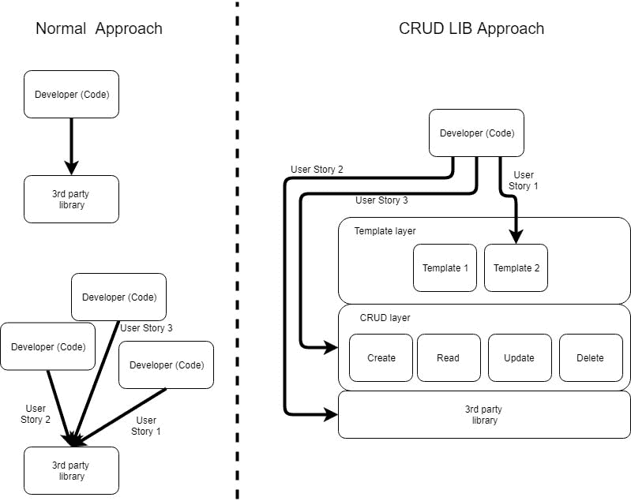

# 提供 CRUD 功能的中间库:相关工作

> 原文：<https://dev.to/khanaazero/intermediate-library-providing-crud-functionality-related-work-3dcg>

我目前计划创建一个库(我称之为 CRUD 库),作为开发人员自己的代码和外部 UI/数据表示库之间的中间层。外部库可以是例如显示列表或让用户操作列表(删除条目、排序、搜索等)的库。我的计划是创建这个中间层，它封装了第三方库的细节，并且只为最常见的用例公开一个更简单易用的“CRUD”层，以加速大多数场景的开发。我画了一张图来更详细地解释这个想法:

通过这种方式，开发人员将能够检查所提供的模板之一是否已经符合他的用户故事(这将是图像中的用户故事 1)，或者他是否将自己实现最外层并使用 CRUD 层(图像中的用户故事 2)，或者他的用例是否如此具体，以至于他仍然需要手动与第三方库对话。

想法是找到一些通用的数据操作模式(这就是为什么我想称之为 CRUD 库),可以在任何第三方库上重用，所以无论第三方库如何定义自己的接口，我都希望在上面公开一个 CRUD 接口，开发者已经习惯于使用它。类似于适配器模式，但在库模式级别。

CRUD 层之上的模板层是这一思想的额外扩展，当然，它对于每个第三方库来说都是不同的，但是我想研究一下，我是否也可以找到非常不同的库和目标数据结构的通用模式。

我的问题是，如果有人知道这方面的任何现有项目或研究，或者有任何其他见解想分享，我欢迎任何反馈或批评，谢谢！