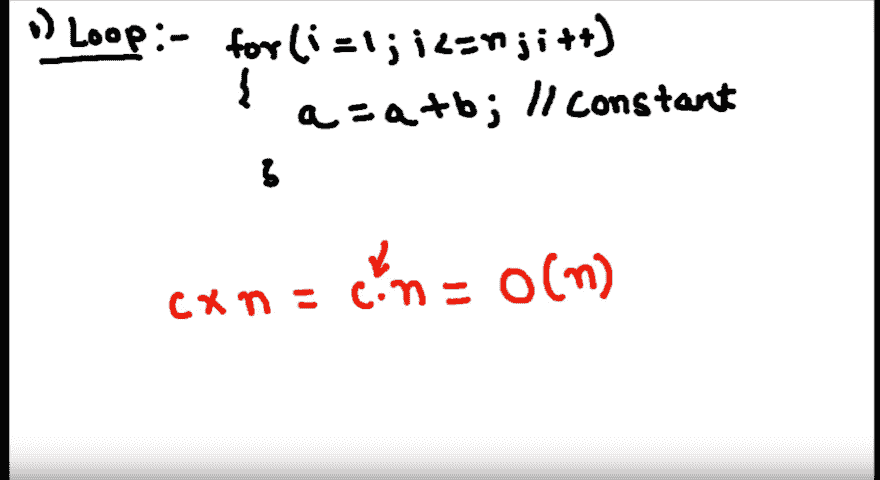
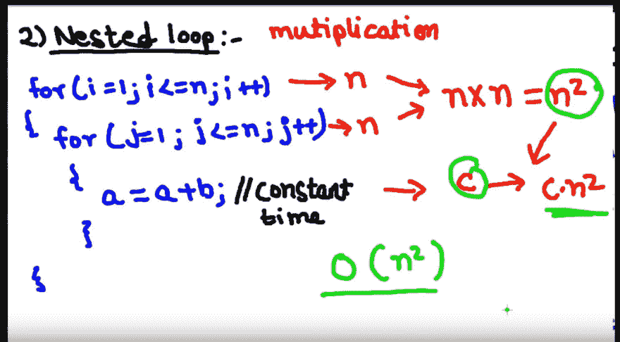
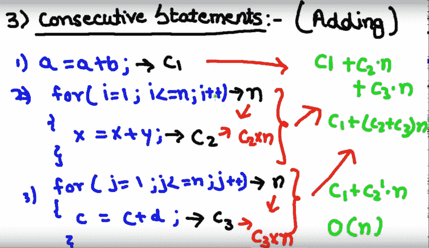
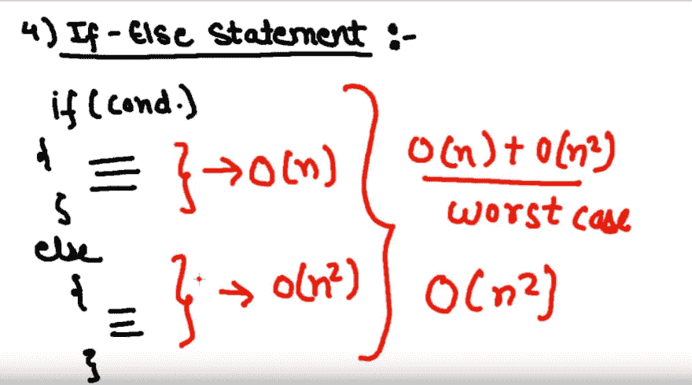
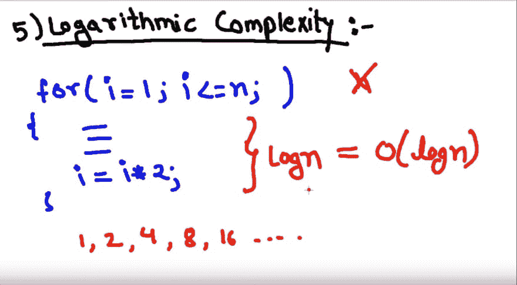
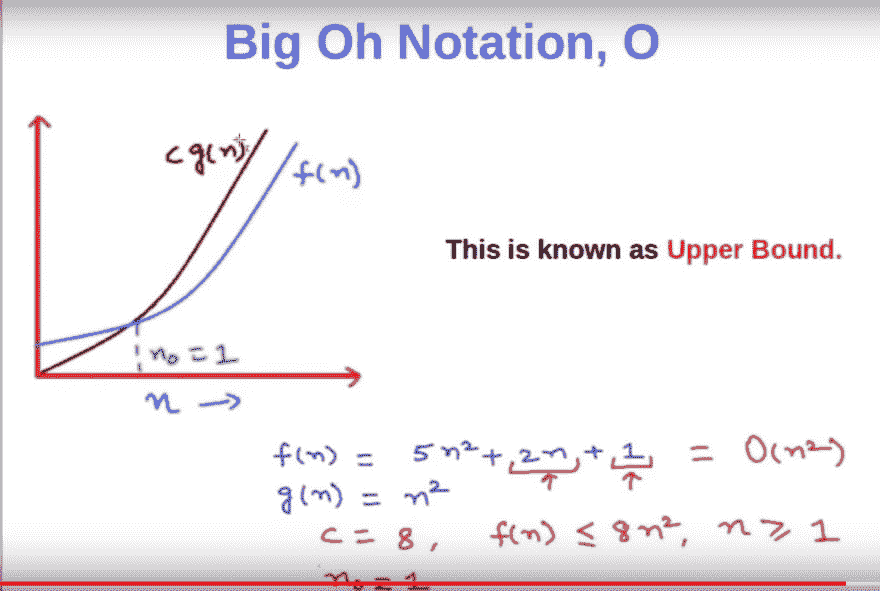
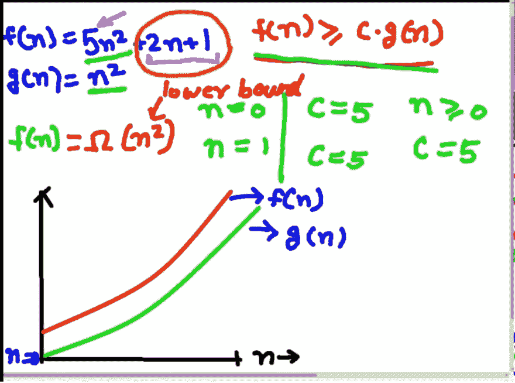

# 面试准备—算法运行时间

> 原文：<https://dev.to/nabendu82/interview-preparation-algorithm-running-time-ifd>

欢迎来到本系列的第 12 部分和算法运行时间问题部分。

很多时候，面试官会让你写一个算法，然后问你它的大 O 或者最差运行时间。这部分会教你如何处理像他们这样的问题。

**问题 72-** *下面简单 for 循环的大 O 是什么？*

```
for(var i=1; i<=n; i++) {
   a = a + b;
} 
```

**答案-** 循环会运行“n”次，“a+b”可以认为是常数“c”。所以，最大或最差的运行时间将是“c.n”。不，我们可以忽略这个常数，因为它很小，n 很大。

[ ](https://res.cloudinary.com/practicaldev/image/fetch/s--wO8jDiwo--/c_limit%2Cf_auto%2Cfl_progressive%2Cq_auto%2Cw_880/https://cdn-images-1.medium.com/max/4176/1%2AKC3cAco_kOWTAhJai4j4qA.png) *简单循环*

所以，单循环的大 O 是 **O(n)** 。

**问题 73-** *下面嵌套的 for 循环的大 O 是什么？*

```
for(var i=1; i<=n; i++) {
    for(var j =1; j<=n; j++) {
      a= a + b;
    }
} 
```

**答案-** 任意嵌套 for 循环的最坏运行时间或大 O 计算如下。
外层的“for”循环将运行“n”次，内层的“for”循环将再运行“n”次。这个常数会和它相乘。但是对于较大的“n ”,我们可以忽略“c”。大 O 是 **O( *n* )** 。

[ ](https://res.cloudinary.com/practicaldev/image/fetch/s--cqd5UMLA--/c_limit%2Cf_auto%2Cfl_progressive%2Cq_auto%2Cw_880/https://cdn-images-1.medium.com/max/4204/1%2AZlQ3A6WwsKj4J0TPM2Jhlg.png) *嵌套循环*

**问题 74-** *下列包含 for 循环的连续语句中的大 O 是什么？*

```
a = a + b;

for(var i=1; i<=n; i++) {
   x = x + y;
}

for(var j =1; j<=n; j++) {
   c = c + d;
} 
```

**回答-** 我们这里有三个连续的语句。一个是常量，两个是循环，一个接一个。在这种情况下，我们做加法。

如下图所示。第一个常量语句运行时间可以取为“c1”，第二个 for 循环取为“c2.n”，第三个 for 循环取为“c3.n”。

[ ](https://res.cloudinary.com/practicaldev/image/fetch/s--fUmD__4Y--/c_limit%2Cf_auto%2Cfl_progressive%2Cq_auto%2Cw_880/https://cdn-images-1.medium.com/max/5444/1%2AJ5cMz_SOJgvaDlhT0o-qdg.png) *连续报表*

然后，我们将所有这些相加，得到 c1 + c2.n + c3.n，然后，我们取出 c1 + (c2+c3)n

我们可以用一个新的常量“c2 破折号”代替“c2+c3”。现在，我们知道我们可以忽略这个常数。所以，连续语句的大 O 是 **O(n)** 。

**问题 75-** *下面 if-else 语句中包含 for 循环的大 O 是什么？*

```
if(true) {
   for(var i=1; i<=n; i++) {
     x = x + y;
   }
} else {
   for(var i=1; i<=n; i++) {
     for(var j =1; j<=n; j++) {
       a= a + b;
     }
  }
} 
```

**回答-** 对于上述有 if-else 语句的情况，我们采用产生最差运行时间的部件的运行时间。

像“if”语句里面的“for 循环”会取 **O(n)** 而“嵌套 for 循环”会取 **O(n )** 。
现在，我们假设 if-else 的最坏情况是 **O(n )** 。

[](https://res.cloudinary.com/practicaldev/image/fetch/s--G8vvcv-z--/c_limit%2Cf_auto%2Cfl_progressive%2Cq_auto%2Cw_880/https://cdn-images-1.medium.com/max/4096/1%2ArzzZNJXs6JT5gNPNU1qZEA.png)T3】if-else 语句

所以，上面提到的 if-else 语句的大 O 是 **O( *n* )** 。

**问题 76-** *在“I”的值以对数方式增加的 for 循环中，下面的大 O 是什么？*

```
for(var i=1; i<=n; i*=2) {
   ...
   ...
   ...
} 
```

**答案-** 以上为循环,“I”的值以对数方式增加，每增加一次就会增加 2 倍。所以，如果我们给 **n=32** ，那么“for 循环”将运行 1，2，4，8，16，32

因此，循环将运行“log n”次，而不是“n”次。因此，算法的运行时间将为 **O(log n)**

[ ](https://res.cloudinary.com/practicaldev/image/fetch/s--RGUO1wlX--/c_limit%2Cf_auto%2Cfl_progressive%2Cq_auto%2Cw_880/https://cdn-images-1.medium.com/max/4116/1%2AO7VzZOfafiRZ0rYExWJaag.png) *对数*

**问题 77-** *什么是时间复杂度的顺序或者大 O* ？
**答案-** 大 O 的顺序是`O(1) < O(log n) < O(n) < O(n log n) < O(n²)`

所以，我们应该尽量避免算法用 **O(n )** 运行时间。一般都是“嵌套 for 循环”的算法。

**问题 78-***O，ω，θ*三个渐近记法有什么区别？
**答案-** 算法的渐近分析是指定义其运行时性能的数学边界。使用渐近分析，我们可以很好地总结出算法的最佳情况、平均情况和最坏情况。

*   **最坏情况** -程序执行所需的最大时间。它被称为“大 Oh”符号，用 o 表示。

*   * *最佳情况** —程序执行所需的最短时间。它被称为“ω”符号，用ω表示。

*   **平均案例** —程序执行所需的平均时间。它被称为“θ”符号，用θ表示。

**“大哦”记法，O**
记法 O(n)是表示一个算法运行时间上界的形式化方式。它衡量的是最坏的时间复杂度或算法完成可能需要的最长时间。它的数学表达式如下-

```
O(g(n) = {f(n) : there exists c>0 and n0 such that f(n)<c.g(n) for all n > n0 } 
```

我们现在将看到“大 Oh”的图形来理解上面的数学术语。
如下图，假设 f(n) = 5n + 2n + 1。因此，g(n)将是 **n** ，因为它是上限，我们将忽略常数。
现在，对于 n=1，f(n)将是 8，g(n)将是 1。为了使 g(n)等于 f(n ),我们用常数 8 乘以它。现在，f(n) = c.g(n)。
接下来，我们将取 n=2，f(n)将是 25，c.g(n)将是 32。
如果我们画一个同样的图，当 n=1 时，c.g(n)将与 f(n)相交，此后它将一直大于 f，直到无穷大。因此，上限是 O(n ),这也是最坏的情况。

[ ](https://res.cloudinary.com/practicaldev/image/fetch/s--758r3xiu--/c_limit%2Cf_auto%2Cfl_progressive%2Cq_auto%2Cw_880/https://cdn-images-1.medium.com/max/4748/1%2AHIYEN84nEAVsC2K_4uiOkw.png) *大哦*

**“ω”记法，ω**
记法ω(n)是一种表示算法运行时间下界的形式化方法。它测量最佳情况下的时间复杂度。它的数学表达式如下-

```
Ω(g(n) = {f(n) : there exists c>0 and n0 such that f(n)>=c.g(n) for all n >= n0 } 
```

我们将考虑下图来理解它。假设 f(n) = 5n + 2n + 1， **g(n)=n** 。现在，条件是“f(n)应该总是大于或等于 c.g(n)”。我们将常数 5 乘以 g(n)，因为如果我们乘以 5，那么 f(n)也将有 2n +1，这将总是使它大于 c.g(n)
对于 n=0 和 c=5，f(n)将是 1，c.g(n)将是 0。
对于 n=1，c=5，f(n)将为 8，c.g(n)将为 5。
正如你在图中看到的，f(n)总是大于 g(n)。
下限将是ω(n)

[ ](https://res.cloudinary.com/practicaldev/image/fetch/s--IViEdBtC--/c_limit%2Cf_auto%2Cfl_progressive%2Cq_auto%2Cw_880/https://cdn-images-1.medium.com/max/3016/1%2ArRezsxMlpcO0ViFD40RPrA.png) ** *【欧米茄】符号***

**“Theta”符号，θ**
符号θ(n)是表示算法运行时间的下界和上界的形式化方法。也称为紧束缚。它的数学表达式如下-

```
Θ(g(n) = {f(n) : there exists c1, c2 and n0 such that c1.g(n) <= f(n) <= c2.g(n) for all n >= n0 } 
```

我们将通过图表来理解它。如你所见，我们需要常量的值来满足条件。
对于 f(n)≤ c1.g(n)，我们将 c1 的值取为 8。这类似于“大哦”符号。
对于 f(n)≤c2.g(n)，我们将 c2 的值取为 5。这类似于“欧米伽”符号。
现在，当我们绘制图表时，它是“大哦”和“欧米茄”符号的组合。

[](https://res.cloudinary.com/practicaldev/image/fetch/s--GnjtzAXR--/c_limit%2Cf_auto%2Cfl_progressive%2Cq_auto%2Cw_880/https://cdn-images-1.medium.com/max/3848/1%2A6oW1FJkM5uzRlFSWvQ10Kg.png)***【Theta】批注***

本系列的第 12 部分到此结束，并结束算法运行时间问题。