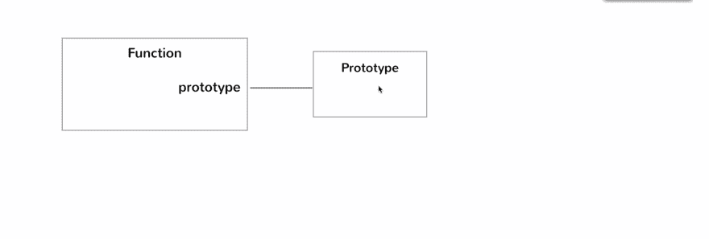
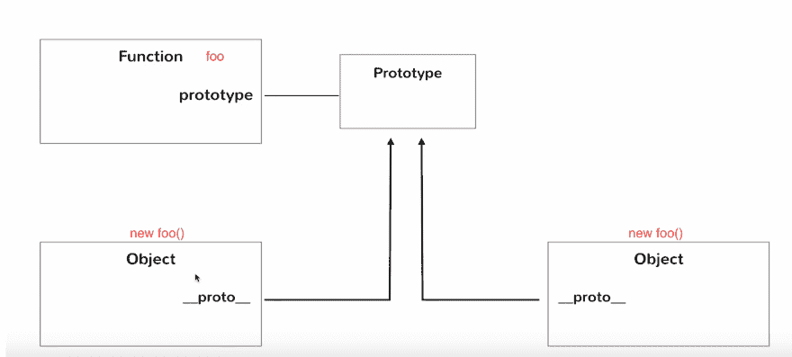
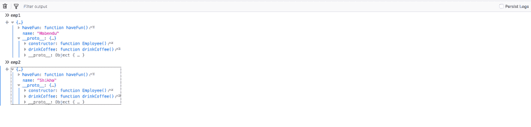
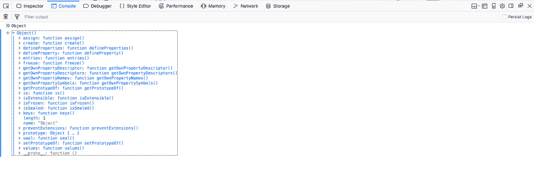
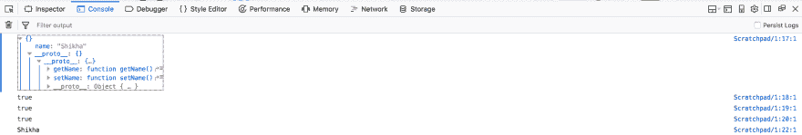
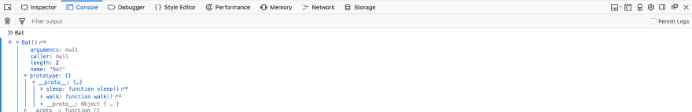
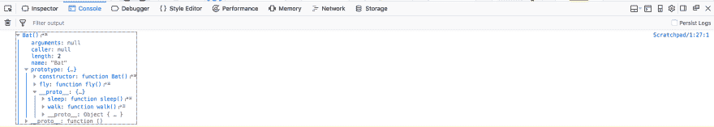
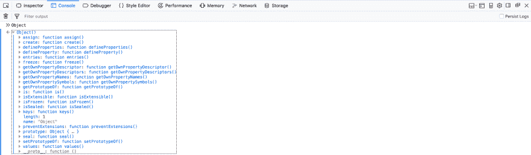

# 面试准备—面向对象的 JavaScript-1

> 原文：<https://dev.to/nabendu82/interview-preparation-object-oriented-javascript-1-9m9>

欢迎来到本系列的第 10 部分，也是面向对象 JavaScript 问题的第一部分。

在这一部分中，我们将按照老的方式学习面向对象的 JavaScript，因为它的语法有点复杂。最新的 ES6 类不过是合成糖，只是在引擎盖下使用这些概念。但是这是面试的一个重要话题，在面试中他们会问一些关于 OOPs 的知识。

**问题 60-***JavaScript 中有哪些构造函数*？
**答-** 构造函数是用来创建它的实例的特殊函数。它相当于 C++和 Java 等其他编程语言中的 JavaScript 类。

让我们从使用 object 创建一个简单的函数来创建 employee 对象开始。

```
function createEmpObj(fName, lName, gender, desig) {
  var newObj = {};
  newObj.firstName = fName;
  newObj.lastName = lName;
  newObj.gender = gender;
  newObj.designation = desig;
  return newObj;  
}

var emp1 = createEmpObj("Parag", "Khandar", "M", "Project Manager"); 
```

> 现在考虑行**var new obj = { }；**和**返回 newObj**它们在我们创建的每个功能中都是一样的。所以，JS 给了我们一个特殊类型的函数，称为**构造函数**来创建它们。

我们将重构上面的代码以使用**构造函数**。看看下面的代码。

```
function CreateEmpObj(fName, lName, gender, desig) {
  //var this;
  this.firstName = fName;
  this.lastName = lName;
  this.gender = gender;
  this.designation = desig;
  //return this;
}

var emp2 = new CreateEmpObj("Shikha", "Biswas", "F", "Developer"); 
```

我们添加关键字 **new** 来创建对象。它主要负责 newObj 的创建和返回。但是给它起了一个新名字**这个**。
注意，我们不需要把这两行放在我们的代码中，由 JS 引擎自动放置。

**问题 61-** *如何在 JavaScript 中使构造函数中的变量私有*？
**答-** 让我们首先考虑下面的普通构造函数的代码。在这里，我们可以通过*redCar.color 直接访问变量“color”。*现在，这在许多地方可能是不可取的，在传统语言中，通过在类中使用“私有”变量，然后使用“Getters”和“Setters”来访问它们来解决。

```
let Car = function(color) {
  this.color = color;
};

let redCar = new Car('red');

console.log(redCar.color); //red 
```

现在，我们使用闭包在 JavaScript 中实现了同样的功能。我们有两个闭包函数 **setColor** 和 **getColor** ，它们基本上是“设置器”和“获取器”。现在，变量 **_color** 是私有的，不能被 *blueCar 在函数外部访问。_color* 并且我们只能通过 *blueCar.getColor()* 访问它

```
let PrivateCar = function(_color) {
 this.setColor = function(color) {
   _color = color;
  };

  this.getColor = function() {
   return _color;
  } 
}

let blueCar = new PrivateCar();
blueCar.setColor('blue');
console.log(blueCar._color);  //undefined
console.log(blueCar.getColor()); //blue 
```

你可以在这里找到上面[的 JSFiddle。](https://jsfiddle.net/nabendu/u98tf2hb/)

**问题 62-** *什么是原型，我们如何在 JavaScript 中使用它们*？
**答案-** 在 JavaScript 中你知道一切都是对象。所以每当我们创建一个函数，就有一个对象被创建。但实际上还有另一个被创建的对象，叫做原型对象。
现在，为了访问原型对象，我们引用了函数对象，也称为原型。

[ ](https://res.cloudinary.com/practicaldev/image/fetch/s--KzXJe-nW--/c_limit%2Cf_auto%2Cfl_progressive%2Cq_auto%2Cw_880/https://cdn-images-1.medium.com/max/3948/1%2Ah9nQExQntFiqFiwvQXxbPQ.png) *原型*

当我们用 **new 关键字**创建函数的实例时，有趣的事情发生了。它创造出被称为 ****的东西原型**** 。这是 JavaScript 引擎使用 new 关键字为每个函数调用创建的。

[ ](https://res.cloudinary.com/practicaldev/image/fetch/s--_ubStGOd--/c_limit%2Cf_auto%2Cfl_progressive%2Cq_auto%2Cw_880/https://cdn-images-1.medium.com/max/3864/1%2A_UPUngmrIx2d4KdIqXvYtA.png) *新增关键词特效*

现在，让我们看看如何使用 prototype 创建一个函数，以及它的好处。下面的代码有两个函数 haveFun 和 drinkCoffee。函数 haveFun 是构造函数中的一个普通函数。函数 drinkCoffee 是在外部创建的，并使用其引用原型添加到原型对象中。

```
function Employee(name) {
  this.name = name;
  this.haveFun = function() {
    console.log('Play badminton');
  };
}

Employee.prototype.drinkCoffee = function() {
  console.log('coffee break')
}

let emp1 = new Employee('Nabendu');
let emp2 = new Employee('Shikha');

console.log(emp1.haveFun()); //Play badminton
console.log(emp1.drinkCoffee()); //coffee break 
```

这两个功能似乎在做同样的事情，那么有什么好处呢。使用 prototype 声明函数的好处是它只在 Prototype 对象中创建一次。所以，现在每当我们创建一个构造函数的新实例时，这个函数就不再被创建了。如下图截图，可以看到 **emp1** 和 **emp2** 都有**名字**和**有乐趣**。但是 **drinkCoffee** 在 ****proto**** 里面，是对 Prototype 对象的引用。

[ ](https://res.cloudinary.com/practicaldev/image/fetch/s--vxsSwQ-E--/c_limit%2Cf_auto%2Cfl_progressive%2Cq_auto%2Cw_880/https://cdn-images-1.medium.com/max/5752/1%2AkUYbY3EROsYN9MbPRM0y0w.png) *受益的原型*

关于物体和原型的更多细节，请点击我的帖子[这里](https://medium.com/@nabendu82/ydkjs-objects-and-prototypes-part3-c89383dd5d3f)。

**问题 63-** *解释 JavaScript 中的 object . create()*？
* *回答-* *每个对象都是从 JavaScript 中的全局对象创建的。如果我们在控制台中查看它，它有许多属性，create been 就是其中之一。

[](https://res.cloudinary.com/practicaldev/image/fetch/s--TNwXozFM--/c_limit%2Cf_auto%2Cfl_progressive%2Cq_auto%2Cw_880/https://cdn-images-1.medium.com/max/5760/1%2AkUTOvBqTV0iqe_oGDKQl4w.png)*JavaScript 中的全局对象*

> Object.create()方法创建一个新对象，使用现有对象作为新创建对象的原型。

考虑下面的例子，我们可以从现有的对象创建一个新的对象，还可以向它添加新的属性或修改现有的属性。

```
const person = {
  isCoder: false,
  printIntroduction: function () {
    console.log(`My name is ${this.name}. Am I coder? ${this.isCoder}`);
  }
};
const me = Object.create(person);
me.name = "Nabendu"; 
me.isCoder = true; 
me.printIntroduction();
// Output: "My name is Nabendu. Am I coder? true" 
```

现在，让我们看看 *Object.create* 在**继承**中的实际使用。在下面的例子中，我们有一个**雇员**函数，它的原型有两个函数。然后我们有另一个函数 **SalesEmployee** ，然后将其原型设置为 Employee 的原型。
*sales employee . prototype = object . create(雇员.原型)；*

```
const Employee = function() {
}

Employee.prototype =  {
  setName(_name) {
    this.name = _name
  },
  getName() {
    return this.name;    
  }
}

const SalesEmployee = function () {

}

SalesEmployee.prototype = Object.create(Employee.prototype);

let emp1 = new SalesEmployee();

console.dir(emp1);
console.log(emp1 instanceof SalesEmployee); //true
console.log(emp1 instanceof Employee); //true
console.log(emp1 instanceof Object); //true

emp1.setName('Shikha');
console.log(emp1.getName()); //Shikha 
```

然后我们创建一个 **SalesEmployee** 的实例作为 **emp1** 变量。它具有**员工**功能的所有功能，还可以使用。

[ ](https://res.cloudinary.com/practicaldev/image/fetch/s--WCPvyYNN--/c_limit%2Cf_auto%2Cfl_progressive%2Cq_auto%2Cw_880/https://cdn-images-1.medium.com/max/5760/1%2AZ1o5sxMmGbhDRjRw5HWGmQ.png) *输出以上*

**问题 64-** *用 Object.create()* 解释 JavaScript 中的原型链？
**答案-** 原型链可以通过下面的例子来解释。这里我们有三个函数 *Car，ToyCar 和 ToyTransformer* 。每个人都有自己版本的*打印机*()。

我们通过将玩具汽车的原型设置为汽车的原型来从汽车继承玩具汽车，然后通过将玩具汽车的原型设置为玩具汽车的原型来从玩具汽车继承玩具汽车。

然后我们有三个实例 *Car，ToyCar 和 ToyTransformer* 。在调用 print()时，我们获得各自的控制台日志。

```
// Car constructor
const Car = function() {};

// Set Car's prototype
Car.prototype = {
  print() {
    return 'This is a Car';
  }
};

// ToyCar constructor
const ToyCar = function() {};

// Set ToyCar's prototype to be Car's prototype
ToyCar.prototype = Object.create(Car.prototype);

// Adding ToyCar's own print method
ToyCar.prototype.print = function(){
 return 'This is a ToyCar';
}

//ToyTransformer constructor
const ToyTransformer = function() {};

// Set ToyTransformer's prototype to be ToyCar's prototype
ToyTransformer.prototype = Object.create(ToyCar.prototype);

// Adding ToyCar's own print method
ToyTransformer.prototype.print = function(){
 return 'This is a ToyTransformer';
};

const toyota = new Car();
const legoCar = new ToyCar();
const bumbleBee = new ToyTransformer();

console.log(toyota.print()); //This is a Car
console.log(legoCar.print()); //This is a ToyCar
console.log(bumbleBee.print()); //This is a ToyTransformer 
```

现在，让我们删除 ToyTransformer 的 print()方法，然后如果我们对它的实例 bumbleBee 调用 print()，我们将从 ToyCar 的 print()中获得结果。

```
// Car constructor
const Car = function() {};

// Set Car's prototype
Car.prototype = {
  print() {
    return 'This is a Car';
  }
};

// ToyCar constructor
const ToyCar = function() {};

// Set ToyCar's prototype to be Car's prototype
ToyCar.prototype = Object.create(Car.prototype);

// Adding ToyCar's own print method
ToyCar.prototype.print = function(){
 return 'This is a ToyCar';
}

const ToyTransformer = function() {};

// Set ToyCar's prototype to be Car's prototype
ToyTransformer.prototype = Object.create(ToyCar.prototype);

const bumbleBee = new ToyTransformer();

console.log(bumbleBee.print()); //This is a ToyCar 
```

如果我们进一步删除 ToyCar 的 print()方法，然后对它的实例 bumbleBee 调用 print()，我们将从 Car 的 print()中获得结果。

```
// Car constructor
const Car = function() {};

// Set Car's prototype
Car.prototype = {
  print() {
    return 'This is a Car';
  }
};

// ToyCar constructor
const ToyCar = function() {};

// Set ToyCar's prototype to be Car's prototype
ToyCar.prototype = Object.create(Car.prototype);

const ToyTransformer = function() {};

// Set ToyCar's prototype to be Car's prototype
ToyTransformer.prototype = Object.create(ToyCar.prototype);

const bumbleBee = new ToyTransformer();

console.log(bumbleBee.print()); //This is a Car 
```

所以，如果你在子节点上调用一个方法，而这个方法不在子节点上，那么它将签入它的父节点，如果不在子节点上，那么它将签入父节点的父节点。

**问题 65-** *解释构造函数中的继承是如何工作的*？
* *回答-**为了理解使用构造函数的继承，我们将看到一个包含哺乳动物父函数和蝙蝠子函数的例子。此外，使用 Object.create 使蝙蝠的原型具有对哺乳动物原型的引用。蝙蝠的原型将具有哺乳动物原型的所有方法

```
let Mammal = function(legs) {
  this.legs = legs;
};

Mammal.prototype = {
  walk() {
    return 'walking!';
  }, sleep() {
    return 'sleeping';
  }
};

let Bat = function(legs, isVegetarian) {
  Mammal.call(this, legs);
  this.isVegetarian = isVegetarian;
}

Bat.prototype = Object.create(Mammal.prototype); 
```

现在，让我们看看控制台中的“Bat”。正如你所看到的，在它的**原型**中包含了“哺乳动物”的睡眠和行走功能。

[ ](https://res.cloudinary.com/practicaldev/image/fetch/s--XLGwYCV1--/c_limit%2Cf_auto%2Cfl_progressive%2Cq_auto%2Cw_880/https://cdn-images-1.medium.com/max/5760/1%2AIfz3xoSqd9p1vQTyni3OSQ.png) *控制台中的蝙蝠*

但是我们有一个主要的问题是" *Bat.prototype = Object.create(哺乳动物.原型)这个语句；*“清除任何 Bat 的原型函数及其构造函数。
我们没有声明任何 Bat 的原型函数，但是构造函数被清除了。

因此，我们通过下面的代码来解决它。它正在使用**Bat . prototype . constructor = Bat；**将构造函数设置回“Bat”。
还有，我们在“ *Bat.prototype = Object.create(哺乳动物.原型)之后声明 Bat 的原型函数；*

```
...
...
Bat.prototype = Object.create(Mammal.prototype);

Bat.prototype.constructor = Bat;

Bat.prototype.fly = function() {
  return 'Flying!';
}

console.dir(Bat); 
```

[ ](https://res.cloudinary.com/practicaldev/image/fetch/s--JGYJXq9B--/c_limit%2Cf_auto%2Cfl_progressive%2Cq_auto%2Cw_880/https://cdn-images-1.medium.com/max/5760/1%2AMsgnHbLyH4iwxEUAIaHhSQ.png) *问题解决*

现在让我们完成代码，创建“蝙蝠”的两个实例，分别为 **fruitBat** 和 **bugBat** 。两者都可以访问行走、睡眠和飞行功能。

```
let Mammal = function(legs) {
  this.legs = legs;
};

Mammal.prototype = {
  walk() {
    return 'walking!';
  }, sleep() {
    return 'sleeping';
  }
};

let Bat = function(legs, isVegetarian) {
  Mammal.call(this, legs);
  this.isVegetarian = isVegetarian;
}

Bat.prototype = Object.create(Mammal.prototype);

Bat.prototype.constructor = Bat;

Bat.prototype.fly = function() {
  return 'Flying!';
}

let fruitBat = new Bat(4, true);
let bugBat = new Bat(2, false);

console.log(fruitBat.walk()); // walking!
console.log(bugBat.sleep());  // sleeping
console.log(bugBat.fly());    // Flying! 
```

**问题 66-** *解释 Object.setPrototypeOf()方法*？
**答-** 方法 Object.setPrototypeOf()是在 ES6 中为顶级“对象”引入的。
这个方法接受一个对象方法，并使它对另一个对象可用。

[](https://res.cloudinary.com/practicaldev/image/fetch/s--x7oBuCyT--/c_limit%2Cf_auto%2Cfl_progressive%2Cq_auto%2Cw_880/https://cdn-images-1.medium.com/max/5760/1%2A0yDg4xzd4HD8Wqr0fSnKHw.png)*object . set prototypeof()方法*

这也有助于使用对象文字而不是构造函数来实现继承(见问题 65)。

我们在下面的代码中有两个对象——哺乳动物和蝙蝠。然后为了在 bat 中使用哺乳动物的方法，我们使用了 **Object.setPrototypeOf(bat，哺乳动物)；**。

另外，请注意，我们正在更新“bat”中的 walk()，并且还调用了哺乳动物的 walk by **super.walk()**

```
let mammal =  {
  walk() {
    return 'walking!';
  }
};

let bat = {
  fly() {
    return 'Flying!';    
  },
  walk() {
    return `${super.walk()} and eating`;
  }
}

Object.setPrototypeOf(bat, mammal);
console.log(bat.fly()); //Flying!
console.log(bat.walk()); //walking! and eating 
```

本系列的第 10 部分和面向对象 JavaScript 问题的第一部分到此结束。