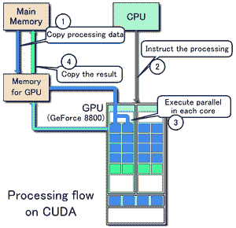
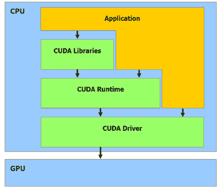
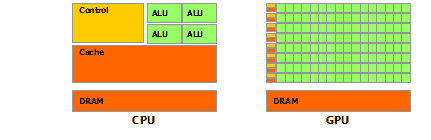
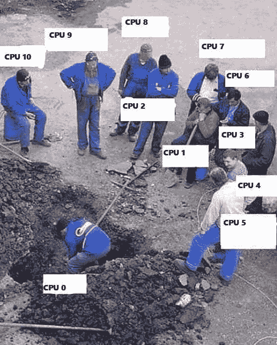
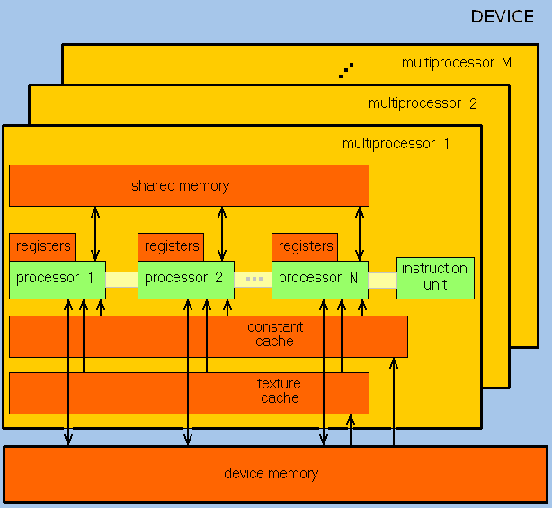
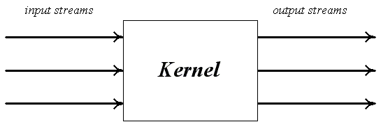
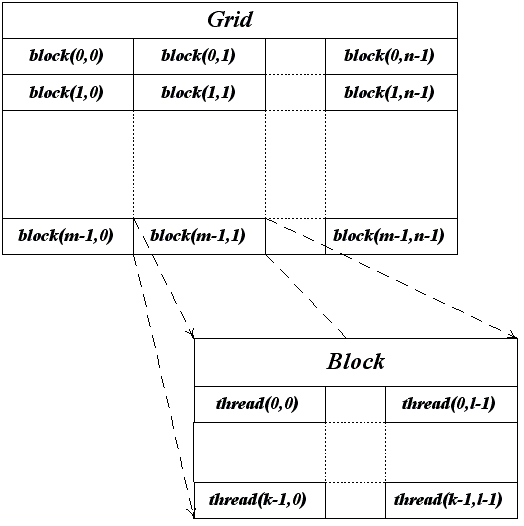

# CUDA 技术简介

> 原文：<https://dev.to/liashchynskyi/intro-to-cuda-technology-79g>

又见面了！让我们来谈谈 CUDA 以及它将如何帮助您加快数据处理速度。

> 今天没有代码！只有理论😎

想象一下，如果你知道世界上没有 CUDA，你还会永远训练任何神经网络🙁CUDA 到底是什么？

* * *

## [T1】简介](#intro)

CUDA 是 Nvidia 创建的并行计算平台和应用编程接口(API)模型([来源](https://en.wikipedia.org/wiki/CUDA))。

在我们开始之前，您应该了解什么是:

*   **设备** -显卡本身，GPU -运行从 CPU 接收的命令
*   **主机**——中央处理器(CPU)——在**设备**上运行某些任务，分配内存等。
*   **内核**——将由**设备**运行的功能(任务)。

CUDA 允许你使用 C 语言的特殊语法来实现算法。CUDA 架构允许你组织 GPU 指令访问和管理它的内存。全靠你了，兄弟！小心点。

好消息——这项技术得到了多种语言的支持。选择最好的一个😉

## 魔法？不😮

让我们来了解一下 GPU 是如何启动代码的。

1.  **主机**在**设备**上分配一些内存；
2.  **主机**将自身内存中的数据复制到**设备的**内存中；
3.  **主机**在**设备**上运行**内核**；
4.  **设备**执行**内核**；
5.  **主机**将结果从**设备的**内存复制到自己的内存中。

图中没有步骤 1(分配内存)，但是步骤 1 和步骤 2 可以合并。

CPU 通过 *CUDA 运行时 API、CUDA 驱动 API 和 CUDA 库*与 GPU 交互。运行时和驱动 API 之间的主要区别非常简单——这是一个抽象层次。

运行时 API ( *RAPI* )更加抽象，也就是更加用户友好。驱动 API ( *DAPI* ) -一个低级 API，驱动级。总的来说，RAPI 是 DAPI 的抽象包装。两个都可以用。从我的经验来看，我可以告诉你使用 DAPI 更困难，因为你应该考虑低层次的东西，这不好笑😑。

你应该明白另一件事:

> 如果创建内核所花费的时间比这个内核实际运行的时间长，那么你将得到零效率。

无论如何，事情是启动任务，在 GPU 上分配内存需要一些时间，因此**你不应该在它上面运行“简单”的任务**。简单的任务可以由你的 CPU 在几毫秒内完成。

即使 CPU 可以更快地计算，你应该在 GPU 上运行内核吗？实际上没有...为什么？让我们去发现它！

## 硬件

GPU 的架构与 CPU 有所不同。由于图形处理器最初仅用于涉及独立并行数据处理的图形计算，因此 GPU 是为并行计算而设计的。

GPU 旨在处理大量线程(基本并行进程)。

正如你所看到的，GPU 由许多 [ALU](https://en.wikipedia.org/wiki/Arithmetic_logic_unit) 组成，合并成几个具有公共内存的组。这种方法可以提高生产率，但有时很难用这种方式编程。

为了实现最佳加速，您必须考虑内存访问策略并考虑 GPU 特性。

GPU 面向处理大量数据的繁重任务，由流处理器阵列(SPA)组成，其中包括纹理处理器集群(TPC)。TPC 由一组流多处理器(SM)组成，每个处理器都包括几个流处理器(SP)或内核(现代 GPU 可以有 1024 个以上的内核)。

GPU 核心通过 [SIMD](https://en.wikipedia.org/wiki/SIMD) 原理工作，但有点不同。

> SP 可以处理不同的数据，但是它们应该在同一时刻执行相同的命令。不同的线程执行相同的命令。

因此，GPU 实际上成为了一个实现流计算模型的设备——存在输入和输出数据流，这些数据流由相同的元素组成，可以相互独立地进行处理。

## 计算能力

每一个 GPU 都有自己的生产力系数或*计算能力* -图形处理器上某些操作的性能速度的量化特征。Nvidia 称之为**计算能力版本**。高版本比低版本好😁

| 计算能力版本 | GPU 芯片 | 视频卡 |
| --- | --- | --- |
| One | G80、G92、G92b、G94、G94b | GeForce 8800GTX/Ultra，Tesla C/D/S870，FX4/5600，360M，GT 420 |
| One point one | G86，G84，G98，G96，G96b，G94，G94b，G92，G92b | GeForce 8400GS/GT，8600GT/GTS，8800GT/GTS，9400GT，9600 GSO，9600GT，9800GTX/GX2，9800GT，GTS 250，GT 120/30/40，FX 4/570，3/580，17/18/3700，4700x2，1xxM，32/370M，3/5/770M |
| One point two | GT218、GT216、GT215 | GeForce 210、GT 220/40、FX380 LP、1800M、370/380M、NVS 2/3100M |
| One point three | GT200、GT200b | GeForce GTX 260，GTX 275，GTX 280，GTX 285，GTX 295，特斯拉 C/M1060，S1070，夸德罗 CX，FX 3/4/5800 |
| Two | GF100，GF110 | GeForce (GF100) GTX 465，GTX 470，GTX 480，Tesla C2050，C2070，S/M2050/70，Quadro Plex 7000，Quadro 4000，5000，6000，GeForce (GF110) GTX 560 TI 448，GTX570，GTX580，GTX590 |
| ........ | ......... | ........ |
| Five | GM107，GM108 | GeForce GTX 750 Ti，GeForce GTX 750，GeForce GTX 860M，GeForce GTX 850M，GeForce 840M，GeForce 830M |
| ........ | ......... | ........ |

你可以在这里找到整个列表[。计算能力版本描述了许多参数，如每块线程数、最大线程数和块数、warp 大小和](https://en.wikipedia.org/wiki/CUDA#GPUs_supported) [more](https://en.wikipedia.org/wiki/CUDA#Version_features_and_specifications) 。

## 螺纹、块和网格

CUDA 使用许多独立的线程进行计算。它们都按照类似于 ***网格/块/线程*** 的层次进行分组。

<figure> 

<figcaption>积木结构</figcaption>

</figure>

顶层—*网格*—与内核相关，并联合所有执行该内核的线程。网格是由*块*组成的 1D 或者 2D 阵列。每个模块都是由*线程*组成的 1D / 2D / 3D 阵列。在这种情况下，每个块代表一组完全独立的协调线程。**来自不同模块的线程不能相互交互**。

上面，我提到了与 SIMD 建筑的区别。还有一个类似 **warp** 的概念——一组 32 个线程(取决于 GPU 的架构，但几乎都是 32 个)。因此，只有同一组(warp)中的线程才能在同一时刻被物理执行。不同经线的线程可以处于程序运行的不同阶段。这种数据处理方法被称为 **SIMT** (单指令-多线程)。Warp 的管理是在硬件层面进行的。

## 某些情况下 GPU 比 CPU 慢，但是为什么呢？

不要试图在你的 GPU 上运行简单的任务。我会解释的。

1.  *Delay* -它是请求一个特定资源和访问该资源之间的等待时间；
2.  *带宽* -单位时间内执行的操作数量。

所以，主要问题是:为什么图形处理器有时会出错？让我们去发现它！

我们有两辆车:

*   客货车-速度 *120 公里/小时*，定员 9 人；
*   客车速度 *90 公里/小时*，载客量 30 人。

如果一个操作是一个人在一定距离的移动，假设是 1 公里，那么第一辆车的延迟(一个人将通过 1 公里的时间)是 *3600/120 = 30s* ，带宽是 *9/30 = 0.3* 。
总线为 *3600/90 = 40s* ，带宽为 *30/40 = 0.75* 。

因此，CPU 是一辆客车，GPU 是一辆公共汽车:它有很大的延迟，但也有很大的带宽。

> 如果对于你的任务来说，每个特定操作的延迟没有每秒这些操作的数量重要，那么就值得考虑使用 GPU。

## 思想

GPU 的独特功能(与 CPU 相比)包括:

*   架构，最大限度地旨在提高纹理和复杂图形对象的计算速度；
*   典型 GPU 的峰值功率远高于 CPU 的峰值功率；
*   由于专门的流水线架构，GPU 在处理图形信息方面比 CPU 更有效。

在我看来，最主要的缺点是这项技术只有英伟达 GPU 支持。

在执行某些算法时，GPU 可能不会总是给你加速。因此，在使用 GPU 进行计算之前，您需要仔细考虑在那种情况下是否有必要。您可以使用图形卡进行复杂的计算:处理图形或图像、工程计算等。，但是**简单任务不要用 GPU**(当然可以，但是那样效率会是 0)。

再见！记住:

> 使用 GPU 时，降低程序速度比提高程序速度要容易得多。