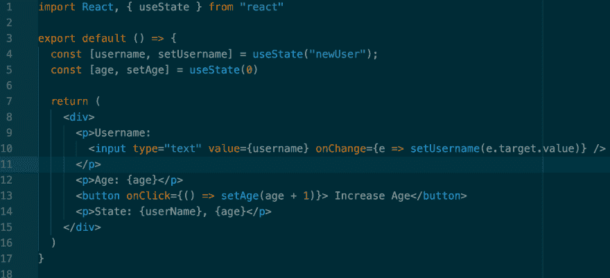
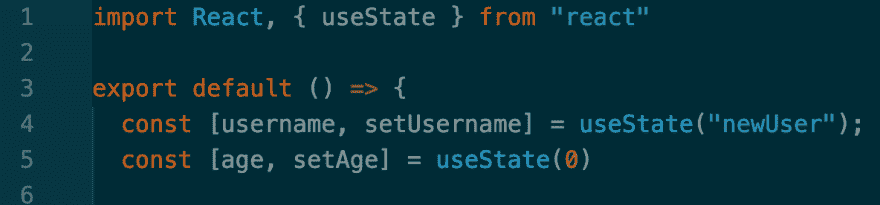
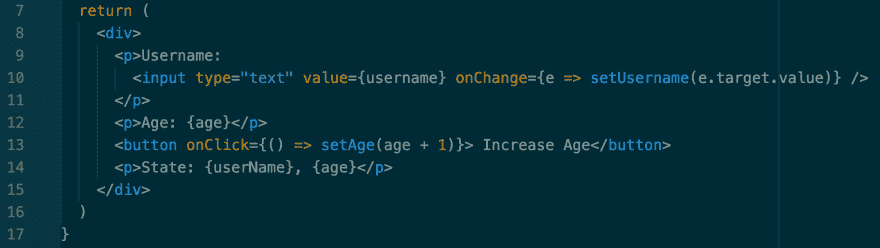
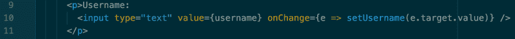

# 钩子介绍

> 原文：<https://dev.to/aliyalewis/intro-to-hooks-516b>

上周一，我开始了我的第一个个人项目！我在 React 应用中加入的主要功能是一个交互式地图，这是我以前从未做过的。我知道这个地图会很有挑战性，但我对自己有足够的信心，我可以制作这个地图，并向自己证明，仅仅因为一些事情看起来很复杂，并不意味着它不可能。正如所料，我遇到了一些障碍，但没有什么是我不通过谷歌搜索就无法解决的，直到谷歌停止给我提供我一直在寻找的帮助。

在网上搜索无果后，我去找了一些帮助，并请我的一位教练帮助调试我的代码。他们看了一眼，说“你在做钩子？!"对此我回答说“也许？”虽然我的教练似乎对此非常兴奋，但我却非常困惑。什么是钩子？我怎么不知道我用了钩子？所以，让我们深入 React Hooks 吧！

# 什么是钩子？

React 文档非常棒，自然是我想了解更多关于钩子知识的第一个地方。我首先看到的是这个:

钩子是 React 16.8 中的新功能。它们允许您使用状态和其他 React 特性，而无需编写类。

好的，太好了！但是它长什么样，怎么用？这就是事情变得有趣的地方！钩子让我们在功能组件中使用状态，它们非常容易阅读和使用。下面是一个使用钩子的功能组件的例子，我将把它分解成更小的部分来解释。

上面你会看到有两个 *const* 变量和一个有趣的数组，还有一个叫做 **useState** 的东西。每当一个组件的属性(如用户名和年龄)将会或可能会改变时，你必须使用 *const* 来定义它们，并将其放入一个数组中。在数组内部，您将看到 *setUsername* 和 *setAge* ，它们是类似于 *setState* 的函数。最后一部分是 **useState** ，这是我们在第一行导入的 React 钩子:

使用状态允许我们在一个功能组件中改变用户名和年龄的状态，而不会导致任何错误。我对它到底是如何工作的仍然有点模糊，但由于这只是一个开始，我不会深入探究引擎盖下的一切是如何工作的。

现在，如果我们看第 7 行到第 17 行，我们可以看到这些被解构的“状态”在被呈现和改变时是如何工作的。

这很容易理解，但有两点需要指出:

### 1。

因为我们在一个功能组件中，没有任何东西从父组件传递给它，所以我们不需要用{props.username}或{props.age}来调用状态，我们只需说{username}或{age},如第 10、12 和 14 行所示。

### 2。

在第 10 行和第 13 行，我们看到了析构数组的第二个参数 *setUsername* 和 *setAge* 。 *setUsername* 在 onChange 中被调用，充当 *this.setState({})* ，所以每当用户在输入框中输入时，Username 就会从“newUser”(这是第 4 行定义的默认值)更新，新的状态就会被设置。

类似的事情发生在第 13 行。在 onClick 中调用 setAge ,它将获取年龄的第一个状态(这是 0，因为我们在第 5 行的 *useState* 中定义了默认年龄 0 ),并在每次单击按钮时加 1。

关于钩子还有很多要学的，在这里我只是简单地介绍了一下。如果你有兴趣了解更多关于钩子的知识，可以看看我用来帮助我理解它们的视频，这些视频也是我写这篇博客的灵感来源:

*   为什么要反应钩子？[https://www.youtube.com/watch?v=eX_L39UvZes](https://www.youtube.com/watch?v=eX_L39UvZes)

*   React.js 钩子速成班[https://www.youtube.com/watch?v=-MlNBTSg_Ww](https://www.youtube.com/watch?v=-MlNBTSg_Ww)