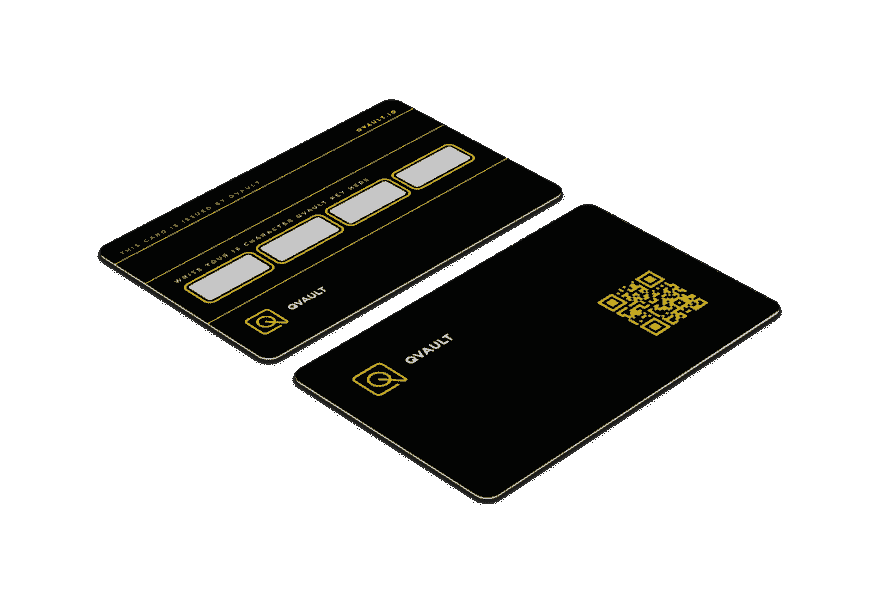
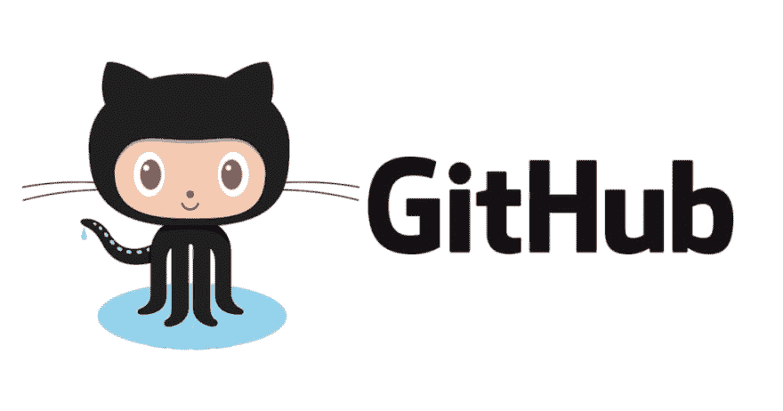

# Qvault 简介

> 原文：<https://dev.to/wagslane/intro-to-qvault-5eka>

Qvault 是一个新的[开源](https://github.com/Q-Vault/qvault)密码管理器，强调用户体验和定制选项。

许多偶然发现 Qvault 的人会问:

> “这与其他密码管理器有何不同？”

在本文中，我们将解释 Qvault 与众不同的地方。

## 1。开放源码

<figure>

<figcaption></figcaption>

</figure>

今天存在的许多密码管理器不公开他们的代码供公众查阅和合作。这是一个巨大的安全和隐私风险，因为用户和社区不能:

1.  确保应用程序的所有者没有**窃取用户信息**
2.  同行评审代码并检查**漏洞**

我们断言，开源是任何密码管理器的必需品。

## 2。物理 Qvault 卡

没有其他密码管理器可以让用户选择通过物理卡来升级安全性和恢复能力。Qvault 卡(一旦发行)将有两张一包，大小相当于一张信用卡。会有**一张钥匙卡**和一张**恢复卡**。

**钥匙卡将以**二维码**的形式包含一个随机且唯一的 256 位钥匙**。该密钥与用户的主密码一起用于加密他们的保管库。这提供了额外的安全层，因为攻击者需要知道用户的主密码并获得钥匙卡。

**恢复卡**包含相同的 256 位密钥，以及背面的空白区域，用户可以在那里写入恢复代码。恢复码是由 app 生成的 **16 位字符码。QR 码用于防止用户丢失钥匙卡，恢复码用于重置用户的主密码，以防用户忘记。**

<figure> 

<figcaption>原型 Qvault 卡</figcaption>

</figure>

Qvault 卡仍处于原型开发阶段，但很快将在 https://qvault.io 上上市销售这些卡的销售将有助于为开源开发提供资金，并确保应用程序的未来维护。

## 3。方便用户的

开源应用一直在用户体验和用户界面上苦苦挣扎。Qvault 拥有业内最优秀的软件设计师之一 DJ Shott，他拥有多年的工作经验。DJ 引领 Qvault 成为当今最简单、最好看的密码管理器。

Qvault 也建立在[电子](https://electronjs.org/)、[节点](https://nodejs.org/)和 [Vue](https://vuejs.org/) 之上，这使得我们开发迷人而美丽的用户体验变得异常简单。

## 4。用户化

Qvault 允许用户定制最适合其安全性和可用性需求的体验。目前支持的一些选项有:

*   用户可以使用主**密码或通行短语**。
*   用户可以使用自定义的主密码或生成随机密码。
*   包含了一个虚拟键盘,可以选择性地用于绕过键盘记录器恶意软件。
*   **完全支持离线**使用，以及将加密的 vault 文件自动备份到 **Qvault 云**的选项。
*   保险库可以仅使用主密码/口令进行加密，或者使用 Qvault 密钥卡进行双重加密
*   可以选择使用 Qvault 恢复卡创建恢复码，以便在忘记密码时恢复访问。
*   所有更新都是提示性的，而不是自动的。这对于希望验证每个更新来源的高级用户来说非常重要。

## 5。主动维护

<figure>

<figcaption></figcaption>

</figure>

我们有一个雄心勃勃的项目路线图。以下是我们希望尽快实现的一些功能:

*   在 Qvault 中为各种加密货币生成[冷钱包](https://en.bitcoin.it/wiki/Cold_storage)，如[比特币](https://bitcoin.org)。
*   与其他 Qvault 用户共享机密。
*   向其他用户授予对保管库各部分的访问权限。
*   支持 PGP 或 SSH 密钥等常见秘密的生成。
*   构建与桌面版本集成的移动应用程序
*   …以及更多。让我们知道你想在这个应用中看到什么，或者随时在 [github](https://github.com/Q-Vault/qvault) 上为这个项目做贡献！

跟着我们走！[https://medium.com/qvault](https://medium.com/qvault)

莱恩·瓦格纳