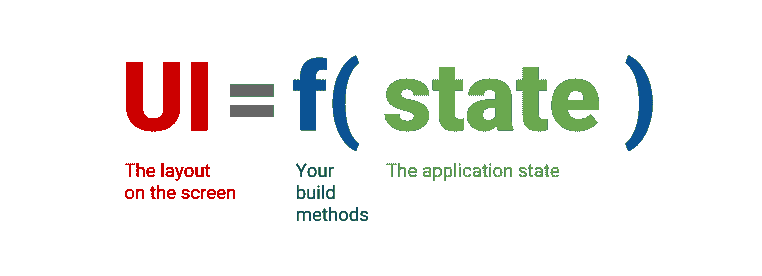

# 浮动简介

> 原文：<https://dev.to/isacjunior/introducao-ao-flutter-c1f>

目前，我使用 React 从事 web 平台开发工作，但我也曾有过与 **React Native** 进行跨平台开发工作的专业经验。

最近我在空闲时间来研究一下浮力，有些朋友提到我是叶之交。😁

我认为，我们应该时刻关注新技术，以便在必要时，我们能够讨论并在必要时决定在特定情况下使用哪种最佳工具。

### 浮子是怎么产生的？

当被问及 Flutter 是如何出现的时，Eric Seidel 报告说 Chrome 团队已经开始了一项实验，他们正在那里移除一些旧片段，以实现 web 兼容性，从而寻求性能。实验结束时，他们进行了基准测试，惊讶地发现实验速度快了 20 倍。所以他们想，我们有东西在这里。

### 什么是颤音？

这是谷歌创建的 SDK，2017 年发布。float 不仅是一种跨平台移动技术，而且还可用于所有屏幕。

*   移动设备(iOS/Android)
*   腹板(颤动 1.9)
*   桌面
*   恩巴卡多什

### 浮子中使用的语言是什么？

float 使用 Dart 作为语言，它也是 Google 在 2011 年创建的，Dart 旨在取代 Javascript 并成为浏览器世界的标准语言。😁

但为什么谷歌选择**【dart】**作为浮式开发的标准语言呢？他们甚至试图用 Javascript 作为语言，但没有成功。我要就此提出几点，在这些点之间，有些是无神论，有些已经有技术上的包装了。

*   **Dart 来自谷歌:**这迫使语言的选择。另一点是，如果颤振真的成为富士达操作系统移动开发的主要工具，谷歌就不会犯同样的错误，为他们的主要移动平台选择第三语言。

*   **JIT 和 Otto:**dart 支持这两种编译形式，这是语言带给我们的伟大奇迹之一。JIT(即时消息)提供了一个绝佳的实时热加载体验，带来了惊人的开发体验。早在 8 月，我们就可以通过与 ARM 和 x64 体系结构通信，直接处理本机平台。

### 思想宣言

float 尝试为各种开发平台和语言带来互操作性。

通过不提供 React 中存在的 JSX 这样的标记语言，它使本地开发人员(iOS/Android)更加熟悉。通过引入声明形式，这使得 React/Native 开发人员的访问更加方便。

宣告式程式设计就像描述影像一样，是使用者检视应用程式的方式。这给我们带来了各种好处，使编写的代码成为实际的应用状态。

*   **可读:**当代码是以声明方式编写时，你很直观地理解它。
*   **可预测性:T1】就像我们有可读性一样，我们也容易预测应用的效果。**

### 他提出什么？

不仅仅是我们在所有屏幕上都有唯一的基本代码的可能性，我和你们可以看到的一件令人惊奇的事情是颤栗的体验和学习曲线是极其美妙的。如前所述，它通过书写方式甚至在我们已经习惯的方法名称上带来了互操作性。

float 还提供了构建高质量应用程序所需的全部工具，而不需要大量的库。

浮起来的几点给我们提供了:

*   快速轻松的开发
*   康登
*   FAA features com maestria
*   我们可以控制每一个像素和每一个手势
*   创建只有一个基本代码的产品
*   永远不要拒绝你的设计师

### 微件

你一定在什么地方听过:漂浮的一切都是小部件。

基于 reactor 组件，widget 是将集成您整个 widget 树的小元素，然后这些元素一起组成并表示您整个应用程序的状态。

在此，我们还拥有两个对浮点开发至关重要的小部件，**state leswidget**和**state fulwidget**。这些名字已经暗示了每个人的行为，我们将在这里展示每个人的一个小例子。

statelessWidget:没有状态的 widget。