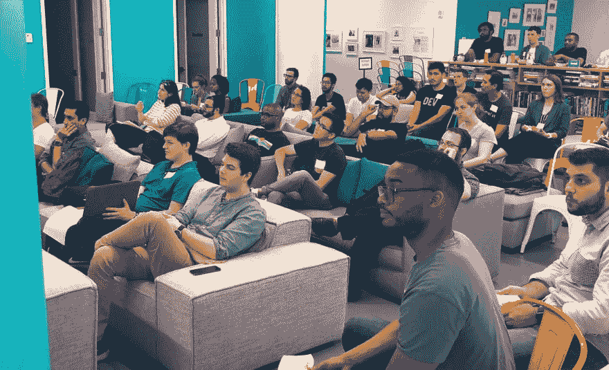

# 引入一个新的计划:IRL。偏差

> 原文：<https://dev.to/devteam/introducing-a-new-initiative-irl-dev-6ck>

正如昨天在这篇文章中讨论的，遇见 irl 是令人敬畏的。

[](/awwsmm) [## DEV 大会？

### 安德鲁(他/他)6 月 24 日 191 分钟阅读

#fun #discuss #eventsinyourcity](/awwsmm/dev-conference-2fb9)

不，我们还没有宣布第一次会议，但我们正在介绍一项计划，以帮助我们的社区成员组织和弥合线上线下的差距。

这种社区主导的活动实际上昨晚在纽约市举行，得到了 DEV 工作人员的支持，但不是由我们正式运营的。我们中的一些人也出席了，这真是太棒了。这让我们对未来感到非常兴奋。

我们有社区里认识的演讲者，还有许多熟悉的面孔。我们也有第一次被介绍给 DEV 的新面孔。(顺便说一下，演讲者绝对不是大型聚会的必要条件，你可以随意组织一些不那么结构化的聚会)。

[](https://res.cloudinary.com/practicaldev/image/fetch/s--63_wF32Z--/c_limit%2Cf_auto%2Cfl_progressive%2Cq_auto%2Cw_880/https://thepracticaldev.s3.amazonaws.com/i/er7r1kjmzbmrl44cluij.png)

如果您有兴趣在您的城市组织一次聚会，请访问我们的新网站:

# **[✨ IRL。德夫✨](https://irl.dev)**

我们希望组织者能够致力于持续管理他们的聚会，并与我们保持联系，以帮助丰富包容性的活动。

这个新网站是一个开源项目，因为它独立于我们的主母舰，贡献应该是相当低的门槛。到目前为止，它主要是为接受组织活动的申请而设计的，但是我们可以一起将它发展成为一个关于社区如何组织自己的信息中心。

总之，以创造性的方式弥合线上和线下的差距将是一个有趣的项目。😄

##  [ forem ](https://github.com/forem) / [ IRL。戴夫](https://github.com/forem/IRL.DEV)

### 没有什么比见到你的网友更好的了，IRL。

<article class="markdown-body entry-content container-lg" itemprop="text">

# [](https://camo.githubusercontent.com/331c62f316ea6c5470f4404d4df4a3b99be78a6bd3daeeeefd02c018553f07cd/68747470733a2f2f74686570726163746963616c6465762e73332e616d617a6f6e6177732e636f6d2f692f677678317a653274633765337a393132776461762e706e67)

There's nothing more awesome than meeting your internet friends, IRL

## 关于项目

伊尔。DEV 是一个以来自 [DEV 社区](https://dev.to)志愿者的真实事件为特色的网站。

它由[盖茨比](https://www.gatsbyjs.org/)和[飞行台](https://airtable.com/)组成。

## 装置

安装盖茨比

```
npm install -g gatsby-cli 
```

克隆存储库

```
git clone git@github.com:thepracticaldev/IRL.DEV.git 
```

变更到项目中

```
cd IRL.DEV 
```

安装依赖项

```
npm i 
```

建立到开发数据库的链接。[这里的](https://airtable.com/shrbYFEryJW3xEJYo)是数据库，点击`copy base`按钮。

如果你还没有生成你的 API 密匙，现在就去[https://airtable.com/account](https://airtable.com/account)生成你的 Airtable API 密匙。

然后，转到您复制的库，查看它的 API 文档。如果你转到右上角的`help`按钮，点击`API documentation`。转到`node.js`或`JavaScript`选项卡。您应该会看到一行如下所示的代码:

```
const base = require("airtable")
```

…Enter fullscreen mode Exit fullscreen mode</article>

[View on GitHub](https://github.com/forem/IRL.DEV)

这是一个 Gatsby 网站，是我们团队的一个不同方法的实验，看它走向何方应该会很有趣。@aspittel 带头让这一切发生。