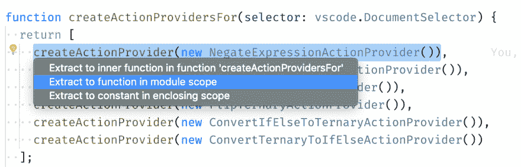
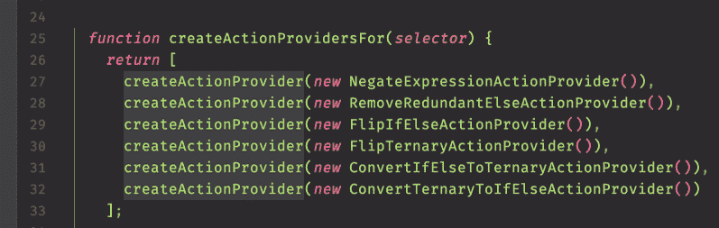
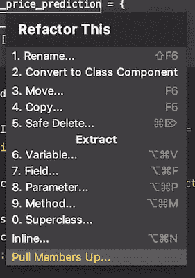
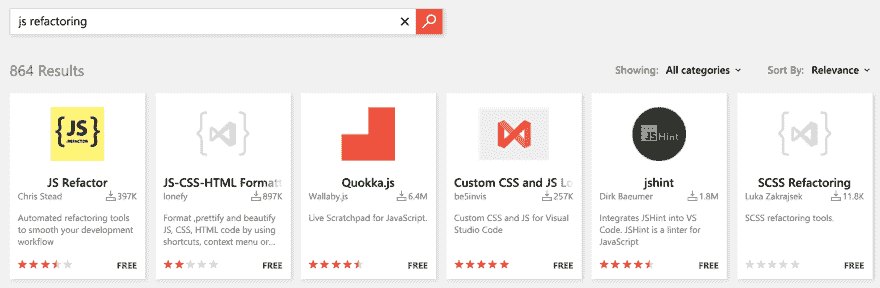
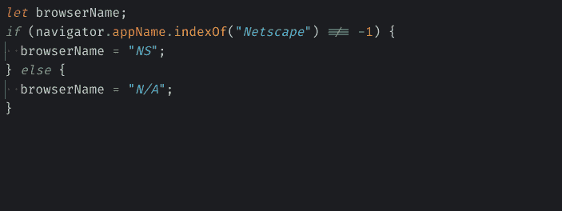

# VS 代码重构工具介绍

> 原文：<https://dev.to/nicoespeon/introducing-a-refactoring-tool-for-vs-code-53l9>

> *这篇文章最初是为我的个人博客写的[。](https://www.nicoespeon.com/en/2019/07/introducing-refactoring-tool-vscode/)*
> *我在这里为开发者社区重新发布它。*

我每天都用 VS 代码。我从 2018 年 2 月开始独家使用，个人和专业都有。我非常喜欢它。

但是我很沮丧。

我很沮丧，因为我错过了一个**伟大的**工具来为我执行**自动化重构**。无论是 VS 代码，还是现有的扩展都没有提供我正在寻找的体验！

因此，两个月前，我决定遵循自己的建议，解决自己的问题。我开始创建我正在寻找的 VS 代码扩展。这个扩展分析我的代码，建议重构并以最少的击键次数执行它们。

它帮助我专注于我的意图，而不是手动遵循重构的脚本机制。

> 我把这个扩展叫做:✨

## 为什么我对 VS 代码重构不满意？

诚然，VS 代码附带了[基本重构操作](https://code.visualstudio.com/docs/editor/refactoring)。那到底怎么了？

从个人角度来说，很少有事情是不好的:

*   我需要的不止这些。我知道有很多自动化重构，但没有提出来。
*   我不能把光标放在一个变量上，然后触发提取。要得到一个合适的建议，需要准确地选择*要重构的代码。我需要首先选择整个提取的语句，这会降低我的速度。*
**   我不太喜欢 UX。说起拔牙，在所有的建议选项面前，我常常感到迷茫。我需要在我的大脑中运行计算机，并根据结果代码解释“封闭范围”和“模块范围”的含义。我*知道*有更好的方法。*

 * 

<figure>

<figcaption>我明白是什么意思，但是需要宝贵的几秒钟去处理。不要让我思考！</figcaption>

</figure>

在独家使用 VS 代码之前，我专业使用过几年 Webstorm。我更喜欢 VS 代码:它是免费的，使用起来感觉更轻松，并且有一个非常活跃的社区。

但是有一点是 Webstorm 明确指出的，VS 代码没有提供的:许多直观的自动化重构。

这让我在过去很有效率。我依靠我的编辑快速行动🏇

我认为这很重要。如果重构代码需要两次击键，我很可能会这么做。如果我必须找到 5 次击键的正确组合才能让它工作，我不太可能。如果我必须用手来做…你会明白的。

伟大的自动化重构对每个开发人员来说都是生产力的提升。

## 但是等等，不是已经有扩展了吗？

是啊！我用了一段时间。

我基本上是用 JavaScript(和 TypeScript)工作的。如果你在 VS Code Marketplace 上搜索“JS Refactor”[，你会发现一个很有前途的扩展，叫做“JS Refactor”:](https://marketplace.visualstudio.com/search?term=js%20refactoring&target=VSCode&category=All%20categories&sortBy=Relevance)

我很感激大家为此付出的努力。至少有人致力于提供更多的重构，**免费分享了它**并维护它👏👏

但在这一点上，这并不是我所需要的，原因如下:

*   我需要更多的重构操作。我认为像“添加导出”、“求反表达式”或“包装选择”这样的操作不是“重构”。即使它们很方便，它们也会修改代码行为。
*   还有，有时候，效果并不好。它在处理类或打字稿时有一些小问题。
*   它比 VS 代码更好地处理了部分选择，但是仍然没有我期望的那么流畅。UX 不是我想象中的那个。

在那种情况下，我最好的选择是:

> 好吧，也许我可以贡献出来，改进一下！

前往[仓库](https://github.com/cmstead/js-refactor)，我真的很高兴看到它似乎测试良好👍

但是我觉得这个建筑不是我想要的。我会用不同的方式进行抽象…

现在，我不是说这不好，我知道更好。实际上，我认为代码非常干净，并且经过了很好的测试。但是我开始想象如何建立这样的解决方案，我有这个愿望去实现它。事实上，这对我来说是一个很好的机会，我可以尝试一些东西，快速地，搔搔自己的痒处。

当然，从社区的角度来看，再建一个扩展并不是最好的主意。为了更大的利益，我应该联系现有扩展的作者，看看我能帮上什么忙。而且，在某个时候，我可能会联系他，看看我能帮上什么忙，因为现在我对所有这些是如何工作的有了一个更清晰的想法。

但目前，我想靠自己的力量做点什么。不是替换现有的扩展，而是尝试不同的东西。一些符合我需要的东西。而不必处理现有的代码和用户。

## 胡言乱语！

这就是为什么，2 个月前，我开始建立这个扩展。

我的目标基本上是**构建我缺少的工具**。

这有一个非常酷的副作用:学习部分。挖掘抽象语法树的操作非常有趣。此外，我第一次发现了如何构建 VS 代码扩展。最后，它是我测试架构决策和实践的平台，比如[通过 ADRs](https://github.com/nicoespeon/abracadabra/tree/master/docs/adr) 记录架构决策。

在这两个月里，我实现了几次重构。几天前我在市场上发布了这个扩展[。](https://marketplace.visualstudio.com/items?itemName=nicoespeon.abracadabra)

现在我正在等待反馈，以改进这些第一次重构，修复边缘情况并改进 UX，以符合我对一个伟大的扩展的期望！

##  [尼可斯佩昂](https://github.com/nicoespeon) / [阿布拉卡达布拉](https://github.com/nicoespeon/abracadabra)

### VS 代码的自动化重构(JS & TS) ✨这是神奇的✨

<article class="markdown-body entry-content" itemprop="text">

# 🧙‍阿布拉卡达布拉

Abracadabra 是一个 Visual Studio 代码扩展，为您带来了 JavaScript 和 TypeScript 的自动化重构。

我们的目标是为您提供易于使用、直观的重构。他们帮助你清理代码，理解正在发生的事情。

> 重构(Refactoring)(名词):在不改变软件可观察到的行为的情况下，对软件内部结构进行的改变，使其更容易理解，修改成本更低。
> 
> — *“重构:改进现有代码的设计”，作者 Martin Fowler*

相关项目:

*   [Hocus Pocus](https://marketplace.visualstudio.com/items?itemName=nicoespeon.hocus-pocus) ，一个 VS 代码扩展，用 JavaScript 和 TypeScript 为你创造有用的东西。

## 目录

*   [安装](https://raw.githubusercontent.com/nicoespeon/abracadabra/master/#installation)
*   [可用重构](https://raw.githubusercontent.com/nicoespeon/abracadabra/master/#available-refactorings)
    *   基本要素
        1.  [重命名符号](https://raw.githubusercontent.com/nicoespeon/abracadabra/master/#rename-symbol)
        2.  [提取变量](https://raw.githubusercontent.com/nicoespeon/abracadabra/master/#extract-variable)
        3.  [行内变量](https://raw.githubusercontent.com/nicoespeon/abracadabra/master/#inline-variable)
        4.  [内嵌功能](https://raw.githubusercontent.com/nicoespeon/abracadabra/master/#inline-function)
        5.  [将语句上移](https://raw.githubusercontent.com/nicoespeon/abracadabra/master/#move-statement-up)
        6.  [下移语句](https://raw.githubusercontent.com/nicoespeon/abracadabra/master/#move-statement-down)
    *   简化条件逻辑
        1.  [求反表达式](https://raw.githubusercontent.com/nicoespeon/abracadabra/master/#negate-expression)
        2.  [删除多余的 Else](https://raw.githubusercontent.com/nicoespeon/abracadabra/master/#remove-redundant-else)
        3.  [简化三进制](https://raw.githubusercontent.com/nicoespeon/abracadabra/master/#simplify-ternary)
        4.  [翻转 If/Else](https://raw.githubusercontent.com/nicoespeon/abracadabra/master/#flip-ifelse)
        5.  [翻转三进制](https://raw.githubusercontent.com/nicoespeon/abracadabra/master/#flip-ternary)
        6.  [将 If/Else 转换为三进制](https://raw.githubusercontent.com/nicoespeon/abracadabra/master/#convert-ifelse-to-ternary)
        7.  [将三进制转换为 If/Else](https://raw.githubusercontent.com/nicoespeon/abracadabra/master/#convert-ternary-to-ifelse)
        8.  [将 If/Else 转换为 Switch](https://raw.githubusercontent.com/nicoespeon/abracadabra/master/#convert-ifelse-to-switch)
        9.  [Split If 语句](https://raw.githubusercontent.com/nicoespeon/abracadabra/master/#split-if-statement)
        10.  [合并 If 语句](https://raw.githubusercontent.com/nicoespeon/abracadabra/master/#merge-if-statements)
        11.  [合并](https://raw.githubusercontent.com/nicoespeon/abracadabra/master/#merge-with-previous-if-statement) …

</article>

[View on GitHub](https://github.com/nicoespeon/abracadabra)

### 你呢？

首先，如果你做 JavaScript 或 TypeScript，并且你正在寻找伟大的自动化重构，你可以[试试 Abracadabra](https://marketplace.visualstudio.com/items?itemName=nicoespeon.abracadabra)！

如果你想帮我，你可以:

*   给我你的反馈，你喜欢什么，你想改善什么。无论您是发现了一个 bug，有了一个建议，还是只想分享一些东西，[看看现有的问题，或者打开一个新的问题](https://github.com/nicoespeon/abracadabra/issues)。
*   如果你想投稿，你可以从我列出的[“好的第一期”开始](https://github.com/nicoespeon/abracadabra/issues?q=is%3Aissue+is%3Aopen+label%3A%22%3Awave%3A+Good+first+issue%22)。欢迎任何形式的贡献🙂
*   传播消息，这样我可以得到更多的用例和更多的反馈来改进扩展！

就是这样。对此我真的很兴奋，也很高兴开始传播这个消息。

现在，*我感觉好多了*。

*