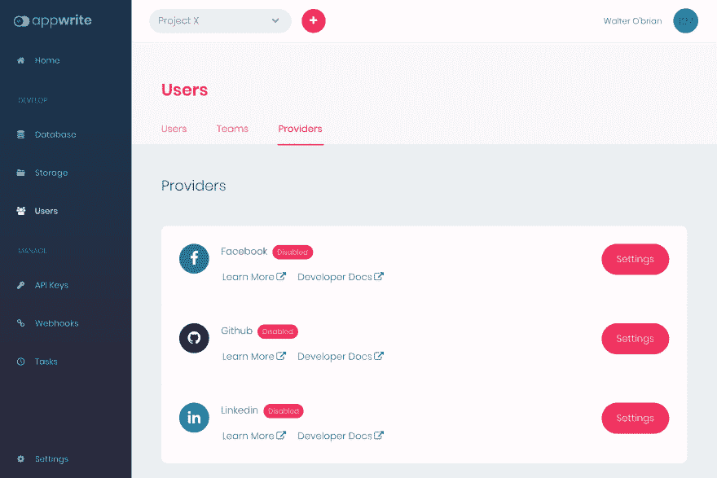
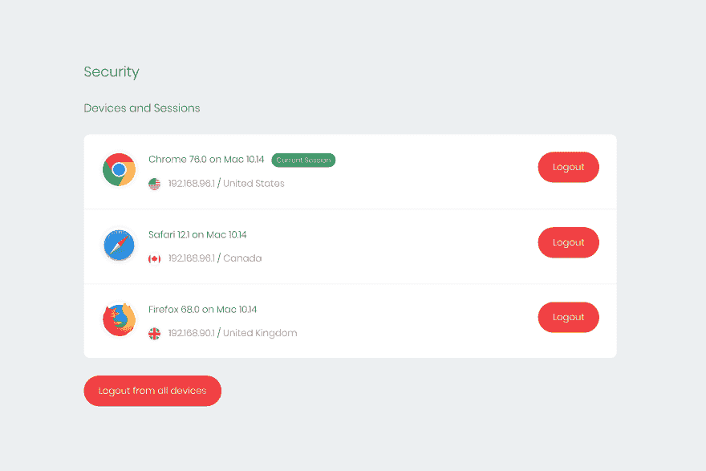
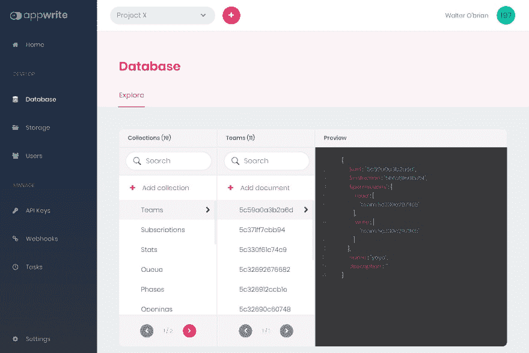
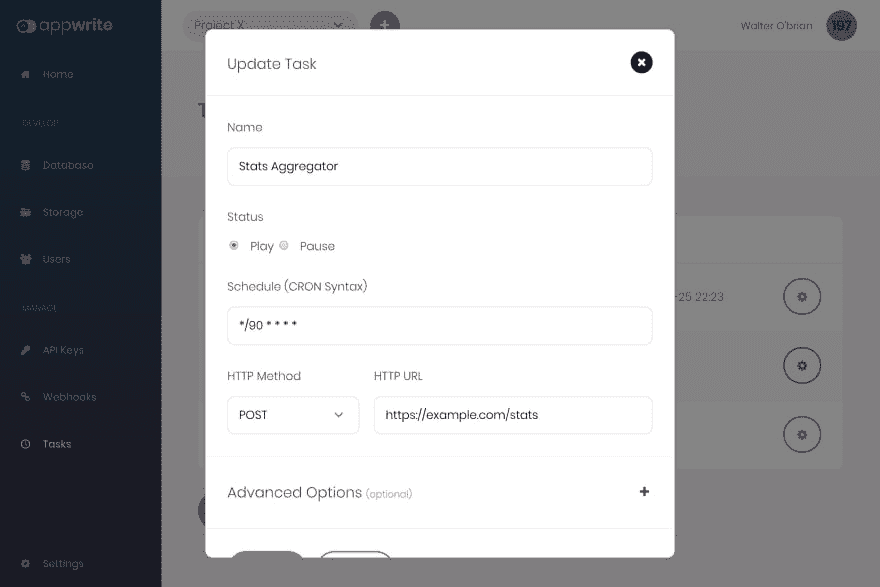
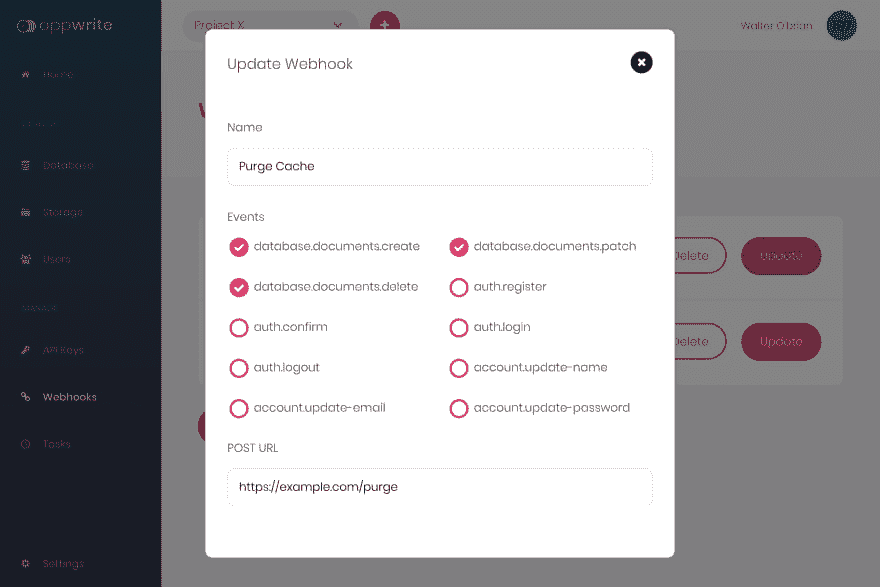

# 介绍 Appwrite:一个面向移动和 Web 开发人员的开源后端服务器

> 原文：<https://dev.to/eldadfux/introducing-appwrite-an-open-source-backend-server-for-mobile-web-developers-4b84>

Appwrite 是一款新的[开源](https://github.com/appwrite/appwrite)，面向前端和移动开发者的端到端后端服务器，允许你更快地构建应用。Appwrite 的目标是抽象和简化 REST APIs 和工具背后的常见开发任务，以帮助开发人员更快地构建高级应用程序。

在这篇文章中，我将简要介绍一些主要的 Appwrite 服务，并解释它们的主要特性，以及它们是如何帮助您比从头开始编写所有后端 API 更快地构建下一个项目的。

Appwrite 服务器被打包为 docker 容器，您可以在本地机器或云提供商的终端上使用简单的 docker-compose 命令轻松设置它。

```
mkdir appwrite-ce && \
cd appwrite-ce && \
curl -o docker-compose.yml https://appwrite.io/docker-compose.yml && \
docker-compose up -d --remove-orphans 
```

Enter fullscreen mode Exit fullscreen mode

Appwrite 安装就像从命令行终端运行一个命令一样简单。

# Appwrite 认证

Appwrite 身份验证服务可让您轻松管理用户注册和应用程序登录。Auth 服务还提供与多个 OAuth 提供商的内置集成，如脸书、Github、LinkedIn 等。

[](https://res.cloudinary.com/practicaldev/image/fetch/s--2VgOIkv2--/c_limit%2Cf_auto%2Cfl_progressive%2Cq_auto%2Cw_880/https://miro.medium.com/max/4800/1%2Ad9egnOpYwD7Gxuj0rButaw.jpeg)

*您可以轻松集成 OAuth 提供者，作为应用程序的新登录方法*

除了管理对应用程序及其不同资源的访问控制，Auth 服务还抽象出其他重复任务，如管理用户电子邮件确认和密码恢复。

使用 Auth 服务，您可以节省大量时间，并消除构建稳定、安全的用户身份验证和授权系统时的顾虑，该系统还必须与多种第三方登录方法集成。

# Appwrite 账号

Appwrite 帐户服务向您的客户端公开一个 API，该 API 允许您与当前登录的用户帐户进行交互。

[](https://res.cloudinary.com/practicaldev/image/fetch/s--Ojkm0cGu--/c_limit%2Cf_auto%2Cfl_progressive%2Cq_auto%2Cw_880/https://miro.medium.com/max/4800/1%2A7p-nrHK2ili_kZiQqeVNxw.png)

Appwrite 帐户服务允许您管理您的用户活动会话。

帐户服务允许您的用户更新他们的帐户相关信息，并保存他们的个人偏好，如用户界面语言、时区或最喜欢的主题。您可以根据自己的意愿为用户设置任何偏好。

您还可以使用 API 来获取用户活动会话的列表，包括关于会话位置、设备、操作系统和用户代理的信息。使用 API 安全日志端点，您可以让您的用户查看他们最近的登录、密码恢复和其他安全敏感事件。

# Appwrite 数据库

[](https://res.cloudinary.com/practicaldev/image/fetch/s--WJrxOAcB--/c_limit%2Cf_auto%2Cfl_progressive%2Cq_auto%2Cw_880/https://miro.medium.com/max/4800/1%2Ar68IlauvlAY9PnEoW1HMzw.jpeg)

Appwrite Database dashboard 允许您轻松浏览您的项目集合和文档。

Appwrite 数据库服务可让您直接从客户端应用集成用户和应用数据，无论是浏览器还是本机应用。数据库中的每个文档都能够嵌套其他子文档。使用 Appwrite 数据库过滤器，您可以应用高级查询并过滤嵌套的文档集合。

每个文档都可以为特定用户、一组用户、API 键或用户角色设置读写权限。使用 Appwrite 数据库，简单而灵活的[权限机制](https://appwrite.io/docs/permissions)，您可以为您的应用程序管理复杂而精密的访问控制逻辑。

Appwrite Database 还提供了在结构化数据收集或灵活收集之间进行选择的灵活性，以便随时管理您的数据。使用简单而强大的数据集合 Appwrite，您可以为集合中的每个文档实施数据结构和验证规则。

# Appwrite 存储

Appwrite 存储服务是让您或您的应用程序用户安全、简单地上传和管理其文件的最简单方法。

Appwrite 存储 API 利用了 Appwrite 数据库使用的相同的简单读写权限机制。这使您可以轻松地决定您的文件是否可以被所有用户、特定用户甚至用户组访问。

```
var appwrite = new window.Appwrite();

appwrite
    .setEndpoint('https://localhost/v1')
    .setProject('[PROJECT-ID]')
;

var file  = document.getElementById('file-input').files[0];
let read  = ['*']; // wildecard read access
let write = ['user:self']; // write access only to me

appwrite.storage.createFile(file, read, write)
    .then(function (response) {
        console.log('file uploaded successfully');
    }, function (error) {
          console.log(error);
    }); 
```

Enter fullscreen mode Exit fullscreen mode

Appwrite 存储 API 允许您在应用程序中轻松集成安全文件上传。

Appwrite 存储服务还提供了与自动更新防病毒服务器的内置集成。所有上传到您系统的新文件都经过扫描和验证，以确保您和您的用户的安全。

Appwrite 存储服务提供的最有用的功能之一是预览文件内容的能力，并在应用程序或网站中以缩略图的形式显示它们。你也可以动态地改变你的缩略图的大小，在不同的图像格式之间转换(支持 webp！)并改变它们的质量以提高网络性能。

# Appwrite 团队

Appwrite Teams 服务允许您和您的用户创建团队并共享对不同 API 资源(如文件或文档)的权限。这是为您的产品实现复杂的访问控制需求的一个伟大而简单的方法。

每个团队成员也可以扮演不同的角色，这样你就有了更大的灵活性。

# Appwrite 任务

[](https://res.cloudinary.com/practicaldev/image/fetch/s--NB9e6szP--/c_limit%2Cf_auto%2Cfl_progressive%2Cq_auto%2Cw_880/https://miro.medium.com/max/4800/1%2Aoyn3wzrOtU-7WrFsomvqug.jpeg)

Appwrite 任务服务是一种设置定期计划作业的好方法。

您不需要处理复杂的 crontabs 或长时间运行的守护进程，也不需要担心容错、监控和错误日志之类的事情，您只需要提交一个表单，将您的任务作为 HTTP 端点，并使用一个类似于 [cron 的语法](https://en.wikipedia.org/wiki/Cron)来指示它应该多长时间执行一次。就这么简单。

您还可以使用“任务”的“高级选项”向您的请求添加不同的 HTTP 头，或者使用基本的 HTTP 验证来保护它。不用说，所有敏感的 HTTP 密码都安全地加密在 Appwrite 内部数据库中。

# Appwrite Webhooks

[](https://res.cloudinary.com/practicaldev/image/fetch/s--3T8_-V5E--/c_limit%2Cf_auto%2Cfl_progressive%2Cq_auto%2Cw_880/https://miro.medium.com/max/4800/1%2AVNdG7tIMcinmNTFZsXdQlg.png)

你可以很容易地从你的 Appwrite 控制台注册一个新的 webhook。

Appwrite Webhooks 旨在允许您轻松方便地为后端集成自定义行为。

想在新用户注册你的应用时收到短信吗？想要在您的某个应用程序文档获得更新时清除缓存吗？只需添加一个新的 webhook，当特定的 Appwrite 事件触发时，它会在您的一端触发一个 HTTP 端点。使用 Appwrite Webhooks，你只会受到想象力的限制。

# 接下来是什么？

在这篇文章中，我强调了一些更引人注目的 Appwrite 服务。在以后的文章中，我将更深入地探讨一些特性，并解释如何将它们集成到您的代码中。

与此同时，我鼓励您阅读 [Appwrite 官方文档和 API 参考文献](https://appwrite.io/docs)，以了解不同 Appwrite 工具为开发人员提供的更多信息。你也可以在 medium 上关注我[获取更多 Appwrite 教程。](https://dev.to/@eldadfux)

如果你喜欢这个项目并想为它做贡献，你可以在项目 [Github 库](https://github.com/appwrite/appwrite)中打开新的问题或发送新的请求。