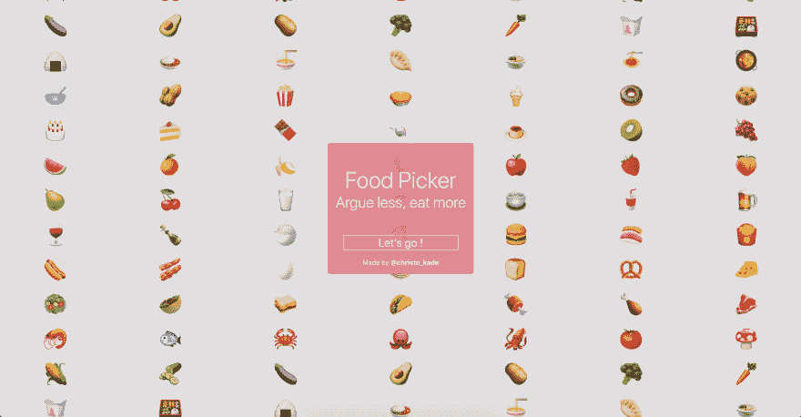

# 介绍食物挑选者，这是和你的同事挑选食物的最好方法！

> 原文：<https://dev.to/christopherkade/introducing-food-picker-the-best-way-to-pick-what-to-eat-with-your-colleagues-pmd>

> 午餐时间到了，你从显示器上抬起头，迎着同事的目光，他们低声说:*寿司*，你小声回答:*没门何塞*。
> 
> 然后你和他们分享一个[取菜器](https://foodpicker.club/)的链接，两人选择你想吃的东西**嘭**，达成一致:披萨。

如果你和你的团队使用食物采摘器，这可能就是你，不再争论去哪里吃，不再有眼泪和愤怒，只有食物。

我希望你们中的一些人真的觉得这很有用，否则这里是我最近做的一些其他项目:

*   开发➡️的横幅生成器[链接](https://github.com/christopherkade/banner-generator)
*   一个`.gitignore`发电机 CLI ➡️ [链接](https://github.com/christopherkade/gitignore-it)

如果你喜欢它，请在这里给它一个⭐️！