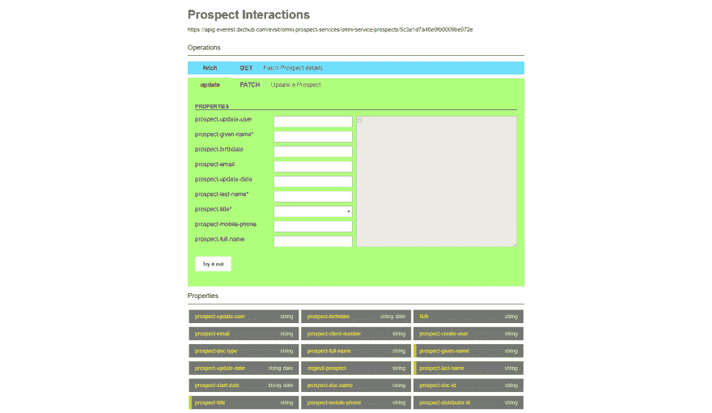

# Halstack 简介:浏览基于超媒体的 API

> 原文：<https://dev.to/peibolsang/introducing-halstack-browsing-hypermedia-based-apis-4oje>

API 是一种用户界面。只是刚好用户是另一台机器。因此，它们受制于应用可用性和用户体验技术:如果它是一个图形用户界面，我们将谈论一个漂亮的，赏心悦目的外观和动态的，交互的行为。然而，对于 RESTful APIs，这意味着提供可自动发现的、动态的和自我记录的操作和属性。我们如何做到这一点？答案是基于超媒体的 API 实现了 [HATEOAS 模式](https://martinfowler.com/articles/richardsonMaturityModel.html)。

首先，这篇文章不是要描述这种建筑风格的细节。虽然提到基于超媒体的 API 有很多争议很重要([hate OA s 解决方案是在找问题吗？](https://techblog.commercetools.com/graphql-and-rest-level-3-hateoas-70904ff1f9cf))，我也喜欢记住模式本身是有道理的。它让你专注于问题领域的建模，并让消费者动态地发现它。这意味着完全解耦，系统架构的天堂。如果你担心你的交互的闲聊性，记住[结合 HTTP/2 和高级内容协商使得 HATEOAS 不那么愚蠢](https://apisyouwonthate.com/blog/lets-stop-building-apis-around-a-network-hack)。正如前一篇文章的作者提到的*“也许你可以通过更多地关注你的 API 作为一个状态机来从你的 RESTish APIs 中移除‘ish’，现在你不那么害怕进行更多的 HTTP 调用了”*。

## 浏览自动发现的 API

基于超媒体的 API 是软件中的伊比利亚猞猁:它们很难在野外被发现，尽管有非常好的例子。实际上，这种建筑风格是我们在 DXC Technology 的愿景和价值主张的基石。

这是 DXC Technology 向社区提出的建议:一个数字平台，我们在这个平台上提供产品 API，供合作伙伴和客户共同创新。在这种情况下，DXC Technology 的工具正在帮助他们理解基于超媒体的 API，更重要的是，让他们通过集成到开发人员门户的交互式 Web 控制台**尝试**这些 API。这个控制台提供了一个交互式的， *à la Swagger UI* 用户界面，完全基于 HTTP 选项和 [JSON:API](https://jsonapi.org/) 和 [JSON hyperschema](https://json-schema.org/latest/json-schema-hypermedia.html) 规范来动态导航和发现基于超媒体的 API。

作为一个进步，今天我们宣布 DXC Technology 将发布这个工具，作为一个开源项目，名为 **Halstack** :一套帮助开发人员使用基于超媒体的 API 构建应用程序的工具。

[Halstack Browser](https://github.com/dxc-technology/dxc-halstack-browser) 是一个 React 组件，可以包含在任何 React Web App 中，为基于超媒体的 API 提供了一种可视化机制，可以动态地抓取和发现 API 资源和操作。与其他基于路径的方法相反，例如 OpenAPI(其中静态规范用于描述预定义路径资源和可用操作的列表), Halstack Browser 允许 API 消费者和生产者基于其实现使用可自动发现的 REST APIs，而无需任何规范。因此，每次 API 实现发生变化时，这些更新将在 Halstack 浏览器 Web 组件中自动可见，而无需导入或配置任何 API 规范。

### haltack 客户端

用于 JavaScript 的 Halstack Client 使开发人员能够以编程方式轻松使用基于超媒体的 API。基于 JSON:API 和 JSON Hyperschema 规范，它提供了一组功能来促进超媒体资源之间的导航和动态访问它们的属性。

该 SDK 作为客户端无关的库发布，可用于许多不同类型的消费者:浏览器应用程序(如与 Halstack 浏览器结合的 React 应用程序)或后端应用程序(node.js 应用程序或 AWS Lambdas)。

## 总结

在这个在线演示中，使用基于超媒体的 API [尝试 Halstack 浏览器。你会发现它非常容易使用，而且它会帮助你以不同的方式看待基于超媒体的 API。我们希望 Halstack 能够帮助您和您的客户更好地理解自我记录的、实现驱动的 RESTful APIs。](https://hal.us.insurance.dxc.com)

Halstack 对 github.com 大学的合作开放。我们渴望阅读您的评论。