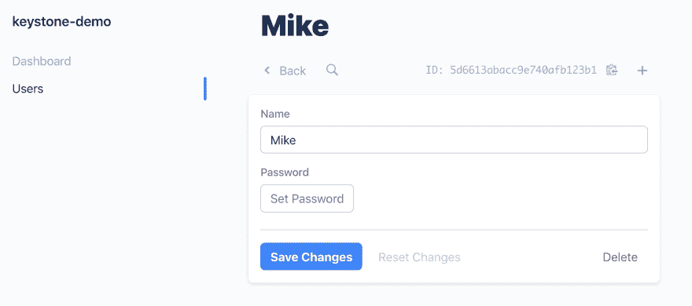
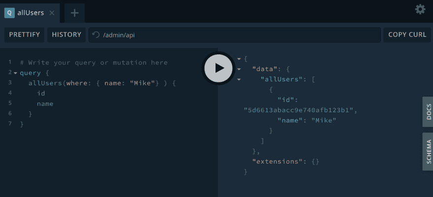

# 介绍 Keystone 5

> 原文：<https://dev.to/mikeriethmuller/introducing-keystone-5-756>

我想向你介绍一种在网上制作东西的新工具。叫做 [Keystone 5](https://v5.keystonejs.com) 。

它可以作为一个 CMS 使用，并且当你需要一点定制和灵活性的时候，它是 WordPress 的一个很好的替代品。

它也可以是用 React、Vue、Angular 或任何其他 JavaScript 框架构建现代 web 应用程序的伟大工具。

开始需要几行配置，您就可以开始了。[入门指南](https://v5.keystonejs.com/quick-start/)和 CLI 应该会有所帮助。

配置完成后，您将可以访问可扩展的管理界面和强大的 GraphQL API。这些工具以及 Keystone 提供的构建模块将允许您创建任何类型的应用程序。

我们正努力使它对初学者友好，对有经验的构建者快速，所有这些都不需要对你正在构建的应用程序类型做任何假设。为了促进这一点，Keystone 开发了应用程序。

Keystone 的其余部分是由小的可组合构件组成的，但应用程序为不同类型的应用程序提供了有时更固执己见的起点。

为了让您了解应用程序的可能性，管理界面和 GraphQL API 都是重要的应用程序。

Keystone 还有一个为公共目录服务的静态应用，以及一个 Next.js 应用。这些是前端开发的有益起点。但是你当然可以在任何你喜欢的地方构建和托管一个前端应用程序，而不需要制作一个 Keystone 应用程序。

顺便说一句:我们希望在未来添加更多的应用程序，并欢迎[的反馈和贡献](https://github.com/keystonejs/keystone-5)。

我有没有提到 Keystone 是骄傲的开源软件？代码可以在 GitHub 上免费获得。请给我们一颗星或者加入[社区](http://community.keystonejs.com/)。

如果您是一名 JavaScript 开发人员，正在为现代前端应用程序寻找完美的 CMS 和 API，我们认为您会爱上它的！

Keystone 5 目前处于 Alpha 阶段，因此您的反馈非常重要。这是现成的，所以请尝试一下，并让我们知道你的想法。我们将尽最大努力回答任何问题，并在未来几个月努力添加更多的文档和功能。