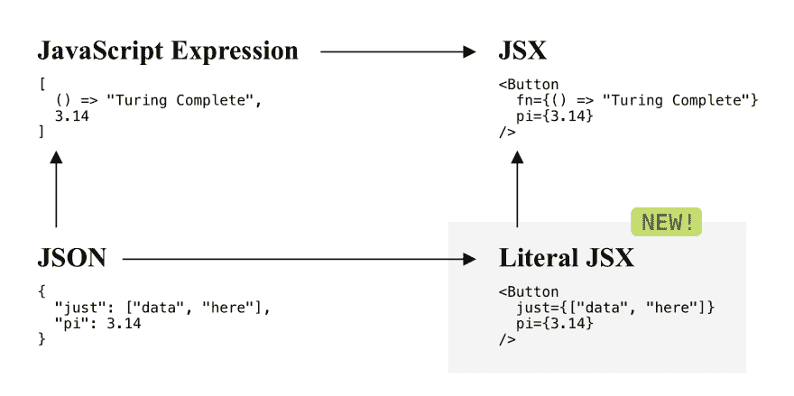
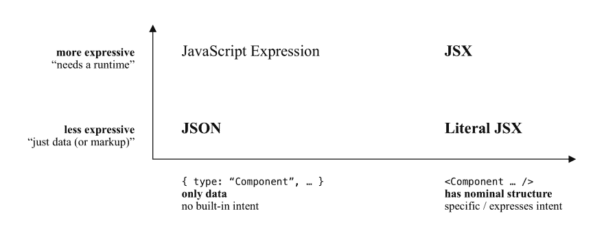
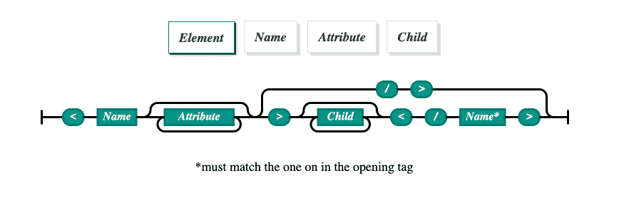
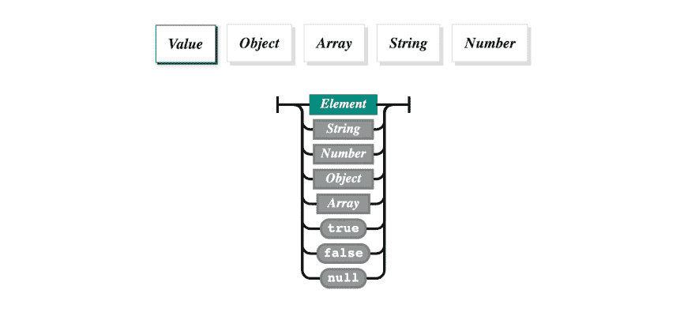

# 介绍文字 JSX

> 原文：<https://dev.to/kelleyvanevert/introducing-literal-jsx-1plm>

*非常简短的介绍:(1)看起来是这样的:*

[](https://res.cloudinary.com/practicaldev/image/fetch/s--dgMqIlq_--/c_limit%2Cf_auto%2Cfl_progressive%2Cq_auto%2Cw_880/https://dti6i5hz1tz1z.cloudfront.net/items/060z40080y0s0e0X2m1G/Image%25202019-06-29%2520at%25207.09.25%2520PM.png)

这就是事情的全部！

但那只是 JSX！—你可能会说。而且你说的没错，确实是 JSX([spec](https://facebook.github.io/jsx/)/[React docs](https://reactjs.org/docs/introducing-jsx.html))，不是我发明的。相反，我决定将 JSX 语法——它本身是 JavaScript 表达式的一个扩展——专门划分为其合理而简单的数据结构部分，就像 [JSON](https://json.org/) 对于 JavaScript 表达式一样。在图表中:

[](https://res.cloudinary.com/practicaldev/image/fetch/s--wv6s5DH7--/c_limit%2Cf_auto%2Cfl_progressive%2Cq_auto%2Cw_880/https://thepracticaldev.s3.amazonaws.com/i/h2j04y5tddmywbq2be39.png)

箭头表示语法扩展，或者相反:语法子集。

那么为什么子集 JSX 语法？—你可能会问。

让我们暂时后退一步，我将带你去看和我一样的文字 JSX 的“发明”。

JSX 是和脸书的 React 一起发明的，并在 React 的上下文中得到推广，React 是一个优先考虑声明性组件的库，是构建 comple UIs 的主要构件(剩下的就是历史了)。推动这种基于组件的方法的主要技术发明是虚拟 DOM [的思想，它是一种功能性和反应性的 API，用于包装有状态 DOM API](https://staltz.com/nothing-new-in-react-and-flux-except-one-thing.html) 。但是 JSX 和后者没有任何关系。为了使用虚拟 DOM 以声明方式编写组件，我们可以只编写如下所示的 javascript 代码(T2，有时我们还会做 T3):T4

```
function Greeting({ name }) {
  return { nodeType: "div", children: [
    { nodeType: "span", text: "Hello ," },
    { nodeType: "span", text: name }
  ] };
} 
```

## 论文:JSX 是关于人体工程学和意图的

JSX 相对于数据结构(或创建函数调用的数据结构)的比较优势可以被最好地描述为 JSX 相对于 JSON 的比较优势——JSON 是 JavaScript 世界中事实上的数据交换格式。换句话说，选择写作

*   `<Greeting name="Kelley" />`

比如说

*   `{ "component": "Greeting", "attrs": { "name": "Kelley" } }`

我可以想象我们更喜欢前者而不是后者的两个原因:

*   **人体工程学。**

    很明显，因为它包含的字符更少，而且程序员喜欢减少他们需要编写的字符数。(尤其是在网络社区，它围绕着一种动态语言，这种语言在历史上允许各种创造性的降低开销的发明。)

*   **意图。**

    但我认为不止如此。我认为字符串`Greeting`从一个属性的值(这里是`"component"`)到*事物的名称*的“提升”可能是最重要的区别。它看起来像 HTML(或 XML)，其中事物的名称定义了布局、语义等。

    ***有具体的、意向的语义(表象的、交互的等。)—相对于它“仅仅是数据”。*T3】**

让我用这些见解来注释上面的图表:

[](https://res.cloudinary.com/practicaldev/image/fetch/s--ZAKBQY9j--/c_limit%2Cf_auto%2Cfl_progressive%2Cq_auto%2Cw_880/https://thepracticaldev.s3.amazonaws.com/i/kqjisyxnwhfk9hncq621.png)

## 论文:JSON 是一项重要发明*作为标准*

通过将 JavaScript 语法子集化为最少的数据结构(并强加一些格式约束)，道格拉斯·克洛克福特创造了一种简单明了的数据交换格式。你可以说它“赢得了”与 XML 作为 web 轻量级数据交换格式的战斗。那么 JSON 有什么让它流行起来呢？

*   它比 XML 更符合人体工程学。如果您想轻松地交换数据，您不希望必须做出太多的决定，通常将数据结构转换为 XML 需要做出许多这样的决定(通常与语义相关，例如什么是类型 T1、什么是 T2 属性 T3 等问题)。)还有，你需要的字符少。
*   它有一个明确的单遍可解析语法，这使得它很容易实现，使用起来也很快。
*   这是一个标准而不是实现。这一点怎么强调都不为过。

## 最终论文:字面上的 JSX 可以成为与名义上的 UI 结构交换数据的合理标准

当谈到交换“UI 数据”时，我能想到两个主要的用例

### 用例:内容创作

用 Markdown(和其他相关的轻量级标记格式)创作内容是一种时尚。由于“更少的结构使更容易的互操作性”的原则(也与“垃圾输入，垃圾输出”的思想相关)，加上其视觉上的简单性，Markdown 似乎是内容创作和标记格式之间近乎完美的折衷。然而，我们经常想打破降价的简单性，添加特定领域的额外功能。

例如，`dev.to`本身有一大堆“附加组件”,你可以放在你的文章中(用 Liguid 标签),比如与 Codesandbox、Glitch、GitHub 和一些`dev.to`特定插件的集成，等等。有许多替代方法可以给减价文本添加这样的附加成分，但它们都基于我所谓的“语法技巧”:只是一个巧妙选择的语法“转义标识符”，如``或`[[ ... ]]`或`$$ ... $$`或`%% ...`或...，但没有严格的附加语法规范，使其过于具体和不灵活。

在 [Codaisseur](https://codaisseur.com/) (我在那里教全栈开发)，我们也在 Markdown 中编写课程材料，对它们进行版本控制等。我们的课程材料中有一些小练习，以及一些交互式代码编辑集成。但是我们的目标是一个更通用的解决方案，为我们的内容添加更多类型的交互性和练习，而不牺牲 Markdown 创作的易用性和灵活性，保持我们的内容版本可控，等等。简而言之，字面上的 JSX 让我们有可能写出如下基于降价的材料:

```
---
title: "JavaScript 6 - Scoping"
learning_goals:
  - id: var_shadow
    description: "Understand variable shadowing"
  - id: analyze_scope
    description: "Analyze where a variable is \"visible\""
  # etc
---

## Welcome to the JS 6 module!

<LearningGoals showProgress />

<TeacherContent>
- Remember to discuss how block statements introduce new scopes!
- And show them the example of creating functions inside a for-loop
</TeacherContent>

[...]

## Exercises

<VariableShadowingExercise
  learning_goal="analyze_scope"
  variables={["name", "age", "totalAge"]}>
let totalAge = 0;
const people = ["Aretha", "Avishai", "Alice"];
for (const name of people) {
  const name = person;
  const age = Math.floor(Math.random() * 50);
  totalAge += age;
}
</VariableShadowingExercise> 
```

但是 [MDX](https://mdxjs.com/) 已经存在了，为什么我们还需要字面上的 JSX 呢？—你可能会问。您说得对，这几乎正是 MDX 正在解决的问题。但是有一个关键的不同:MDX 是一个*实现*，而字面上的 JSX 希望成为一个*标准*。具体来说，这意味着在 MDX 中用*呈现*我们的内容是不可行的，因为这要么需要 bundler(比如 Webpack 或 package)在构建时阅读我们所有的课程材料(很多),要么我们必须在应用程序中使用 MDX 运行时(包括一个成熟的 JavaScript 表达式解析器和 transpiler)。这也没有意义:因为内容是数据*而不是代码*。

### 用例:UI 数据的实际编程交换

因为这将使更灵活，传统的分割(一方面)在*应用程序*之间，它需要理解如何可视化地构造数据；以及(另一方面)内容*，它需要遵循应用程序中预先定义的结构。*

 *## 字面 JSX，定义

所以现在我们有了。在我看来，字面上的 JSX 是一个通用的，但更重要的是，它是交换 UI 内容问题的显而易见的解决方案。JSX 已经是创作“UI 组件”最广泛采用和公认的面孔。我们所做的就是*将它从完整的 JavaScript 语言规范*中剥离出来，并将其子集化，只包含基础良好的数据结构，以及简单的单遍可解析语法。

在可爱的铁路语法图中，这就是它的样子。首先，一个精简版的类似 JSON 的 JSX 的简单语法:

[](https://res.cloudinary.com/practicaldev/image/fetch/s--Wssg7cQe--/c_limit%2Cf_auto%2Cfl_progressive%2Cq_66%2Cw_880/https://dti6i5hz1tz1z.cloudfront.net/items/0v1V3e1g1n1x0s0h4411/Screen%2520Recording%25202019-06-29%2520at%252008.43%2520PM.gif)

然后，我们扩展了 JSON 的语法，以包括非终结符的“元素”:

[](https://res.cloudinary.com/practicaldev/image/fetch/s--JIMrYXhd--/c_limit%2Cf_auto%2Cfl_progressive%2Cq_auto%2Cw_880/https://dti6i5hz1tz1z.cloudfront.net/items/1Q0E0D2B3r0Z1R2U280b/Image%25202019-06-29%2520at%25208.44.26%2520PM.png)

结果呢？以下是现在有效的*文字 JSX* 值(即“值”非终结符的有效语法):

*   `42`
*   `"Just a String"`
*   `<SomeComponent />`
*   `["a string", <AComponent />, 3.14]`
*   `<Button data={["a string", <AComponent />, 3.14]} />`
*   *等。*

那现在怎么办？

*   [前往网站](https://literal-jsx.org/)，看看那些可爱的铁路图:)
*   查看我在 npm 上的示例实现，并使用它做一些很酷的事情！
*   使用您选择的语言，为您选择的语言编写一个更好的实现！
*   让我知道你是否认为我说的是明智的！:D*