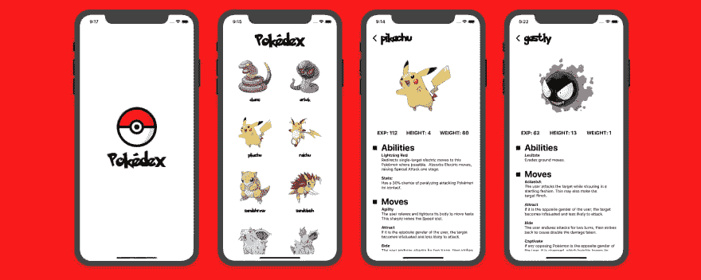

# 介绍 Pokedex

> 原文：<https://dev.to/theworstdev/introducing-pokedex-4976>

[](https://res.cloudinary.com/practicaldev/image/fetch/s--5cOLO2Q_--/c_limit%2Cf_auto%2Cfl_progressive%2Cq_auto%2Cw_880/https://thepracticaldev.s3.amazonaws.com/i/3ipt518c0ngfkgy0r4j7.png)

**在几分钟内部署由 AWS AppSync 和 AWS Lambda 支持的全栈 Pokédex 应用。**

我最近问人们下一步希望看到什么样的例子，目前最大的要求是如何在 AWS Amplify 和 AWS AppSync 中处理分页，以及有什么比神奇宝贝更好的方式来展示这一点！

## 它有什么作用

*   🦊滚动 100 个口袋妖怪
*   💅动画片
*   📄页码
*   🔥无服务器后端
*   🚀GraphQL
*   💻在几分钟内部署后端

## 工作原理

应用程序的代码位于[这里](https://github.com/kkemple/pokedex)。

这个项目使用 AWS AppSync 来提供一个由无服务器函数支持的无服务器 GraphQL API。这些函数用于与[口袋妖怪 API](https://pokeapi.co) 进行交互。

在项目中，您会注意到一个名为`amplify`的文件夹。该文件夹包含应用程序的后端，可以在任何人的帐户中重新部署。在`amplify`文件夹中，你会看到一个`backend`文件夹。在该文件夹中，您将看到三个主要功能的配置:

*   GraphQL API(使用 AWS AppSync 构建)
*   函数(用 AWS Lambda 构建)

在`backend/api`文件夹中，你会看到 GraphQL API 配置以及基本的 [GraphQL 模式](https://github.com/kkemple/pokedex/blob/master/amplify/backend/api/pokedex/schema.graphql)。

这是基本的 GraphQL 模式。您将看到基础模式如下所示:

```
type  Query  {  listPokemon(limit:  Int,  nextToken:  Int):  PokemonConnection  @function(name:  "listpokemon-${env}")  pokemon(id:  Int):  Pokemon  @function(name:  "getpokemon-${env}")  }  type  PokemonConnection  {  nextToken:  Int  items:  [Pokemon]  }  type  Pokemon  {  abilities:  [PokemonAbility]!  baseExp:  Int!  height:  Int!  id:  Int!  image:  String!  moves:  [PokemonMove]!  name:  String!  weight:  Int!  }  type  PokemonMove  {  id:  String!  details:  PokemonMoveDetails  @function(name:  "pokemonmovedetails-${env}")  }  type  PokemonAbility  {  id:  String!  details:  PokemonAbilityDetails  @function(name:  "pokemonabilitydetails-${env}")  }  type  PokemonMoveDetails  {  name:  String!  flavorText:  String!  effect:  String!  }  type  PokemonAbilityDetails  {  name:  String!  effect:  String!  } 
```

Enter fullscreen mode Exit fullscreen mode

如果你以前从未使用过 Amplify，你可能不知道`@function`指令。这是 Amplify CLI 的 [GraphQL 转换](https://aws-amplify.github.io/docs/cli-toolchain/graphql)库的一部分。

**@ function**——用这个指令修饰任何字段，使用无服务器函数作为 AppSync 解析器。这些映射到通过 Amplify CLI 配置的功能。

## 部署 App

### 部署后端，运行 app

1.  克隆存储库并安装依赖项

```
~ git clone https://github.com/kkemple/pokedex.git
~ cd pokedex
~ npm install 
```

Enter fullscreen mode Exit fullscreen mode

1.  初始化放大项目

```
~ amplify init
? Enter a name for the environment: dev (or whatever you would like to call this env)
? Choose your default editor: <YOUR_EDITOR_OF_CHOICE>
? Do you want to use an AWS profile? Y 
```

Enter fullscreen mode Exit fullscreen mode

1.  模拟后端，以确保应用程序正常工作

```
amplify mock 
```

Enter fullscreen mode Exit fullscreen mode

1.  启动应用程序并验证用户界面是否正常工作

```
~ expo start 
```

Enter fullscreen mode Exit fullscreen mode

1.  推送到 AWS

```
~ amplify push
? Are you sure you want to continue? Y
? Do you want to generate code for your newly created GraphQL API? N
> We already have the GraphQL code generated for this project, so generating it here is not necessary. 
```

Enter fullscreen mode Exit fullscreen mode

## 定制 GraphQL 模式

此模式可以编辑。如果需要额外的字段或基本类型，可以通过执行以下操作来更新后端:

更新模式(位于 amplify/back end/API/gweather app/schema . graph QL)。

重新部署后端

```
amplify push 
```

Enter fullscreen mode Exit fullscreen mode

> 应用程序中有一个设置页面，一个有趣的挑战是允许用户存储位置，并为预测设置一个！

如果您或您认识的任何人需要帮助来启动和运行此应用程序，请通过 [Twitter](https://twitter.com/kurtiskemple) 联系我，我很乐意提供帮助！