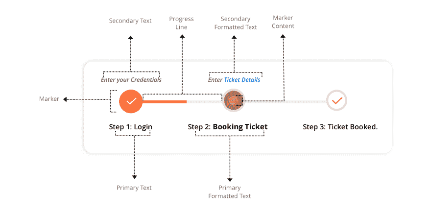
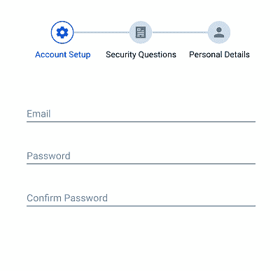
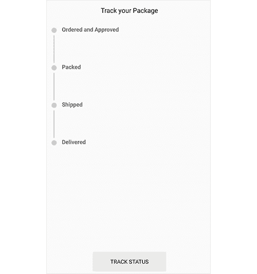
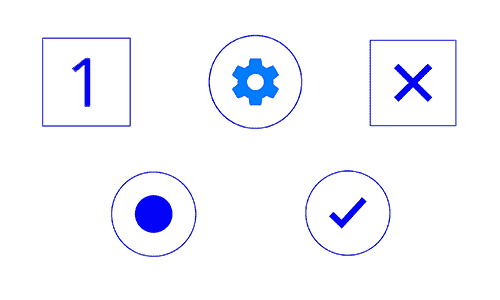
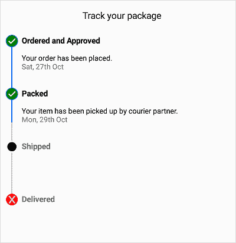

# 为 Xamarin 介绍 StepProgressBar。形式

> 原文：<https://dev.to/syncfusion/introducing-stepprogressbar-for-xamarin-forms-gmj>

我们很高兴向您介绍 [Xamarin。在 Xamarin 的](https://www.syncfusion.com/xamarin-ui-controls/xamarin-stepprogressbar) [Essential Studio 中形成 StepProgressBar 组件](https://www.syncfusion.com/forums/145843/essential-studio-2019-volume-2-release-v17-2-0-34-is-available-for-download)。表格 2019，第二卷。

大多数移动应用程序的任务或操作都涉及需要通过用户界面传达的多个步骤或阶段。这就是为什么 Syncfusion 为 Xamarin 创建了一个 StepProgressBar 组件，它具有醒目的视觉效果和无障碍的可用性。

<figure>

[Xamarin。Forms](https://docs.microsoft.com/en-us/xamarin/xamarin-forms/) StepProgressBar 是一个指示多步骤(状态)过程进度的控件，比如新用户注册或包状态跟踪。您可以通过更改步骤形状、步骤内容、进度条颜色等来自定义其外观。在这篇博文中，我们将总结 Xamarin 的主要特性。窗体 StepProgressBar 控件。【T2

<figcaption>Step Progress Bar Control Overview</figcaption>

</figure>

## 方位

<figure>

由于多步骤流程可以在水平或垂直方向上进行，我们为这两个方向都提供了方向支持。[](https://res.cloudinary.com/practicaldev/image/fetch/s--auXIu_h9--/c_limit%2Cf_auto%2Cfl_progressive%2Cq_auto%2Cw_880/https://blog.syncfusion.com/wp-content/uploads/2019/07/Horizontal-StepProgressBar-Control.png)

<figcaption>Horizontal Step Progress Bar Control</figcaption>

</figure>

<figure>

[](https://res.cloudinary.com/practicaldev/image/fetch/s--DbbAysy2--/c_limit%2Cf_auto%2Cfl_progressive%2Cq_auto%2Cw_880/https://blog.syncfusion.com/wp-content/uploads/2019/07/Vertical-StepProgressBar-Control.png)

<figcaption>Vertical Step Progress Bar Control</figcaption>

</figure>

## 状态

<figure>

步骤有三种状态:未开始、正在进行和已完成。基于状态，您可以用不同的样式格式化一个步骤，这意味着每当一个步骤的状态改变时，可视化的样式将同步改变。[](https://res.cloudinary.com/practicaldev/image/fetch/s--5KA30e2Q--/c_limit%2Cf_auto%2Cfl_progressive%2Cq_66%2Cw_880/https://blog.syncfusion.com/wp-content/uploads/2019/07/Steps-in-Not-Started-Status.gif)

<figcaption>Steps in different status</figcaption>

</figure>

## 步骤描述

多步骤流程中的每一步都有不同的操作。为了提供关于步骤的不言自明的信息，可以在任一侧显示步骤描述。主要描述位于步骤的右侧或底部，次要描述位于步骤的左侧或顶部。

<figure>

我们通过提供额外的支持扩展了这个特性，在这里, [FormattedString](https://docs.microsoft.com/en-us/dotnet/api/xamarin.forms.formattedstring?view=xamarin-forms) 类可以作为两个描述的输入。您可以使用不同的格式样式来自定义这些描述。【T2

<figcaption>Step Descriptions</figcaption>

</figure>

## 标记形状

<figure>

台阶标记的形状可以是圆形或方形。[](https://res.cloudinary.com/practicaldev/image/fetch/s--in8gLRb9--/c_limit%2Cf_auto%2Cfl_progressive%2Cq_auto%2Cw_880/https://blog.syncfusion.com/wp-content/uploads/2019/07/Step-Markers.jpg)

<figcaption>Step Markers</figcaption>

</figure>

## 内容类型

<figure>

您可以使用数字、记号、十字、点或图像来自定义步骤内容。[](https://res.cloudinary.com/practicaldev/image/fetch/s---g4GVqnY--/c_limit%2Cf_auto%2Cfl_progressive%2Cq_auto%2Cw_880/https://blog.syncfusion.com/wp-content/uploads/2019/07/Step-Content.png)

<figcaption>Step Content</figcaption>

</figure>

## 样式

<figure>

Xamarin。Forms StepProgressBar 控件允许您根据步骤的状态对其进行自定义。为每个状态定义一个单独的风格来实现这一点。可以为样式定义标记颜色、标记形状类型、标记内容颜色、标记内容类型、标记笔画颜色、标记笔画宽度、标记大小、标记内容大小、进度线颜色和字体。[](https://res.cloudinary.com/practicaldev/image/fetch/s--RT2PQWFT--/c_limit%2Cf_auto%2Cfl_progressive%2Cq_auto%2Cw_880/https://blog.syncfusion.com/wp-content/uploads/2019/07/Style-applied-to-Step-Progress-Bar.png)

<figcaption>Style applied to Step Progress Bar</figcaption>

</figure>

## stepprogress bar 入门

本节逐步向您展示如何使用 StepProgressBar 控件实现 Xamarin 移动应用程序。

1.  创建一个空白的 Xamarin。表单应用程序。
2.  在应用中，参考 **[Xamarin。从 nuget.org](https://www.nuget.org/packages/Syncfusion.Xamarin.SfProgressBar/)[拿包裹](https://www.nuget.org/)。要了解关于 **SfStepProgressBar** 的更多信息，请参考 [Syncfusion 文档](https://help.syncfusion.com/xamarin/stepprogressbar/gettingstarted#adding-sfstepprogressbar-reference)中的“添加 SfStepProgressBar 参考”。**
3.  在 UWP 和 iOS 中部署应用程序时，请遵循“[使用 StepProgressBar](https://help.syncfusion.com/xamarin/stepprogressbar/gettingstarted#launching-the-application-on-each-platform-with-stepprogressbar) 在每个平台上启动应用程序”中提供的步骤，Syncfusion 的文档中也提供了该步骤。
4.  在各自的页面中导入进度栏命名空间，如下面的代码示例所示。

```
xmlns:progressBar="clr-namespace:Syncfusion.XForms.ProgressBar;assembly=Syncfusion.SfProgressBar.XForms" 
```

然后，初始化 **SfStepProgressBar** ，如以下代码所示。

```
<progressBar:SfStepProgressBar HorizontalOptions="Center" VerticalOptions="Center">
    <progressBar:StepView PrimaryText="Step 1" />
    <progressBar:StepView PrimaryText="Step 2" />
    <progressBar:StepView PrimaryText="Step 3" />
    <progressBar:StepView PrimaryText="Step 4" Status="InProgress" />
    <progressBar:StepView PrimaryText="Step 5" />
</progressBar:SfStepProgressBar> 
```

这就是如何将 StepProgressBar 控件添加到应用程序中。[](https://res.cloudinary.com/practicaldev/image/fetch/s--K_BGTEdY--/c_limit%2Cf_auto%2Cfl_progressive%2Cq_auto%2Cw_880/https://blog.syncfusion.com/wp-content/uploads/2019/07/Step-Progress-Bar.jpg)

您可以从这个 [GitHub 位置](https://github.com/syncfusion/xamarin-demos/tree/master/Forms/StepProgressBar)下载入门示例。

## 结论

在这篇博文中，我们对 Xamarin 做了一个快速的概述。表格[步骤进度指示器](https://www.syncfusion.com/xamarin-ui-controls/xamarin-stepprogressbar)在 [2019 卷 2 版本](https://www.syncfusion.com/forums/145843/essential-studio-2019-volume-2-release-v17-2-0-34-is-available-for-download)中提供。我们邀请您查看我们所有的 [Xamarin。表单控件](https://www.syncfusion.com/xamarin-ui-controls/)。您可以随时[下载我们的免费评估版](https://www.syncfusion.com/downloads/xamarin)来查看我们所有的控件。请随意在 [Google Play](https://play.google.com/store/apps/details?id=com.syncfusion.samplebrowser) 和[微软商店](https://www.microsoft.com/en-us/p/syncfusion-essential-studio-for-xamarin/9nn069tldzf4)上探索我们的样品。了解更多关于 Xamarin 的高级功能。表单控件，请参考我们的文档。

如果您对此控件有任何疑问或需要澄清，请在评论部分告诉我们。您也可以通过我们的[支持论坛](https://www.syncfusion.com/forums)、[直接跟踪](https://www.syncfusion.com/support/directtrac/)或[反馈门户](https://www.syncfusion.com/feedback/xamarin-forms)联系我们。我们总是乐意提供帮助。

帖子[介绍 Xamarin 的 StepProgressBar。表单](https://www.syncfusion.com/blogs/post/introducing-step-progress-bar-for-xamarin-forms.aspx)首先出现在 [Syncfusion 博客](https://www.syncfusion.com/blogs)上。