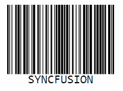

# 介绍 Syncfusion 的新 JavaScript 条形码生成器控件

> 原文：<https://dev.to/syncfusion/introducing-syncfusion-s-new-javascript-barcode-generator-control-3fip>

Syncfusion 很高兴地分享一个新的、强大的、[纯 JavaScript 条形码生成器](https://www.syncfusion.com/javascript-ui-controls/js-barcode)控件已经包含在我们的 web (Essential JS 2)平台中。这个条码生成器控件是轻量级的，易于使用，易于集成。它可用于使用 JavaScript 创建和显示行业标准的 1D 条形码、数据矩阵条形码和 QR 码。生成的条形码针对打印和屏幕扫描进行了优化。该控件可与其他第三方 web 框架(如 Angular、React 和 Vue.js)互操作。

在这篇博客中，我们将引导您了解 JavaScript 条形码生成器控件的主要特性以及如何开始使用。

**主要特点**:

*   各种条形码符号，包括 Code 39、Code 39 extended、Code 11、Codabar、Code 32、Code 93、Code 93 extended、Code 128、UPC-A、UPC-E、EAN-8、EAN-13、数据矩阵和 QR 码。
*   显示带有或不带有人类可读文本的条形码的选项。
*   用于自定义文本位置及其对齐方式的选项。
*   自定义条形码高度、宽度、背景色和前景色的选项。
*   将条形码渲染为 SVG 或画布图形的选项。

让我们看看如何使用 [Syncfusion 的新 JavaScript 条形码生成器控件](https://www.syncfusion.com/javascript-ui-controls/js-barcode)生成 1D 或线性条形码、数据矩阵条形码和 QR 码。

## 生成 1D 或线性条形码

克隆 [Essential JS 2 quickstart](https://github.com/syncfusion/ej2-quickstart) 项目，并使用以下命令安装必要的包:

| `git clone https://github.com/syncfusion/ej2-quickstart.git quickstart
cd quickstart
npm install` |

[依赖包](https://ej2.syncfusion.com/documentation/diagram/getting-started.html?lang=typescript#dependencies)必须映射到 **system.config.js** 配置文件中。

```
System.config({
    paths: {
        'syncfusion:': './node_modules/@syncfusion/',
    },
    map: {
        app: 'app',

        //Syncfusion packages mapping
        "@syncfusion/ej2-base": "syncfusion:ej2-base/dist/ej2-base.umd.min.js",
        "@syncfusion/ej2-barcodegenerator": "syncfusion:ej2-barcodegenerator/dist/ej2- barcodegenerator.umd.min.js",
    },
    packages: {
        'app': { main: 'app', defaultExtension: 'js' }
    }
}); 
```

将条形码的 HTML div 元素添加到**index.html**中。

```
<!-- Add the HTML <div> element  -->
<div id="barcode"> </div> 
```

现在，通过指定条形码类型、值等来实例化条形码生成器。，在**app . ts**【src/app/app . ts】中。下面的代码示例将生成代码为 128 的条形码。

```
import { BarcodeGenerator } from '@syncfusion/ej2-barcode-generator';

/**
 * Initialize the barcode
 */

let barcode: BarcodeGenerator = new BarcodeGenerator({
    width: '200px',
    height: '150px',
    // Define the type of the barcode
    type: 'Code128',
    // Define the value for the barcode to generate
    value: 'SYNCFUSION',
});
barcode.appendTo('#barcode'); 
```

运行以下命令启动应用程序。

| `npm start` |

生成的 Code 128 条形码将类似于以下条形码。[](https://res.cloudinary.com/practicaldev/image/fetch/s--4TIb2ola--/c_limit%2Cf_auto%2Cfl_progressive%2Cq_auto%2Cw_880/https://www.syncfusion.com/blogs/wp-content/uploads/2019/08/Code-128-barcode.png)

## 生成二维码

您可以使用上一节中提到的相同软件包来创建 QR 码。下面的代码示例说明了如何创建 QR 代码。

```
/*[src/app/app.ts] */

import { QRCodeGenerator } from '@syncfusion/ej2-barcode-generator';

/**
 * Initialize the QRCode Generator
 */
let barcode: QRCodeGenerator = new QRCodeGenerator({
    width: '200px',
    height: '150px',
    value: 'SYNCFUSION',    
});
barcode.appendTo('#barcode'); 
```

生成的二维码将如下图所示。[](https://res.cloudinary.com/practicaldev/image/fetch/s--SeQiQwDK--/c_limit%2Cf_auto%2Cfl_progressive%2Cq_auto%2Cw_880/https://www.syncfusion.com/blogs/wp-content/uploads/2019/08/QR-code-1.png)

## 生成数据矩阵

您可以使用以下代码示例创建数据矩阵条形码。

```
/*[src/app/app.ts] */

import { DataMatrixGenerator} from '@syncfusion/ej2-barcode-generator';

/**
 * Initialize the Data Matrix Generator  
 */
 let barcode: DataMatrixGenerator = new DataMatrixGenerator({
    height: 150,
    width: 200,
    value: 'SYNCFUSION'
});
barcode.appendTo('#barcode'); 
```

以下是生成的数据矩阵条形码的屏幕截图。[](https://res.cloudinary.com/practicaldev/image/fetch/s--MiALJWIi--/c_limit%2Cf_auto%2Cfl_progressive%2Cq_auto%2Cw_880/https://www.syncfusion.com/blogs/wp-content/uploads/2019/08/Data-Matrix-barcode.png)

## 结论

我们希望您对我们的纯 JavaScript 条形码生成器控件的关键特性以及如何将其集成到您的 web 应用程序中有一个清晰的概念。该条形码生成器控件被设计为高度可定制的。

要试用我们的条形码生成器控件，请下载我们的[免费试用版](https://www.syncfusion.com/downloads/essential-js2)。你也可以在 [GitHub](https://github.com/syncfusion/ej2-javascript-ui-controls/tree/master/controls/barcodegenerator) 上查看它的来源。为了更深入地了解你能用这个组件做什么，你可以查看我们的[在线样本浏览器](https://ej2.syncfusion.com/demos/#/material/barcode/ean8.html)和[文档](https://ej2.syncfusion.com/javascript/documentation/barcode/es5-getting-started/?no-cache=1)。

如果你有任何问题或需要澄清，请在下面的评论区告诉我们。您也可以通过我们的[支持论坛、](https://www.syncfusion.com/forums) [Direct-Trac](https://www.syncfusion.com/support/directtrac/incidents/) 或[反馈门户](https://www.syncfusion.com/feedback/javascript)联系我们。我们随时乐意为您提供帮助！

介绍 Syncfusion 新的 JavaScript 条形码生成器控件的帖子[首先出现在](https://www.syncfusion.com/blogs/post/javascript-barcode-enerator.aspx) [Syncfusion 博客](https://www.syncfusion.com/blogs)上。