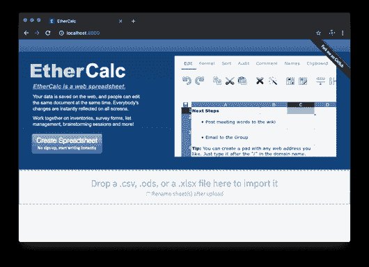
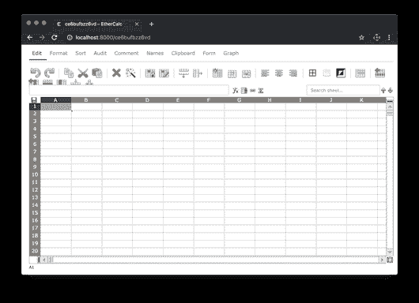
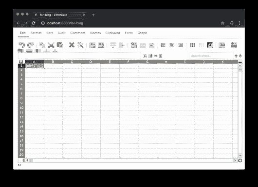
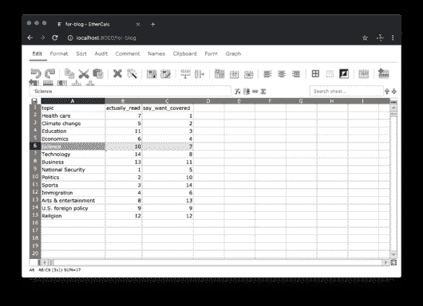
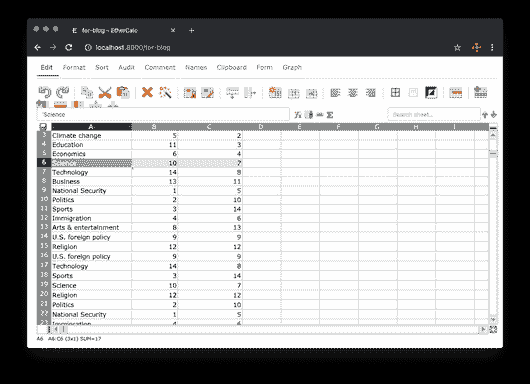

# {ethercalc}软件包简介

> 原文：<https://dev.to/hrbrmstr/introducing-the-ethercalc-package-h6m>

我在以前的一篇文章中提到过 [EtherCalc，并设法挤出一些时间来组装一个初出茅庐的](https://dev.to/hrbrmstr/makeover-jumbalaya-beating-dumbbells-into-slopegraphs-whilst-orchestrating-ethercalc-5bp7-temp-slug-1374326) [`{ethercalc} package`](https://git.rud.is/hrbrmstr/ethercalc) (它也在 GitLab、SourceHut、Bitbucket 和 GitUgh 上，只需替换掉适当的 URL 前缀)。

我正在为 EtherCalc 创建一个特定于包的 Docker 映像(有几个这样的映像，但我不支持它们与包一起使用，因为它们有一个 [CORS](https://developer.mozilla.org/en-US/docs/Web/HTTP/CORS) 配置，这使得 EtherCalc API 争论成问题)，但我强烈建议你只通过`npm`模块使用它。要做到这一点，您需要一个工作的 Node.js 安装，我强烈建议您也运行一个本地 Redis 实例(它是超级轻量级的)。Linux 用户可以使用他们最喜欢的软件包管理器，macOS 用户可以使用`homebrew`。使用传统 Windows 操作系统的用户可以访问:

*   [下载 Node.js](https://nodejs.org/en/download/) ，
*   [获取 npm](https://www.npmjs.com/get-npm) ，并且
*   [在 Windows 10 上运行 Redis](https://redislabs.com/blog/redis-on-windows-10/)

让 EtherCalc 运行起来。

出于性能原因，我还建议将 EtherCalc 和 Redis 一起运行。不管有没有 Redis，EtherCalc 都会为您的电子表格维护一个持久存储(他们称之为“房间”,因为 EtherCalc 支持协作编辑),但是使用 Redis 会使所有的 EtherCalc 操作快得多。

一旦运行了 Redis(在本地主机上，这是默认设置)并安装了 Node.js + `npm`，就可以执行以下操作来安装 EtherCalc:

```
$ npm install -g ethercalc # may require `sudo` on some macOS or *nix systems 
```

Enter fullscreen mode Exit fullscreen mode

`-g`告诉`npm`全局安装该模块，并确保`ethercalc`可执行文件在你的`PATH`上。像许多可以从 Node.js 甚至 Python 安装的东西一样，您可能会看到一系列“警告”，甚至可能是一些“错误”。如果您执行以下命令并看到类似的消息:

```
$ ethercalc --host=localhost ## IMPORTANT TO USE --host=localhost
Please connect to: http://localhost:8000/
Starting backend using webworker-threads
Falling back to vm.CreateContext backend
Express server listening on port 8000 in development mode
Zappa 0.5.0 "You can't do that on stage anymore" orchestrating the show
Connected to Redis Server: localhost:6379 
```

Enter fullscreen mode Exit fullscreen mode

然后转到它给你的网址，你会看到这样的内容:

[](https://i2.wp.com/rud.is/b/wp-content/uploads/2019/06/ethercalc-splash.png?ssl=1)

然后你就可以继续了。

### 一个【非常】简短的 EtherCalc 介绍

以太计算器[有一个维基](https://github.com/audreyt/ethercalc/wiki)。因此，请点击它以获得更多关于以太计算器的信息。

现在，如果你点击蓝色的“创建电子表格”按钮，如果你使用过谷歌工作表、Excel、LibreOffice Calc(等等)，你会看到一些非常熟悉的东西:

[](https://i1.wp.com/rud.is/b/wp-content/uploads/2019/06/ethercalc-create.png?ssl=1)

如果你在没有 T1 的情况下启动 T0，它会监听所有的网络接口，所以你网络上的其他人也可以把它作为一个本地的“云”电子表格应用程序，还可以和你一起 T2 编辑 T3，就像谷歌工作表一样。

我建议在继续之前先在 EtherCalc 中玩一会儿，看看它确实是一个电子表格应用程序，就像你熟悉的所有其他应用程序一样，只是它有一个健壮的 API，我们现在可以在 R 中编排它。

### 使用{ethercalc}

您可以从前面链接的源或通过:
安装{ethercalc}

```
install.packages("ethercalc", repos = "https://cinc.rud.is") 
```

Enter fullscreen mode Exit fullscreen mode

在这里您将获得 Windows 和 macOS 的二进制安装(二进制版本适用于 R 3.5.x，但也适用于 3.6.x 安装)。

如果你不想使用命令行界面来启动 EtherCalc，你可以使用`ec_start()`来运行一个只在你的 R 会话中有效的*。*

一旦运行了 EtherCalc，就需要将 URL 放入一个`ETHERCALC_HOST`环境变量中。我建议在`~/.Renviron`中添加以下内容，并重启你的 R 会话:

```
ETHERCALC_HOST=http://localhost:8000 
```

Enter fullscreen mode Exit fullscreen mode

(如果没有设置环境变量，您将得到一个交互式提示来提供这个信息。)

您可以通过执行`ec_running()`并阅读消息或检查(不可见的)返回值来验证 R 可以与您的 EtherCalc 实例对话。如果你*真的*认为你做对了*每件事*但是到现在还没有开始运行，发表评论或提出问题(在你喜欢的社交编码网站上)。

我在上一篇博文中设置的用例是执行轻量级数据输入，因为抓取是被禁止的，而且考虑到可视化是如何进行的，这会花费更多的时间。要开始一个新的电子表格(记住，EtherCalc 称之为“房间”)，只需:

```
ec_new("for-blog") 
```

Enter fullscreen mode Exit fullscreen mode

您应该会在默认的 web 浏览器中看到:

[](https://i1.wp.com/rud.is/b/wp-content/uploads/2019/06/ethercalc-new.png?ssl=1)

您可以使用`ec_list()`查看所有“保存”的电子表格的名称(`ec_delete()`也可以删除它们)。

我们将输入前一篇文章中的值:

[](https://i2.wp.com/rud.is/b/wp-content/uploads/2019/06/ethercalc-entry.png?ssl=1)

现在，为了检索这些值，我们可以做:

```
ec_read("for-blog", col_types="cii")
## # A tibble: 14 x 3
## topic actually_read say_want_covered
## <chr> <int> <int>
## 1 Health care 7 1
## 2 Climate change 5 2
## 3 Education 11 3
## 4 Economics 6 4
## 5 Science 10 7
## 6 Technology 14 8
## 7 Business 13 11
## 8 National Security 1 5
## 9 Politics 2 10
## 10 Sports 3 14
## 11 Immigration 4 6
## 12 Arts & entertainment 8 13
## 13 U.S. foreign policy 9 9
## 14 Religion 12 12 
```

Enter fullscreen mode Exit fullscreen mode

该函数接受`readr::read_csv()`接受的任何(与这个包用例相关的)参数(因为它使用这些参数来解析从 API 调用返回的对象)。如果有人添加或修改任何值，您可以再次调用`ec_read()`来检索它们。

`ec_export()`功能允许您将电子表格(“房间”)的内容下载到本地:

*   战斗支援车
*   JSON
*   超文本标记语言
*   降价
*   擅长

文件(它还将原始数据直接返回给 R 会话)。所以你可以这样做:

```
cat(rawToChar(ec_export("for-blog", "md", "~/Data/survey.md")))
## |topic|actually_read|say_want_covered|
## | ---- | ---- | ---- |
## |Health care|7|1|
## |Climate change|5|2|
## |Education|11|3|
## |Economics|6|4|
## |Science|10|7|
## |Technology|14|8|
## |Business|13|11|
## |National Security|1|5|
## |Politics|2|10|
## |Sports|3|14|
## |Immigration|4|6|
## |Arts & entertainment|8|13|
## |U.S. foreign policy|9|9|
## |Religion|12|12| 
```

Enter fullscreen mode Exit fullscreen mode

我们将对数据帧进行排序(以证明附加是有效的，我没有撒谎)，并将其附加到现有的工作表中(这是一个玩具示例，但是想象一下作为数据记录器附加到一个总是运行的 EtherCalc 实例，人们实际上做 IRL):

```
ec_read("for-blog", col_types="cii") %>% 
  dplyr::arrange(desc(topic)) %>% 
  ec_append("for-blog") 
```

Enter fullscreen mode Exit fullscreen mode

[](https://i2.wp.com/rud.is/b/wp-content/uploads/2019/06/ethercalc-append.png?ssl=1)

请注意，您也可以通过`ec_view()`将 EtherCalc 打开到任何现有的电子表格(“房间”)。

### 鳍

值得注意的是，EtherCalc *似乎*对每个电子表格(“房间”)有大约 500，000 个“单元格”的限制。我提到这一点是因为如果你试图，比方说，`ec_edit(ggplot2movies::movies, "movies")`你很可能会崩溃正在运行的 EtherCalc 实例，如果我没有在那个函数和`ec_append()`函数中编写一些导轨来阻止你这么做的话。在我看来，这是一个合理的限制，Google Sheets 出于类似的原因也做了类似的事情(每选项卡)(鉴于 javascript 与 DOM 元素争论的局限性，这两个限制也是我仍然反对使用浏览器做任何事情的原因之一)。

如果你正在处理大量的数据，电子表格通常不是最好的工具。

而且，尽管您应该不惜一切代价避免手工处理数据，但在大多数系统上，`ec_edit()`是 R 的`edit()`函数的更快、功能更丰富的替代方法。

在这篇文章中，我已经展示了`{ethercalc}`包的*大部分*当前功能。我漏掉的一个功能是`ec_cmd()`，它让你完全协调*所有的* EtherCalc 操作。它足够强大，EtherCalc 的命令结构也足够粗糙，我们将在另一篇文章中讨论它。另外，请继续关注前面提到的特定于包的 EtherCalc Docker 映像。

踢踢轮胎，提出问题和/或 PRs(在你喜欢的社交编码网站上),看看 EtherCalc 和`{ethercalc}`是否可以代替 Excel 和/或 Google Sheets，或者与它们一起使用。