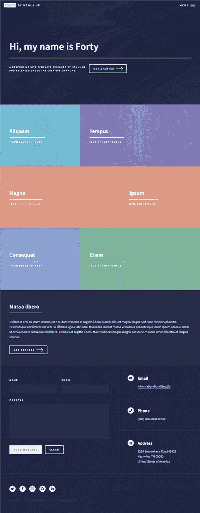
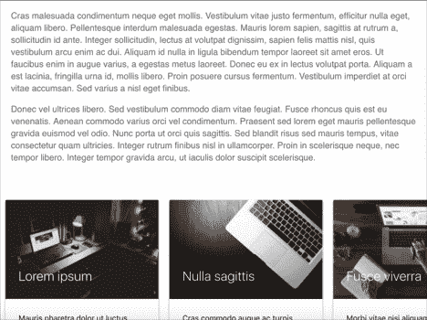
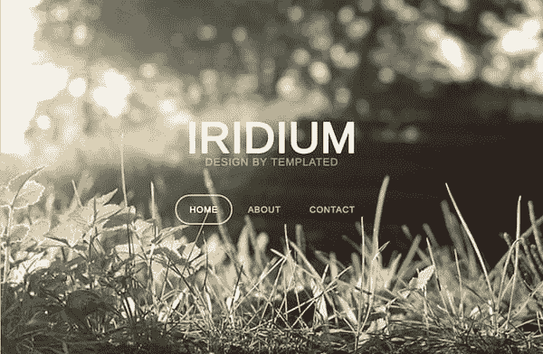

# 介绍主题+滚动卡片，Twitter 时间表|模块周一 56

> 原文：<https://dev.to/tyrw/introducing-themes-scroll-cards-twitter-timeline-module-monday-56-he9>

## 下面的一切都是开源的

它可以在任何网站、web 应用程序或其他任何地方免费使用。在 AnyMod 上还有数百个这样的构建和共享。

单击一个 mod 来查看它及其源代码。

## 四十个主题

一个有 6 个匹配模块的多彩黑暗主题。
[查看 mod](https://anymod.com/html-theme-templates/forty)
  

## 水平滚动条卡片

到达时自动向侧面滚动的卡片。
[查看 mod](https://anymod.com/mod/horizontal-scroll-cards-annbb?preview=true&lorem=true)
  

## 带集成菜单的简介部分

自定义背景、文本和链接。
[查看 mod](https://anymod.com/mod/hero-navigation-with-collapsible-sidebar-nkorba)
  

## 推特用户时间表

为你的任意 Twitter 账户嵌入完整的互动时间表。
[查看 mod](https://anymod.com/mod/twitter-user-timeline-nkdab)
  

## 简单的标题

您或您的团队可以轻松编辑的基本文本标题。
[查看 mod](https://anymod.com/mod/simple-headline-nkolda)
  

* * *

我每周一从社区[这里](https://dev.to/tyrw)贴出新的 mods 我希望你觉得它们有用！

快乐编码✌️