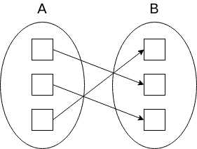
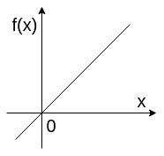

# 简介:从功能到终结

> 原文：<https://dev.to/stereobooster/introduction-from-function-to-closure-3h6o>

从函数的理论概念到闭包在编程中的实际应用。我从不同的角度展示了同一个概念，因此您可以建立更深入的理解。

## 功能

简化定义:

> 函数为每个输入分配一个输出。
> - [卡纳卡德米](https://www.khanacademy.org/math/algebra/algebra-functions/evaluating-functions/v/what-is-a-function)

更正式的定义:

> 函数是唯一地将一个集合的成员与另一个集合的成员相关联的关系。从`A`到`B`的函数是一个对象`f`，使得每个`a in A`都与一个对象`f(a) in B`唯一关联。
> - [Mathworld Wolfram](http://mathworld.wolfram.com/Function.html)

函数示例:

```
f(x) = x 
```

同样，函数也可以根据[λ演算](https://www.inf.fu-berlin.de/lehre/WS03/alpi/lambda.pdf) :
称为“λ”或“λ”

```
λx.x 
```

*旁注*:我提供了 lambda 微积分中的例子，但不是必不可少的，可以跳过。

或“映射”，例如从`A`映射到`B`:

[](https://res.cloudinary.com/practicaldev/image/fetch/s--z0t78Fj0--/c_limit%2Cf_auto%2Cfl_progressive%2Cq_auto%2Cw_880/https://stereobooster.com/posts/from-function-to-closure/from-a-to-b.svg)

或者我们可以把函数想象成一个表(元组集`(x, f(x))`):

| x | f(x) |
| --- | --- |
| one | one |
| Two | Two |
| ... | ... |

或者它可以表示为笛卡尔坐标中的点:

[](https://res.cloudinary.com/practicaldev/image/fetch/s--0FpsHLWC--/c_limit%2Cf_auto%2Cfl_progressive%2Cq_auto%2Cw_880/https://stereobooster.com/posts/from-function-to-closure/cartesian-coordinates.svg)

在编程中，它们被称为函数或“匿名函数”或“lambdas”，例如在 JS:

```
const identity = x => x; 
```

或者“方法”——绑定到一个对象的函数

```
class Example {
  identity(x) {
    return x;
  }
} 
```

## 变量

在给定的例子中`x`是变量。可以有多个变量:

```
f(x, y, z) = x + y + z 
```

它也可以被称为“自变量”或“参数”。所有的论证合在一起可以称为“输入”。

我们可以用任何符号来表示变量，例如用更有意义的名字

```
f(longitude, latitude) = ... 
```

## 指定功能

函数的规格说明是关于输入和输出之间关系的任何一种解释。它可以是一个简单的数学公式

```
f(x) = x + 1 
```

它可以是任何种类的指令

```
f(x) = <if x is even then x + 1; if x is odd then x - 1> 
```

或者另一种描述方式。

在编程中函数是由函数的“体”指定的:

```
const f = x => x + 1;
// or
const f = x => {
  return x + 1;
}; 
```

在λ演算中，函数由表达式
指定

```
function := λ<variable>.<expression> 
```

其中表达式为

```
<expression> := <variable> | <function> | <application>
<application> := <expression> <expression> 
```

(不要专注于此，现在，我们将回到应用程序，它会更清楚)

### 申请

函数应用或变量替换是当你提供变量来获得函数的实际值:

```
f(x) = x + 1
for x = 1, f(1) = 1 + 1 = 2
for x = 2, f(2) = 1 + 2 = 3
etc. 
```

在编程中，它被命名为“函数调用”或“求值”或“执行”或“计算”:

```
const f = x => x + 1;
f(1); // is 2
f(2); // is 3 
```

在 JS 中有两种方法可以做到这一点，因为在 JS 中他们需要一种方法来绑定特殊变量`this`。这不是必要的信息，我提供它是为了全面了解情况

```
f.call(null, 1); // is 2, first argument is for `this`, which we don't use
f.apply(null, [1]); // is 2, first argument is for `this`, which we don't use 
```

在 lambda 演算中，他们将应用程序写成

```
λx.x y
or
(λx.x) y 
```

第一个表达式是应用函数(`λx.x`)，第二个表达式是值(`y`)。申请结果为`y`。

### 作为一个值起作用

我们可以把函数当作值——在其他函数内部传递，或者从其他函数返回。可以返回函数或者将函数作为输入的函数称为高阶函数，这在我看来有点混乱，因为缩写为 HOF 的这三个词看起来好像这些函数有什么特殊之处，但如果你将函数视为值`¯\_(ツ)_/¯`，它们就是相同的函数。

作为价值的职能有一个不同的术语——在这种情况下的职能被称为“一等公民”(难道只有我一个人认为这是某种程度上的种族主义术语吗？)

例如，将函数视为值可以用于多态。假设你有一个列表(或者数组)，有一个通用的过滤器函数，通过提供不同的函数给过滤器你可以改变它的行为:

```
[1, 2, 3, 4, 5, 6]
  .filter(x => x % 2) // 1, 3, 5
  [(1, 2, 3, 4, 5, 6)].filter(x => !(x % 2)); // 2, 4, 6 
```

多态性不是唯一的例子，我们将在下面看到更多函数作为值的例子。将函数视为值允许做一些很酷的技巧。

λ演算中的例子:

```
λx.(λz.(z x)) 
```

在这个例子中，z 是一个函数，最后我们将 z 应用于 x。

### 局部应用

如果我们的函数有不止一个变量，我们不需要一次提供所有的变量，我们可以先提供一部分，然后再提供其余的

```
f(x, y) = x + y
f1(y) = f(2, y) = 2 + y
f1(1) is 3 
```

例如，我们可以想象一个函数，它定义了三维空间中的曲线，通过“固定”其中一个变量(用实际值代替),我们可以进行切片(或投影)。

但是如果我们面前没有公式怎么办，如果我们把函数当成黑盒怎么办？我们可以说:好吧，让我们记住，我们有这个变量的一些值，并继续下去，直到我们得到函数的所有参数，所以我们可以“完全”应用函数。这是典型的编程，出于封装的原因，我们将函数作为黑盒来处理。例如，我们可以引入一个函数`partiallyApplyOne` :

```
const partiallyApplyOne = (f, variableToBind) => y => f(variableToBind, y); 
```

如你所见，没有立即调用函数`f`,而是将它封装到另一个只有一个参数的函数中，一旦得到所有变量
,我们就会调用原始函数

```
const f = (x, y) => x + y;
const f1 = partiallyApplyOne(f, 2); 
```

`f1`是新函数`(y) => f(variableToBind, y)`，我们“记住”在这种情况下`variableToBind`是 2。当我们调用`f1(1)`时，我们用 1 代替`(y) => f(variableToBind, y)`中的 y，现在我们有了调用原始`f`所需的所有变量，例如`f(2, 1)`。

我们可以说，部分应用产生了新的函数(返回函数，例如将函数视为变量)，具有更少数量的变量(具有更小的“arity”)。

在编程中，部分应用也可以称为“绑定”。在 JS 中，它们有额外的绑定形式，因为它们需要一种方式来绑定特殊变量`this` :

```
const f = (x, y) => x + y;
const f1 = f.bind(null, 2); // first argument is for `this`, which we don't use
f1(1); // 3 
```

在 lambda 演算中，他们使用术语“绑定”来描述点之前提到的变量，与没有提到的“自由”变量形成对比

```
λx.xy 
```

在这个例子中，`x`是一个绑定变量，`y`是一个“自由”变量。

## 闭合

我们之前提到过这种“牢记变量”的神奇技巧，没有适当的解释。如何将变量附加到函数上？为此，我们需要使用闭包。闭包是一个函数，它有一个定义(或“创建”)它的上下文。闭包是词汇范围的，这意味着:

*   它的作用域受函数体的限制(函数的变量也在作用域内)
*   闭包可以嵌套，例如子函数可以访问它自己的作用域和它所有的父作用域
*   但是父函数不能访问子范围

我们来看例子:

```
const a = (x) => {
|  const i = 0;
|  const b = (y) => {
|  |  const j = 1;
|  |  const c = (z) => {
|  |  |  return i + j + x + y + z;
|  |  }
|  }
|  return b;
} 
```

第一层是函数`a`的作用域，它可以“看见”变量`b`、`i`和`x`，但不能看见`y`、`j`、`c`、`z`。严格来说，函数`a`也可以“看到”变量`a`，因为它来自父(最顶层或全局)作用域。
第二层是函数`b`的作用域:`c`、`y`、`j`，来自父作用域`a`、`b`、`x`、`i`、
；第三层是函数`c` : `z`，来自父作用域`a`、`b`、`c`、`x`、`y`、`z`、`i`、`j`

在实践中，闭包被实现为“环境”,它与函数一起传递并用于解析变量:求值器从环境中请求变量，如果环境没有所需的变量，求值器从父环境中请求，并将继续这样做，直到得到答案或到达最顶层的环境。

闭包通常使用词法范围，但是有不同方法来解析范围，例如动态范围。词法范围更容易推理。

用 lambda 演算的术语来说:闭包是一个在其定义中使用自由变量的函数。

### 闭关修行

闭包可以有很多有趣的用途(我们已经看到了绑定)，例如，我们可以借助闭包编写记忆化函数

```
const memo = f => {
  const cache = WekMap(); //closure variable
  return x => {
    if (!cache.has(x)) {
      cache.set(x, f(x));
    }
    return cache.get(x);
  };
}; 
```

或者我们可以编写去抖函数

```
const debounce = (f, time) => {
  let timer; //closure variable
  return x => {
    clearTimeout(timer);
    timer = setTimeout(() => {
      f(x);
    }, time);
  };
}; 
```

*旁注 1* :在数学中，它们没有突变(第一个例子打破了这个规则)，并且它们具有引用透明性，例如不能重新分配变量(第二个例子打破了这个规则)，但是这些规则对于作为概念的闭包来说并不重要。

*旁注 2* :为简单起见，示例使用一个参数，但也可能有多个参数。

## PS

还有一些我在本文中没有涉及到的概念，比如递归、currying、复合等等——这将在下一篇文章中讨论。