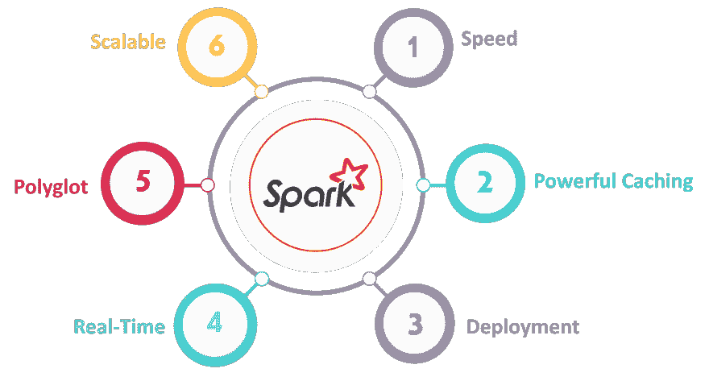
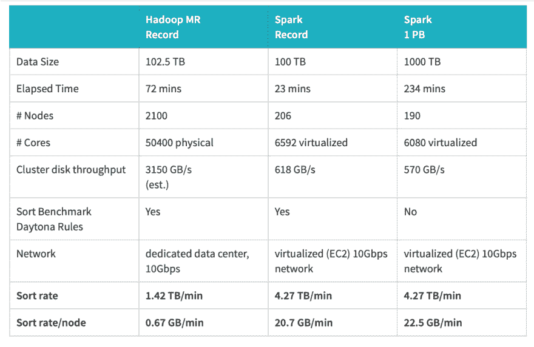
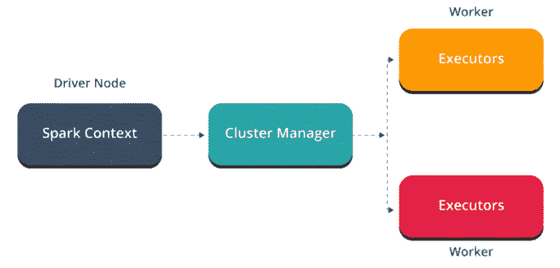
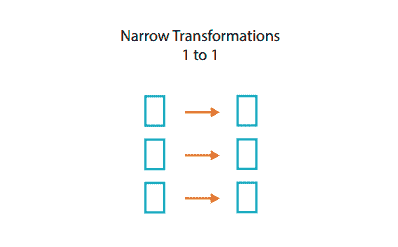
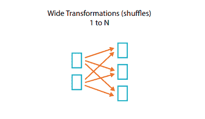

# Apache Spark 简介

> 原文：<https://dev.to/blender/introduction-to-apache-spark-2p2c>

MapReduce 和 Spark 都用于**大规模数据处理**。然而，MapReduce 有一些缺点，这使得 Spark 在许多情况下更有用。

# MapReduce 的缺点

1.  每个工作流都必须经历映射和缩减阶段:无法适应连接、过滤或更复杂的工作流，如映射-缩减-映射。
2.  MapReduce 严重依赖于**从磁盘**中读取数据:性能瓶颈，特别是对于迭代算法来说，它可能会多次循环数据。
3.  只有原生 Java 编程接口可用:Python 也可用，但它使实现变得复杂，并且对于浮点数据不是很有效。
4.  就编程而言并不容易，需要大量的手工编码。

# 解决方案— Apache Spark

*   一个新的框架:不是 Hadoop 堆栈的完全替代，只是 Hadoop MapReduce 等的替代
*   能够使用 Hadoop 生态系统，例如 HDFS、yarn

# 靠火花解决

1.  Spark 提供了**20 多个高效的分布式操作**:可以组合使用
2.  用户可以选择在内存中**缓存数据:提高迭代算法的性能**
3.  **Polyglot** :原生 Java、Python、Scala、R 接口以及**交互 shell** (在 shell 上交互测试和探索数据)
4.  易于编程，不需要太多的手工编码

# 星火架构

Apache Spark 有一个定义良好的分层架构，其中所有 Spark 组件和层都是松散耦合的。

## 工作者节点

*   执行 spark 工作流的通用 JVM 执行器
*   在其上完成所有计算的核心
***   与 Hadoop 生态系统其余部分的接口，例如 HDFS**

 **## 集群管理器

*   管理工作节点**供应和启动**的系统
*   spark 支持的集群管理器接口–
*   **YARN (Hadoop 集群管理器):**相同的集群可以与 Hadoop MR 和 spark 一起使用。
*   **独立:**特殊的 spark 进程，在计算开始时负责启动节点，并在失败时重新启动它们。

## 驱动程序

*   与集群的接口
*   有一个 JVM，它有一个 **spark context** :网关，供我们连接到 spark 实例并提交作业。
*   工作可以提交到-
*   **批处理模式:**发送程序执行，等待结果
*   **流模式**:使用 spark shell，与数据实时交互

# Cloudera 虚拟机设置与 Amazon EMR

## Cloudera 虚拟机设置

*   在独立模式下使用 spark
*   一切都在一台机器上本地运行
*   工作节点(执行器 JVM)、spark 进程和驱动程序在同一台机器上

## 亚马逊 EMR

*   原生支持 spark
*   用于配置数量、实例类型、所需内存等的 Web 界面。
*   Amazon EMR 自动运行 YARN 来生成实例，并准备好用 spark 执行它们。
*   执行器 JVM 运行在 EC2 接口上
*   主节点上运行的驱动程序和纱线

# 弹性分布式数据集

## 数据集

*   从 HDFS、S3、HBase、JSON、text 等创建的数据存储。:一旦 spark 读取数据，就可以用 RDD 引用它
*   或者从改造另一个 RDD: **RDD 是不可改变的**

## 分布式

*   分布在机器集群中
*   数据分为**分区**和跨机器划分的分区

## 富有弹性

*   Spark 跟踪每个分区的历史
*   错误恢复，如节点故障、缓慢的流程

# 火花变换

RDD 是不可改变的，但是我们可以把一个 RDD 变成另一个 RDD。Spark 不会**延迟转换**(直到一个动作被触发，执行才会开始)。

## 缩小变换

*   像地图和过滤器
*   并不意味着通过网络传输数据
*   取决于**内存和 CPU**

## 广变换

*   例如，groupByKey 通过网络将具有相同密钥的数据传输到相同的分区**混洗操作**
*   还取决于**节点之间的互连速度**

进一步阅读: [Apache Spark 教程:开始使用 Spark 服务 ML 模型](https://neptune.ai/blog/apache-spark-tutorial)

来源:[Apache Spark 简介](https://towardsdatascience.com/introduction-to-apache-spark-207a479c3001)**