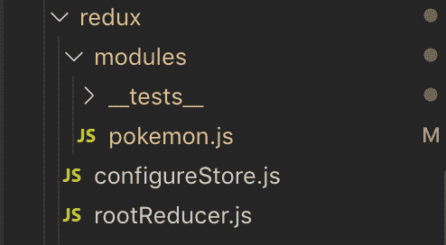

# Redux 简介。

> 原文：<https://dev.to/jean182/introduction-to-redux-2cpi>

嗨，伙计们，今天是哥斯达黎加的节日，我们庆祝我们的独立，为了成为一个自由的国家，我会写文章。

当你在学习 react 时，你可能会发现使用 redux 的文章、教程和项目，它是一个在使用 react 时被广泛使用的库(尽管它并不特别),并解决了 react 最大的问题之一，**我怎样才能将道具共享给非子组件？**。

这就是 redux 派上用场的时候，根据他们的文档`Redux is a predictable state container for JavaScript apps`，它帮助我们在应用程序之间共享状态，这意味着我们可以在整个应用程序中注入全局状态，而不用担心组件是否相互连接。

在开始钻研样板文件之前，首先我想谈谈使用 redux 时应该记住的原则。

1.  真实的单一来源这意味着应用程序的状态应该存储在一个对象中，我们称之为 **store**
2.  状态是只读的，状态只能通过**动作**来改变，这是我们将在本教程后面讨论的对象。
3.  使用纯函数来指定状态如何变化，使用**动作**，我们应该使用**还原器**，还原器是返回新状态对象的纯函数。

在本教程中，我们将讨论动作、动作创建者、减少者和动作类型:

一个**动作**是一个普通的 javascript 对象，它向商店发送数据。他们看起来像这样:

```
{
  type: "FETCH_POKEMON_SUCCESS",
  payload: ["Bulbasaur", "Squirtle", "Charmander"]
} 
```

Enter fullscreen mode Exit fullscreen mode

**动作创建器**是一个创建动作的函数，它们很容易被混淆，但只要把它们看作是返回动作的函数。

一个**动作类型**通常是你想如何命名你的动作，记住动作是一个对象，基本上动作类型是被调度动作的缩减器的引用。

一个 **reducer** 描述了应用程序如何根据接收到的**动作**进行改变，通常情况下，reducer 是一个 switch 语句，它接收 redux 状态和动作作为参数，并在一个新对象中返回状态改变(不要改变现有对象)。

现在你已经知道了一些核心原则和基础知识，我们可以开始讨论如何写了。最后 redux 代码变成了样板文件，一旦你习惯了，你就开始自动地写所有的东西。

Redux 文件结构是多样的，因为库本身并没有指定，你应该如何组织你的代码，它有一些关于[如何](https://redux.js.org/faq/code-structure#what-should-my-file-structure-look-like-how-should-i-group-my-action-creators-and-reducers-in-my-project-where-should-my-selectors-go)的指导方针，如果你习惯于使用固执己见的框架。

我喜欢使用 [ducks](https://github.com/erikras/ducks-modular-redux) 结构，这与其他实现不同，因为它将所有的 redux 逻辑保存在一个文件中，通常你找到的大多数例子都是基于文件夹结构的，其中你将**reducer**存储在一个文件夹中，将**动作**存储在另一个文件夹中，将**动作类型**存储在另一个文件夹中，等等。虽然这也是一个很好的方法，但是我相信它会让你更难知道发生了什么，特别是对初学者来说。我使用的结构(鸭子)是这样的:

[](https://www.loserkid.io/static/c9f3543af637e72e45e022b7bcb4e39a/00171/redux-structure.png)

`rootReducer`是一个文件，包含应用程序中使用的所有 reducer,`configureStore.js`文件用于设置商店，它包含`rootReducer`,还可能包含我们可能想要添加的所有额外的中间件。modules 文件夹包含了所有的 duck 模块，我们希望(我们稍后会谈到它们)和对每个模块的测试。

## 鸭子怎么写？

编写 duck 模块相当容易，一旦你习惯了，你会写得很快。鸭子的结构如下:

*   我们编写动作类型。
*   我们写出了缩减器。
*   我们写动作创作者。
*   如果适用，我们会写下副作用。

听起来没那么难，对吧？但是我们必须记住编写 duck 模块的某些规则:

1.  我们**必须**将减速器作为默认导入。
2.  我们**必须**将其动作创建者导出为函数。
3.  我们**必须**在表单`app-name/reducer/ACTION_TYPE`中有动作类型。
4.  如果我们在其他地方需要动作类型，我们**可以**将其导出为`UPPER_SNAKE_CASE`。

现在我们知道了如何构造它们，让我们编写一个基本模块，我们将开始编写动作类型:

```
// Actions types
const FETCH_POKEMON_DATA = "pokemon-frontend/pokemon/FETCH_POKEMON_DATA"
const FETCH_POKEMON_SUCCESS = "pokemon-frontend/pokemon/FETCH_POKEMON_SUCCESS"
const FETCH_POKEMON_FAILURE = "pokemon-frontend/pokemon/FETCH_POKEMON_FAILURE"
const RESET_POKEMON_DATA = "pokemon-frontend/pokemon/RESET_POKEMON_DATA" 
```

Enter fullscreen mode Exit fullscreen mode

在这种情况下，我有四个使用约定命名的动作类型，在这种情况下，应用程序名称为`pokemon-frontend`，模块名称为`pokemon`，动作类型写在`UPPER_SNAKE_CASE`。

之后，我喜欢为我的模块添加默认状态，在这种情况下将是这个:

```
// Initial State
const initialState = { pokemonList: [], isLoading: false, error: {} } 
```

Enter fullscreen mode Exit fullscreen mode

现在我们应该为我们的状态写一个缩减器，记住这个缩减器负责通过基于收到的动作返回一个新的对象来改变状态:

```
// Reducer
export default function reducer(state = initialState, action = {}) { switch (action.type) {
    case FETCH_POKEMON_DATA:
      return {
        ...state,
        isLoading: true,
      }
    case FETCH_POKEMON_SUCCESS:
      return {
        ...state,
        pokemonList: action.payload.data,
        isLoading: false,
      }
    case FETCH_POKEMON_FAILURE:
      return {
        ...state,
        error: action.payload.response.data,
        isLoading: false,
      }
    case RESET_POKEMON_DATA:
      return { ...state, ...initialState }
    default:
      return state
  }
} 
```

Enter fullscreen mode Exit fullscreen mode

请记住，reducer 应该是默认的导入，并注意该函数接收状态和动作，reducer 将检查`action.type`属性，并据此返回一个新的状态。我们使用 spread 运算符返回一个新对象，该对象包含各自发生变化的初始状态对象。例如，如果我们分派动作`FETCH_POKEMON_DATA`，返回的状态应该是:

```
store.dispatch({ type: FETCH_POKEMON_DATA })

console.log(store.getState())
/*
Output:
 {
  pokemonReducer: {
    error: {},
    isLoading: true,
    pokemonList: [],
  }
 }
*/ 
```

Enter fullscreen mode Exit fullscreen mode

正如您在这个代码片段中看到的，initialState 不再相同，因为 **loading** 属性更改为 true，因为我们调用了`store.dispatch`，这触发了动作`{ type: FETCH_POKEMON_DATA }`,并查看我们的 reducer 以查看 **action.type** 是否与 switch 语句匹配，在这种情况下，它匹配，并且返回的对象将 **loading** 属性更新为 true。

很酷吧，现在我们必须创建动作创建者，正如我之前提到的，它们只是返回动作的函数。

```
// Action Creators
export function loadPokemon() {
  return { type: FETCH_POKEMON_DATA }
}

export function loadPokemonSucceed(payload) {
  return { type: FETCH_POKEMON_SUCCESS, payload }
}

export function loadPokemonFailed(payload) {
  return { type: FETCH_POKEMON_FAILURE, payload }
}

export function resetPokemon() {
  return { type: RESET_POKEMON_DATA }
} 
```

Enter fullscreen mode Exit fullscreen mode

那么，我们为什么要使用它们呢？，因为我们可以在 dispatch 中调用动作本身，就像我上面用来解释 reducer 变化的例子一样。

*   有助于抽象并减少代码，因为我们不必每次都键入动作名称，并且我们减少了导入的数量。
*   通过在参数上命名来更好地理解代码，这样您就知道为了改变状态，操作到底需要什么。

一个关于我们如何使用它们的基本例子(非常类似于上面的例子，使用动作):

```
const payload = { data: ["Bulbasaur", "Squirtle", "Charmander"] }
store.dispatch(loadPokemonSucceed(payload))

console.log(store.getState())
/*
Output:
 {
  pokemonReducer: {
    error: {},
    isLoading: false,
    pokemonList: ["Bulbasaur", "Squirtle", "Charmander"],
  }
 }
*/ 
```

Enter fullscreen mode Exit fullscreen mode

现在，如果你愿意，你可以添加选择器，或者副作用处理，但是你的模块已经完成了。以下是完整的片段:

```
// Actions types
const FETCH_POKEMON_DATA = "pokemon-frontend/pokemon/FETCH_POKEMON_DATA"
const FETCH_POKEMON_SUCCESS = "pokemon-frontend/pokemon/FETCH_POKEMON_SUCCESS"
const FETCH_POKEMON_FAILURE = "pokemon-frontend/pokemon/FETCH_POKEMON_FAILURE"
const RESET_POKEMON_DATA = "pokemon-frontend/pokemon/RESET_POKEMON_DATA"

const initialState = { pokemonList: [], isLoading: false, error: {} }

// Reducer
export default function reducer(state = initialState, action = {}) {
  switch (action.type) {
    case FETCH_POKEMON_DATA:
      return {
        ...state,
        isLoading: true,
      }
    case FETCH_POKEMON_SUCCESS:
      return {
        ...state,
        pokemonList: action.payload.data,
        isLoading: false,
      }
    case FETCH_POKEMON_FAILURE:
      return {
        ...state,
        error: action.payload.response.data,
        isLoading: false,
      }
    case RESET_POKEMON_DATA:
      return { ...state, ...initialState }
    default:
      return state
  }
}

// Action Creators
export function loadPokemon() {
  return { type: FETCH_POKEMON_DATA }
}

export function loadPokemonSucceed(payload) {
  return { type: FETCH_POKEMON_SUCCESS, payload }
}

export function loadPokemonFailed(payload) {
  return { type: FETCH_POKEMON_FAILURE, payload }
}

export function resetPokemon() {
  return { type: RESET_POKEMON_DATA }
} 
```

Enter fullscreen mode Exit fullscreen mode

这是一个关于如何使用 redux 的非常基本的例子，关于鸭子，我解释了 redux 的一些基本知识，你应该还需要知道如何组合减速器，如何设置商店以及如何使用 react，也许我会为此写一篇文章，因为我不想写得太长。

我希望`highlight`通过使用 ducks 的模块来确定范围可以使应用程序可伸缩，更容易阅读，最重要的是，将帮助初学者不被其他方法所迷惑，这些方法通常在许多文件夹中有 redux 样板。

(这是我发布在 loserkid.io 博客上的一篇文章，你可以通过[点击这里](https://www.loserkid.io/redux-intro/)在线阅读。)