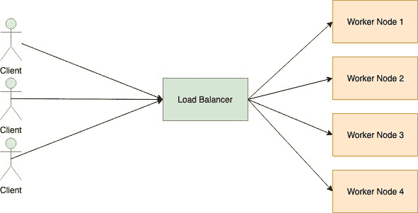
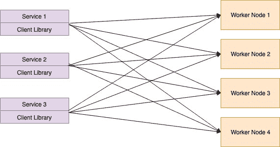
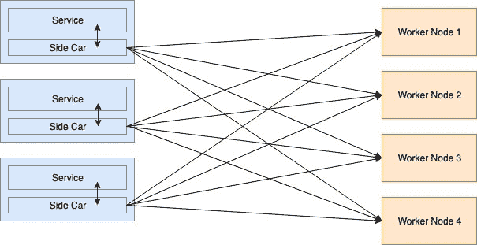

# 特使代理负载平衡简介

> 原文：<https://dev.to/dhanushkadev/introduction-to-the-envoy-proxy-load-balancing-4c4h>

负载平衡是 devops 工程师的常用术语。当大量流量进入您的系统时，您需要找到一种方法来扩展系统，使其能够正确处理。一种解决方案是提高运行单个节点的性能。另一个解决方案是添加更多的节点，并在这些节点之间分配工作。拥有多个节点还有一个额外的高可用性优势。负载平衡器用于在工作节点之间分配流量。

Envoy proxy 是一种代理服务，用于最新的趋势概念，即服务网格。在这篇博文中，我们将看到 Envoy 代理的负载平衡方面。

## 负载平衡器

负载平衡器是一个端点，它监听进入计算集群的请求。当请求进入负载均衡器时，它检查可用的工作节点，并在工作节点之间分发请求。负载平衡器做以下事情。

*   服务发现:检查可用的工作节点
*   健康检查:定期检查工作节点的健康状况。
*   负载平衡:在工作节点之间分发请求。

## 代理

代理是存在于两个端点之间中间组件。代理服务接收客户端请求，并将其转发到目的服务器。有两种类型的代理。正向代理和反向代理。我们也可以通过代理发送请求，而不是直接向端点发送请求。这种类型的代理称为前向代理。转发代理通常用于绕过防火墙限制，访问被阻止的网站。

Revers proxy 是一种代理服务，它接受传入的客户端请求，并将其转发给能够完成该请求的服务器。结果将被路由回客户端。除此之外，代理还提供了对客户端请求更多控制。它还可以缓存请求并加速网络性能。反向代理用于

*   作为一种安全措施，当网站不允许直接连接时，启用间接访问。
*   向互联网用户传输内部内容。
*   允许服务器之间的负载平衡。
*   禁用对网站的访问。

## 负载均衡拓扑

客户端和后端端点之间的代理。根据代理服务所处的位置，负载平衡可以分为以下几种拓扑。

### 中间代理

所有客户端请求都进入中间代理。中间代理将请求路由到工作节点。这种类型的负载平衡器简单明了。

### 嵌入式客户端库

中间代理最大的问题是，单点故障。如果中间代理服务器关闭，那么客户端服务无法访问后端服务。
在这种类型的代理中，不是中央负载均衡器，负载均衡由客户端自己完成。这种系统可以通过使用 gRPC 库来实现。

日益增长的复杂性成为这类负载平衡器的一个问题。此外，开发人员需要为每个服务安装负载平衡组件。

### 侧车代理

嵌入式客户端库中最大的问题是为每个服务构建通信组件的复杂性。随着最近使用容器技术的趋势，客户机库被分离到容器中。因此，在开发分散式负载平衡器时，没有编程语言的限制。这就是众所周知的侧车。这种类型的代理服务实现称为服务网格。侧车负责将客户请求路由到适当的后端服务。

Envoy 是 Lyft 用 C++语言编写的高性能 revers 代理。用于互连服务网格中的服务的特使。以下是特使代理使用通用术语。

*   主机:能够进行网络通信的实体。
*   下游:向特使代理发送请求的主机。
*   上游:托管从特使代理接收请求。
*   侦听器:可以通过下游连接到特使代理的命名网络位置。
*   集群:集群是一组逻辑上相同的上游主机，特使可以连接。特使可以通过使用服务发现来发现集群。

## 前线特使代理

作为侧车代理端口，特使也可以配置为前端特使代理。对于来自公共互联网的请求，前端代理被配置为主要负载平衡器。这个代理也知道和边缘代理。服务网格的整体架构如下所示。

这里，前端代理用作传入互联网流量的负载平衡器。这里还执行 TLS 终止。然后通过侧车代理请求路由到相关服务。服务网格可以通过服务发现来检测可用的服务。它还提供电路制动特征来处理故障转移。总来说，Envoy 提供了一整套功能来实现服务网格。

## 特使代理中负载平衡器的类型

当代理需要连接到上游集群中的主机时，集群管理器使用以下策略来路由流量。

*   Round Robbin
    将负载路由到每个工作节点(上游主机)的循环顺序。所有工作节点被认为是相同的，所有节点获得相同的负载量。

*   随机选择工作节点并路由流量。众所周知，这比循环 Robbin 策略执行得更好。

*   加权最小请求
    该策略基于负载平衡时保持的连接数。假设有两个规格相同的工作节点。由于某种原因，第一个工作者节点需要更长时间来响应。因此，它还必须比第二个节点更长时间地保持与第一个工作节点的连接。在这种情况下，负载平衡器可以将更多的权重放在第二个工作节点上，而不是将流量发送到第一个节点。

*   原始目的地
    当给定的连接需要连接到某个特定的上游主机时，使用这种类型的负载平衡器。通过读取客户端元数据选择的主机。

除了负载平衡，Envoy 还提供了以下特性来实现服务网格。

*   动态服务发现
*   TLS 终止
*   HTTP/2 和 gRPC 代理
*   断路器
*   健康检查
*   基于%流量分割的分阶段部署
*   故障注入
*   丰富的指标

我们将在下一篇文章中讨论这些特性。这篇文章是给你一个关于 Envoy 代理的基本介绍，以及它是如何实现负载均衡的。另一篇文章再见。干杯:)

参考

*   [https://devform . netlify . com/introduction-to-envoy-proxy-load-balancing/](https://devform.netlify.com/introduction-to-envoy-proxy-load-balancing/)
*   [https://www . envoy proxy . io/docs/envoy/v 1 . 5 . 0/intro/arch _ overview/load _ balancing](https://www.envoyproxy.io/docs/envoy/v1.5.0/intro/arch_overview/load_balancing)
*   [https://www.jscape.com/blog/load-balancing-algorithms](https://www.jscape.com/blog/load-balancing-algorithms)
*   [https://blog . envoy proxy . io/introduction-to-modern-network-load-balancing-and-proxy-a57f 6 ff 80236](https://blog.envoyproxy.io/introduction-to-modern-network-load-balancing-and-proxying-a57f6ff80236)