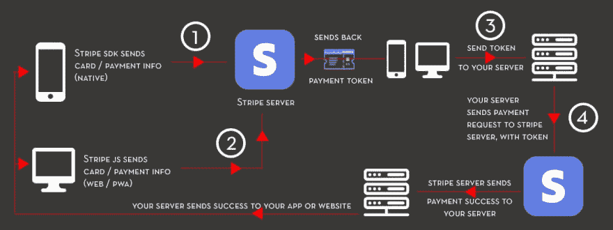
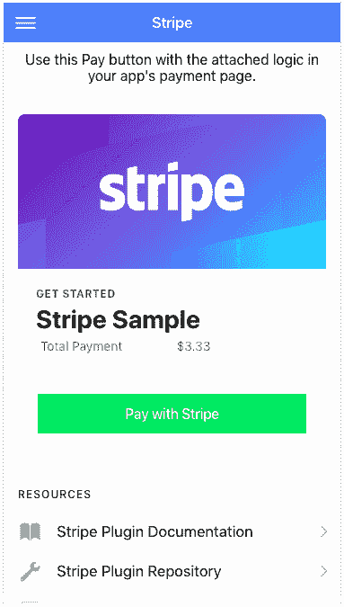
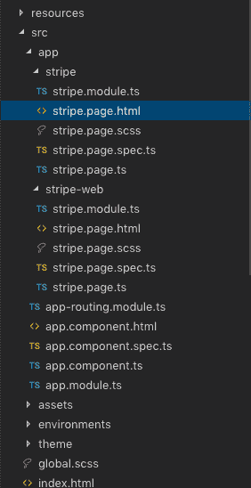
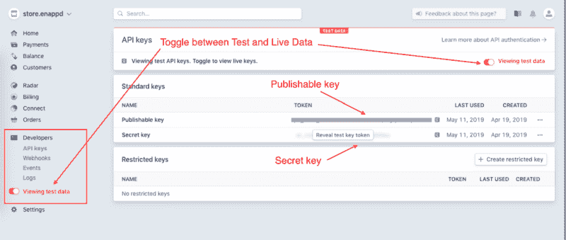
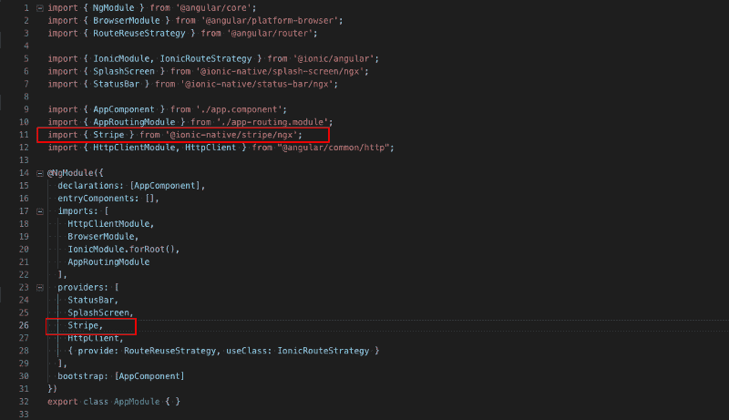
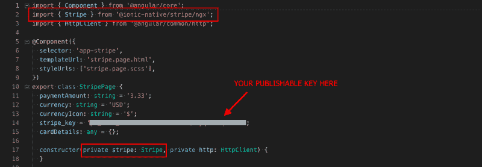

# Ionic 4 Stripe 支付与 Firebase 的集成—用于应用程序和 PWA

> 原文：<https://dev.to/enappd/ionic-4-stripe-payment-integration-with-firebase-for-apps-and-pwa-4e77>

* * *

Stripe 是使用最广泛、发展最快的支付网关之一，您可以将其集成到您的网站或应用程序中。它支持多种多样的支付方式，并正在全球范围内迅速普及。Stripe 几乎可以满足你在应用和网站上的所有支付需求。Stripe 易于集成，这使得它比 PayPal 和其他支付网关更受开发者欢迎。Stripe 和 PayPal 之间的一个很好的比较可以在这里研究(剧透——Stripe 胜出)

### 什么是离子 4？

你可能已经知道离子，但我把它放在这里只是为了初学者。 **Ionic** 是 Drifty Co .的 Max Lynch、Ben Sperry 和 Adam Bradley 于 2013 年创建的一款用于混合移动应用开发的完整开源 SDK。Ionic 提供使用 CSS、HTML5 和 Sass 等 Web 技术开发混合移动应用的工具和服务。可以使用这些 Web 技术构建应用程序，然后通过本地应用程序商店分发，并利用 Cordova 安装在设备上。

所以，换句话说——如果你用 Android 创建原生应用，你就用 Java 编码。如果你在 iOS 中创建原生应用，你用 Obj-C 或 Swift 编码。这两种语言都是强大但复杂的语言。有了 Cordova(和 Ionic ),你可以为你的应用程序编写一段代码，它可以在 iOS 和 Android(以及 windows！)，HTML、CSS 和 JS 的简单性也是如此。

### Ionic 4 和支付网关

Ionic 4 可以创建各种各样的应用程序，因此可以在 Ionic 4 应用程序中实现各种各样的支付网关。流行的有 PayPal，Stripe，Braintree，应用内购买等。关于支付网关的更多细节，你可以阅读我关于 Ionic 4 中的[支付网关解决方案的博客。](https://medium.com/enappd/payment-solutions-in-ionic-8c4bb28ce5cc)

Stripe 可以集成在网站和移动应用程序中。Stripe SDK 有不同的集成方式。在这篇博客中，我们将学习如何在 Ionic 4 应用程序和 Ionic 4 PWA 中集成 Stripe 支付网关。


<figure>

<figcaption class="imageCaption">Ionic 4 and Stripe make a great team</figcaption>

</figure>

#### 将 Stripe 集成到 Ionic 应用程序中有两种主要方式

你可以选择 Ionic Native 实现，它是 iOS 和 Android 的 Stripe native SDKs 的包装器。这是由[科尔多瓦插件条纹](https://github.com/zyra/cordova-plugin-stripe)供电。这有一个限制，即只便于为一次性付款的**创建代币。这适用于移动应用程序和 PWA。**

另一种方法是使用 [Stripe.js](https://stripe.com/docs/stripe-js/reference) ，这是 Stripe 功能的 JavaScript 实现。这很容易使用，也很快实现，因为这是用 JavaScript 实现的。该功能是动态交付到页面中，并支持**单次和经常性付款。**同样，您可以在手机和网络上使用它，但这里我们将只看到一个网络实现。

在本帖中，我们将学习如何在 Ionic 4 应用程序和 PWA 中实现这两种条纹支付方法。为了简化理解，让我们形象地理解完整的流程



<figure>

<figcaption class="imageCaption">Stripe Ionic 4 integration flow</figcaption>

</figure>

先决条件

*   为条带集成创建 Ionic 4 应用程序
*   API 密钥的条带开发人员帐户

步伐

*   **步骤 1** —集成 Stripe 原生插件(SDK)以在应用程序级别生成令牌
*   **步骤 2** —将 Stripe JS 集成到您的 PWA /网站中，以便在网站级别生成令牌
*   **步骤 3** —创建 Firebase 函数(或任何接受 API 调用的后端函数)以接受来自应用程序的令牌，并向条带服务器发出支付请求
*   **步骤 4** —将 app / PWA 连接到我们的 Firebase 服务器。从 Firebase 服务器完成条带付款请求。

让我们一步一步地开始

> 本教程的完整源代码可以在 [Ionic4-stripe Github 库中找到。](https://github.com/enappd/ionic4-stripe)

### 先决条件

#### 创建一个基本的 Ionic 4 应用程序

创建一个基本的 Ionic 4 应用程序非常容易。假设您的系统中已经安装了所有的基本要求，运行

```
$ ionic start MyApp sidemenu
```

这将创建标题为`MyApp`和侧菜单模板的应用程序。

> 关于如何创建一个基本的 Ionic 4 应用程序的更多细节，请参考我的博客[如何创建一个 Ionic 4 应用程序](https://medium.com/enappd/how-to-create-an-ionic-4-app-for-beginners-e181e116190a)

稍加修改，我的主页看起来是这样的。



<figure>

<figcaption class="imageCaption">Stripe payment home page</figcaption>

</figure>

文件结构看起来像这样，只是一个想法



<figure>

<figcaption class="imageCaption">File structure for Stripe Ionic 4 sample app</figcaption>

</figure>

这个 HTML 的主要功能部分就是你在上面看到的支付按钮，它调用`payWithStripe()`函数

```
<ion-button expand="full" color="success" (click)="payWithStripe()">Pay with Stripe</ion-button>
```

#### 条带开发人员帐户

访问[Stripe.com](http://stripe.com)并创建一个帐户。条纹支付服务目前仅在有限的国家可用，如本页所示的。

一旦你进入 Stripe Dashboard，寻找 **Developer** Tab - > API 键。



<figure>

<figcaption class="imageCaption">Stripe Developer account — API keys</figcaption>

</figure>

**可发布键**是你用来连接前端的奋斗原生 SDK 或者 Stripe.js 的。**密钥**用在后端，你的服务器连接 Stripe 的服务器进行实际支付。

目前，这就是你从 Stripe 帐户中需要的全部内容。您可以切换**活动键**，并在测试完流程后使用它们。

现在让我们来看看 Stripe 的 Ionic 4 集成。

### 步骤 1 —集成条带本机插件

> **请注意，上述步骤 1 和步骤 2 仅帮助您从 Stripe 服务器创建支付令牌。它不完成支付。要完成支付，您可以使用生成令牌，将其发送到您的服务器，并通过您的服务器完成支付请求(下面的步骤 4)**

要在 Ionic 4 应用中包含 Stripe 功能，您需要安装 Stripe 原生插件。使用以下命令安装插件

```
$ ionic cordova plugin add cordova-plugin-stripe
```

```
$ npm install @ionic-native/stripe
```

安装完成后，在您的`app.module.ts`中导入条带模块



<figure>

<figcaption class="imageCaption">import Stripe in app.module.ts</figcaption>

</figure>

并在您的`stripe.page.ts`页面文件中导入 Stripe，如下所示



<figure>

<figcaption class="imageCaption">Import Stripe in your page</figcaption>

</figure>

现在，借助原生 SDK，我们只能通过 Stripe SDK 为**一次性支付**生成支付令牌。支付函数如下所示