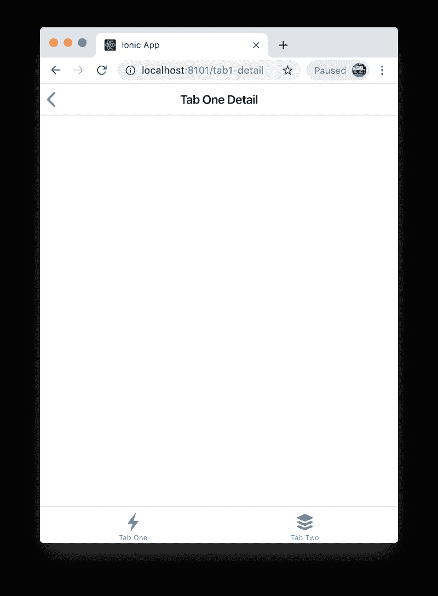
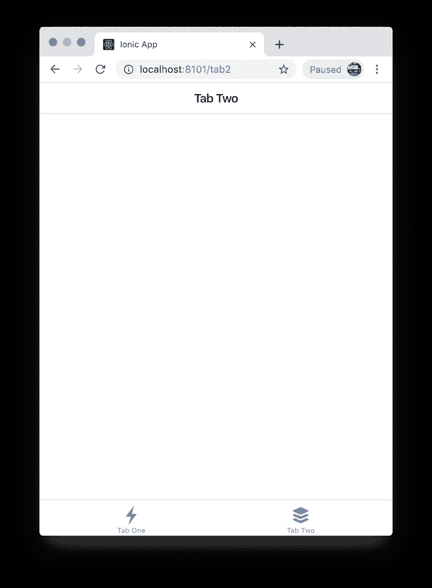

# 离子反应(测试版)标签:逐步

> 原文：<https://dev.to/aaronksaunders/ionic-react-beta-tabs-step-by-step-iij>

> 请结帐并订阅我在 YouTube 上的视频内容。请随意留下您想看的内容的评论和建议。
> [YouTube 频道](https://www.youtube.com/channel/UCMCcqbJpyL3LAv3PJeYz2bg)

# 离子反应(Beta)选项卡:逐步

使用新的 ionic cli 生成一个带有选项卡和最终登录页面的应用程序

本例中使用的离子和反应成分:

*   [IonTabs 文档](https://ionicframework.com/docs/api/tabs)
*   [离子背按钮](https://ionicframework.com/docs/api/back-button)
*   [React 路由器文档](https://reacttraining.com/react-router/web/guides/quick-start)

## 它会是什么样子

|  |  |  |

## 入门

使用 ionic cli 构建您的应用程序，确保您指定了 react，我们将使用 tab starter 作为基线，然后移动一些东西以获得所需的结果。

> 参见博客文章了解更多关于入门的详细说明[博客文章点击此处](https://ionicframework.com/blog/ionic-cli-v5-brings-react-beta-support/)

进入控制台，出现提示时选择`tabs`作为启动模板

```
$ ionic start myApp --type=react 
```

```
? Starter template: tabs 
```

### 大扫除

因此，让我们清理一些，并创建一个更结构化的起点。

创建一个名为`TabRoot.tsx`的新文件，将`App.tsx`中的`IonApp`元素中的所有内容复制到新组件中。当你完成后，`App.tsx`应该是这样的

```
// FILE: App.tsx
const App: React.SFC = () => (
  <Router>
    <Route exact path="/" render={() => <Redirect to="/tab1"/>} />
    <div className="App">
      <IonApp>

      </IonApp>
    </div>
  </Router>
); 
```

删除此行

```
// FILE: App.tsx
<Route exact path="/" render={() => <Redirect to="/tab1"/>} /> 
```

然后添加新的默认组件`Route`，指向我们刚刚构建的`TabRoot`组件

```
// FILE: App.tsx
const App: React.SFC = () => (
  <Router>
    <div className="App">
      <IonApp>
         <Route path="/" component={TabRoot} />
      </IonApp>
    </div>
  </Router>
); 
```

而`TabRoot.tsx`在粘贴了我们从`App.tsx`剪下的代码后应该是这样的。

> 请注意，在查看代码时，为了节省空间，我已经删除了导入。我还将标签的数量从三个减少到两个，我相信这足以说明我的观点。
> 
> 请注意，关于 IonTabs 如何在 React 中工作的文档似乎不正确

```
// FILE: TabRoot.tsx
interface IAppProps {}

const TabRoot: React.FC<IAppProps> = props => {
  return (
    <IonPage id="main">
      <IonTabs>
        <IonRouterOutlet>
          <Route path="/:tab(tab1)" component={Tab1} exact={true} />
          <Route path="/:tab(tab2)" component={Tab2} />
        </IonRouterOutlet>
        <IonTabBar slot="bottom">
          <IonTabButton tab="tab1" href="/tab1">
            <IonIcon name="flash" />
            <IonLabel>Tab One</IonLabel>
          </IonTabButton>
          <IonTabButton tab="tab2" href="/tab2">
            <IonIcon name="apps" />
            <IonLabel>Tab Two</IonLabel>
          </IonTabButton>
        </IonTabBar>
      </IonTabs>
    </IonPage>
  );
};

export default TabRoot; 
```

现在应用程序已经设置好了，默认路径是呈现`TabRoot`组件，但是我们需要告诉组件呈现哪个选项卡，我们希望它是`Tab1`

```
// FILE: TabRoot.tsx
<IonRouterOutlet>
    <Route path="/:tab(tab1)" component={Tab1} exact={true} />
    <Route path="/:tab(tab2)" component={Tab2} />
    <Route path="/" render={() => <Redirect to="/tab1" />} /> 
</IonRouterOutlet> 
```

### 何苦呢？

随着应用程序变得越来越复杂，让所有默认路由都基于应用程序路由级别的选项卡可能会有问题。正如您将在后面的章节中看到的，当应用程序必须检查经过身份验证的用户和受保护的路由时，这种设置将是有益的

### 清理标签 1

`Tab1`中有很多噪音，所以让它看起来像`Tab2`，将内容从`Tab2`复制到`Tab1`

```
// FILE: Tab1.tsx
import React from 'react';
import { IonHeader, IonToolbar, IonTitle, IonContent } from '@ionic/react';

const Tab1: React.SFC = () => {
  return (
    <>
      <IonHeader>
        <IonToolbar>
          <IonTitle>Tab One</IonTitle>
        </IonToolbar>
      </IonHeader>
      <IonContent />
    </>
  );
};

export default Tab1; 
```

## 导航至详细页面

让我们复制文件`Tab1.tsx`并将其重命名为`Tab1Detail.tsx`...清理干净，这样当你完成的时候看起来就像这样。

```
// FILE: Tab1Detail.tsx
import React from 'react';
import { IonHeader, IonToolbar, IonTitle, IonContent } from '@ionic/react';

const Tab1Detail: React.SFC = () => {
  return (
    <>
      <IonHeader>
        <IonToolbar>
          <IonTitle>Tab One Detail</IonTitle>
        </IonToolbar>
      </IonHeader>
      <IonContent />
    </>
  );
};
export default Tab1Detail; 
```

在`Tab1`的`IonContent`部分添加按钮；我们将使用该按钮导航到我们刚刚创建的详细页面`Tab1Detail`。

```
// FILE: Tab.tsx
<IonContent>
    <IonButton
        expand="full"
        style={{ margin: "14" }}
        onClick={e => {
            e.preventDefault();
            props.history.push("/tab1-detail");
        }}
    > NEXT PAGE</IonButton>
</IonContent> 
```

所以当你在`Tab1.tsx`中做这个改变的时候，第一个问题是

> 历史从何而来？

我们可以使用 react-router `withRouter`将`history`对象作为属性传递给组件，因为组件是由`Router`渲染的。因此，让我们对文件进行以下更改。

```
// FILE: Tab1.tsx
// add the import..
import { withRouter } from "react-router"; 
```

然后添加参数，现在我们将指定类型为`any`

```
// FILE: Tab1.tsx
const Tab1: React.SFC<any> = (props) => { 
```

最后，我们需要将我们想要导航到`/:tab(tab1-detail)`的实际路线添加到`TabRoot`中的`Router`元素，因此添加新路线。

```
// FILE: TabRoot.tsx
<IonRouterOutlet>
    <Route path="/:tab(tab1)" component={Tab1} />
    <Route path="/:tab(tab1-detail)" component={Tab1Detail} />
    <Route path="/:tab(tab2)" component={Tab2} />
    <Route path="/" render={() => <Redirect to="/tab1" />} /> 
</IonRouterOutlet> 
```

现在返回，我们需要首先将`IonBackButton`组件添加到`Tab1Detail`页面的工具栏中，就在`<IonTitle>`的上方。

```
// FILE: Tab1Detail.tsx
<IonButtons slot="start">
  <IonBackButton
      text=""
      defaultHref="/"
      onClick={() => props.history.replace("/tab1")}
      goBack={() => {}}
  />
</IonButtons>
<IonTitle>Tab One Detail</IonTitle> 
```

> 已知问题:到目前为止，`defaultHref`还没有工作，所以我必须响应`onCLick`事件才能让它工作。

如你所见，我们再次使用历史属性返回到上一个组件，因此我们需要添加`withRouter`并正确指定组件的参数。

```
// FILE: Tab1Detail.tsx
import { withRouter } from "react-router";        // <== NEW

const Tab1Detail: React.SFC<any> = (props) => {   // <== NEW
  return (
    <>
      <IonHeader>
        <IonToolbar>
          <IonButtons slot="start">
            <IonBackButton
              text=""
              defaultHref="/tab1"
              onClick={ ()=> props.history.replace("/tab1")}  // <== NEW
              goBack={() => {}}
            />
          </IonButtons>
          <IonTitle>Tab One Detail</IonTitle>
        </IonToolbar>
      </IonHeader>
      <IonContent />
    </>
  );
};
export default withRouter(Tab1Detail);  // <== NEW 
```

## [aaronksaunders](https://github.com/aaronksaunders)/[ionic-react-tabs-tut](https://github.com/aaronksaunders/ionic-react-tabs-tut)

### 使用新的 Ionic CLI 生成一个带有选项卡的应用程序，并在第二部分生成一个登录页面来演示身份验证流程

<article class="markdown-body entry-content" itemprop="text">

本例中使用的离子和反应成分:

*   [IonTabs 文档](https://ionicframework.com/docs/api/tabs)
*   [离子背按钮](https://ionicframework.com/docs/api/back-button)
*   [React 路由器文档](https://reacttraining.com/react-router/web/guides/quick-start)

## 它会是什么样子

| [](https://raw.githubusercontent.com/aaronksaunders/ionic-react-tabs-tut/master/public/screen-shots/tab-1.png) | [](https://raw.githubusercontent.com/aaronksaunders/ionic-react-tabs-tut/master/public/screen-shots/tab1-detail.png) | [](https://raw.githubusercontent.com/aaronksaunders/ionic-react-tabs-tut/master/public/screen-shots/tab-2.png) |

## 入门指南

使用 ionic cli 构建您的应用程序，确保您指定了 react，我们将使用 tab starter 作为基线，然后移动一些东西以获得所需的结果。

> 参见博客文章了解更多关于入门的详细说明[博客文章点击此处](https://ionicframework.com/blog/ionic-cli-v5-brings-react-beta-support/)

进入控制台，出现提示时选择`tabs`作为启动模板

```
$ ionic start myApp --type=react 
```

```
? Starter template: tabs 
```

### 肃清

因此，让我们清理一些，并创建一个更结构化的起点。

创建一个名为`TabRoot.tsx`的新文件，将`App.tsx`中的`IonApp`元素中的所有内容复制到新组件中。完成后，`App.tsx`应该是这样的

```
// FILE: App.tsx
const App: React.SFC = () => (
  <Router&gt
    <Route exact
```

…</article>

[View on GitHub](https://github.com/aaronksaunders/ionic-react-tabs-tut)