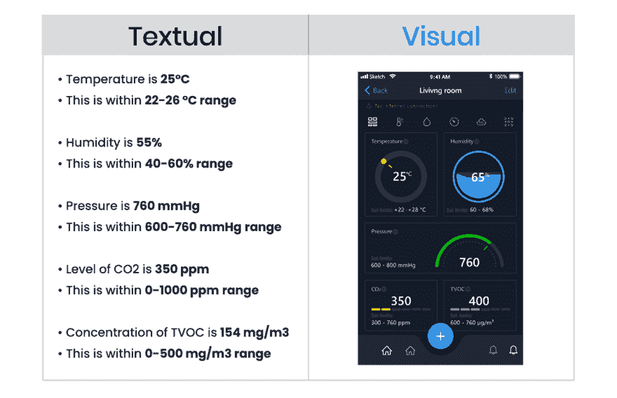
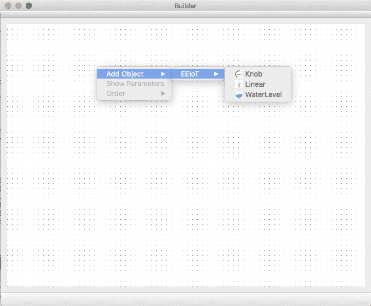
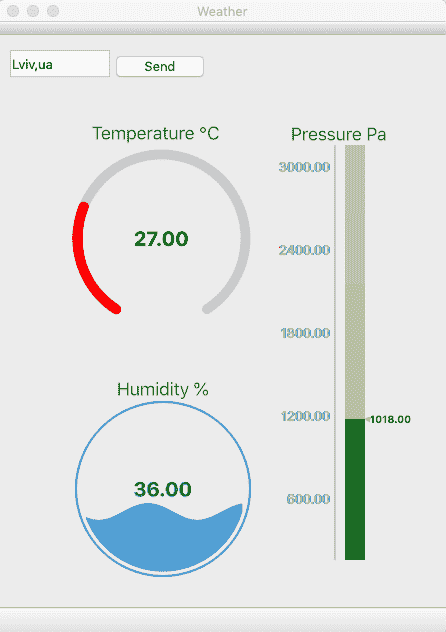
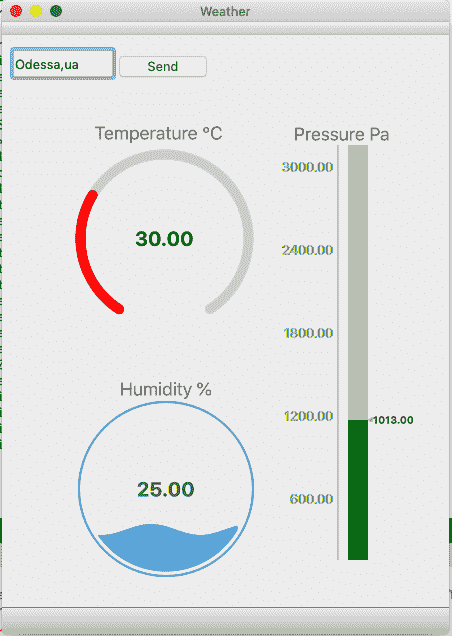

# 物联网仪表板库:瞬间可视化 SCADA 内部免费物联网库]

> 原文：<https://dev.to/indeemasoftware/iot-dashboard-library-visualize-scada-at-a-snap-free-iot-library-inside-3o2d>

有很多物联网 SCADA 解决方案可以满足工厂和其他制造需求。然而，有些情况下(相当多)，您需要开发自己的 SCADA 系统来满足项目的特定需求。

我们经常使用 awesome Qt 框架来实现复杂的物联网解决方案。对于许多 SCADA 和类似 SCADA 的项目，我们遇到了开发设备仪表板的快速工具的需求。这就是我们开发超轻量级非官方 Qt 库的原因。该库是开源的，可定制的，在 MIT 许可下可以免费使用。我们还共享一小组开发的小部件。

享受和使用 Qt；)

**README** :这个库是为在 Qt 上开发的桌面、移动和嵌入式项目而创建的。要使用它，你应该知道 Qt/ C++和 QML。

## QSimpleScada 简介

让我们为您介绍一个适用于您的物联网项目的漂亮库。我们创建 QSimpleScada 是为了加速和简化任何数据的可视化，因此我们(和您)可以专注于开发震撼人心的自动化算法。

它主要是为了加快并因此降低物联网解决方案的[成本。](https://indeema.com/blog/how-much-does-it-cost-to-create-iot-solution)

### 什么是 QSimpleScada？

这是一个完全处理小部件的连接和编辑的库。使用 QSimpleScada，您可以使用鼠标和少量代码轻松创建物联网数据的可视化。对布局感到满意后，保存生成的。xml 文件并在您的项目中使用它。

库是用 Qt/C++创建的，基本的小部件是基于 C++的。有一个 QML 界面，所以你可以在 QML 上独立创建单独的小部件(就像创建经典的 QML 用户界面一样),然后上传到你的应用程序。

### 我为什么需要它？

如果你是一个 Qt 开发者或者一个公司，并且:

*   在你的项目中有严格的期限和复杂的数据评估

*   需要经常制作移动/嵌入式/桌面物联网项目的原型

*   需要多样化 Qt 项目的一站式工具

*   不想/没有时间/资源从头开发仪表板

如果以上两者都不是关于你的，那么你就不是。

### 为什么要构建物联网仪表盘？

嗯，这听起来可能有点多余，所以如果这个问题对你来说是不言自明的，请随意跳过这一部分。否则，有相当多的理由将你从物联网中获得的信息可视化。

它是任何物联网或控制系统的基本 HMI(人机界面)组件。如果你想让用户在移动中看到相关数据，这比文本方法好得多。这适用于传统的 SCADA 和类似 SCADA 的项目。

例如，在我们的 UBreez 上，我们使用 QSimpleScada 来可视化空气读数。自己对比一下显示器。那么，什么看起来更整洁和清晰，甚至当包含许多传感器部件时？l

使用仪表板，您可以立即突出显示任何偏离标准的情况，查明故障发生的位置，跟踪实时位置，查看趋势和任何其他有价值的信息。它节省了用户理解 SCADA 系统收集的数据的时间，他们可以更快地做出反应并决定如何行动。

## 使用 QSimpleScada

以下是将 QSimpleScada 0.9 . x 版集成到项目中的步骤:

### 第一步:安装

**通过包管理器:**

如果您正在使用 Qt 构建精明的解决方案，您最有可能使用 qpm 包管理器，因此不需要进一步的闲聊。如果你还不知道，请从这里下载 [https://www.qpm.io](https://www.qpm.io/)

要通过 qpm 安装，请运行:

`qpm` `install com.indeema.qsimplescada`

并补充:

`include (../vendor/vendor.pri)`

敬*。项目的 pro 文件。

作为奖励，尝试我们预设的小部件:

`qpm` `install com.indeema.eeiot`

**来自 GitHub:**

要克隆回购，请转到:\
[https://github.com/IndeemaSoftware/QSimpleScada](https://github.com/IndeemaSoftware/QSimpleScada)\
还要添加预配置的小部件，请克隆:\
[https://github.com/IndeemaSoftware/EEIoT](https://github.com/IndeemaSoftware/EEIoT)

并补充:

`include($$PWD/com/indeema/QSimpleScada/com_indeema_QSimpleScada.pri)`

`include($$PWD/com/indeema/eeiot/com_indeema_eeiot.pri)`

到*。pro 文件。

**使用二进制发布:**

[https://github.com/IndeemaSoftware/QSimpleScada/releases](https://github.com/IndeemaSoftware/QSimpleScada/releases)

### 第二步:配置

将库下载并安装到项目后:

1.创建将在您的仪表板上显示的新设备。给它一个名称和 IP 地址:

`QScadaDeviceInfo *lDeviceInfo = new QScadaDeviceInfo();`

`lDeviceInfo->setName("Test Device");`

`lDeviceInfo->setIp(QHostAddress("127.0.0.1"));`

2.创建一个控制器类，它将处理所有后来的设备和连接到设备的所有板:\
`QScadaBoardController *` `mController` `= new QScadaBoardController(); mController->appendDevice(lDeviceInfo)`

3.调用 initBoardForDeviceIp 方法为已经附加的设备创建一个新的板。如果特定 IP 上没有设备，则不会创建板。

`mController->initBoardForDeviceIp("127.0.0.1");`

4.为控制器设置可编辑模式，以便能够创建、移动和调整控制器的大小。

`mController->setEditingMode(true);`

如果启用了编辑模式，模式窗口将以虚线背景为特色:

5.在小部件上添加网格布局，然后将控制器添加到该小部件:

`QGridLayout *``mainLayout`T2】

`mainLayout->addWidget(``mController`T2】

**使用微件**

我们还开发了一个 EEIoT 库，其中包含一组预配置的小部件。你可以在 https://github.com/IndeemaSoftware/EEIoT 下载并开始试用。

要使用 widget 收藏:

用 QML 资源的 url 调用函数，让控制器知道 QML 小部件的位置:\
`QMLConfig::instance.appendQMLPath(:/com/indeema/eeiot/EEIoT/);`

Singletone QMLConfig 位于“qscadaconfig . h”\
这里我们使用 EEIoT 作为里面所有小部件的组。您可以配置一个或多个组。\
请注意，如果您在不同的位置创建了两个同名的文件夹，第二个文件夹(稍后创建)将会删除第一个文件夹。

您可以从 QSimpleScada 访问构成 QML(在元数据列表中提到)的所有动态属性，因此您可以快速、轻松地创建自己的复杂仪表板。

### 第三步:使用

您可以使用我们的简单编辑器创建您的第一个仪表板[https://github.com/IndeemaSoftware/QSimpleScadaSample](https://github.com/IndeemaSoftware/QSimpleScadaSample)\
，然后在没有任何设备和电路板的应用程序中设置 QScadaBoardController，并调用:\
\
，其中是您的项目文件的完整路径(*。irp)

例如:

`mController->openProject(QString :/com/indeema/eeiot/EEIoT/)`

## 见 QSimpleScada 在行动

访问我们的 GitHub 简介，探索展示 QSimpleScada 库工作的简单应用程序:

*   ###天气应用

这是一个简单的应用程序，可视化 3 个部件的天气相关数据:

*   温度
*   湿度
*   压力

QSimpleScada 和 EEIoT 用于处理仪表板的显示和连接。我们从 Openweathermap API 接收的所有天气实时数据。你可以在 https://github.com/IndeemaSoftware/QSimpleScadaSample 下载代码

要查看您所在城市的当前读数:

输入您的城市，后跟逗号和国家代码，如下所示:\
**基辅，** **ua**

并点击**发送**按钮。

这将更新您所在地区的温度、湿度和压力。

 

*   ###生成器应用程序

如何使用 QSimpleScada 的另一个例子是 Builder 应用程序，它使我们能够创建仪表板并保存到*。irp 文件。一个简单的仪表板编辑器，使用 QSimpleScada 创建所需的带有 EEIoT 小部件的仪表板，并保存仪表板设置以备后用。在本例中，我们创建了在上述天气应用程序中使用的仪表板。

该代码也可在 https://github.com/IndeemaSoftware/QSimpleScadaSample 获得

## 更多工具给你

我们发现引入物联网会影响每个行业，并重新定义我们使用技术的方式。我们已经在 [6 工业物联网的前景应用](https://indeema.com/blog/6-promissing-applications-for-the-industrial-iot)文章中详细讨论了该主题，我们很高兴推动第四次工业革命带来的自动化进步。

### 理解和语境

如果所有的项目都有固定的规格，开发世界将会是一个乌托邦。然而，最初的目标和需求越清晰，整个团队理解得越好，项目就越精简。要加深您对物联网项目细节和典型陷阱的了解，请阅读:

*   [如何创建一个初创公司:从创意到生产的物联网项目](https://indeema.com/blog/how-to-create-a-startup--iot-project-from-idea-to-production)

*   [B2C & B2B 开发物联网产品的细节](https://indeema.com/blog/b2c--b2b-specifics-of-developing-iot-products)

*   [物联网开发:创建项目的 5 个步骤](https://indeema.com/blog/internet-of-things-development--5-steps-to-creating-your-project)

**剧透**:找到项目相关文档的模板，这样你就可以交流需求，并以更少的努力将它们转化为可操作的规范。

### 估算成本和时间

彻底了解你需要的时间和资源几乎是不可能的。因此，为了让您对复杂性有一个大致的了解(以时间和成本计算)，这里有一个特定于物联网的计算器:

### 开发工具

为了更快、更高效地开发物联网项目，我们分享了我们的工具包，在 https://github.com/IndeemaSoftware[上传了我们的 Qt 和物联网相关开源项目，回购标题的开头是 Q。你还可以在那里找到一堆 React、Android 和 iOS 开发工具。](https://github.com/IndeemaSoftware)

## 重述

在 Indeema，我们习惯了紧张的截止日期和富有挑战性的项目。我们致力于创造明智的解决方案，并逐渐意识到:

*   理解是首要的。 \
    保持好奇。阐明每个需求，不管你认为它有多明显。确保你确实明白。因为您可以设计一个逻辑的、可伸缩的架构，编写令人敬畏的干净的代码，但是却不能传达出想要的结果。细节决定成败(所以确保你没有遗漏任何细节)。

*   彻底改造 **g 自行车是徒劳的。** \
    每个项目都包含独特的挑战，需要打破常规的想法。而且没有必要从头开始开发一切。为什么？因为这只会减少你发现和实现真正具有挑战性的特性、模块和架构的时间。

*   **Qualit** **y 是** **a 标** **。对你的工作负责。你正在创造未来。如果你是一名开发人员，根据规范、最佳实践、常识、项目的稳定性等来测试你的代码。这同样适用于任何其他角色。**

感谢阅读&希望你喜欢这篇文章。订阅更新，让我们知道您感兴趣的内容。