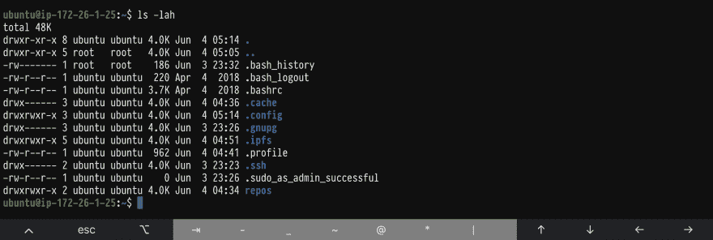
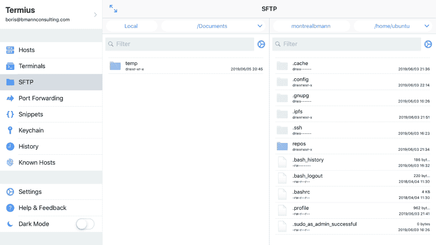
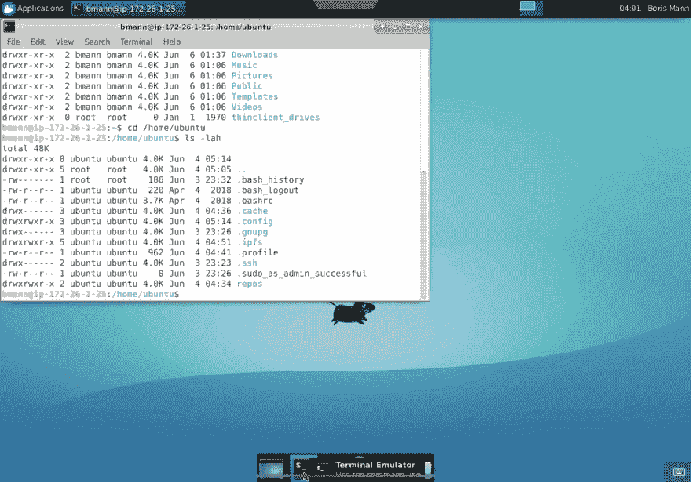
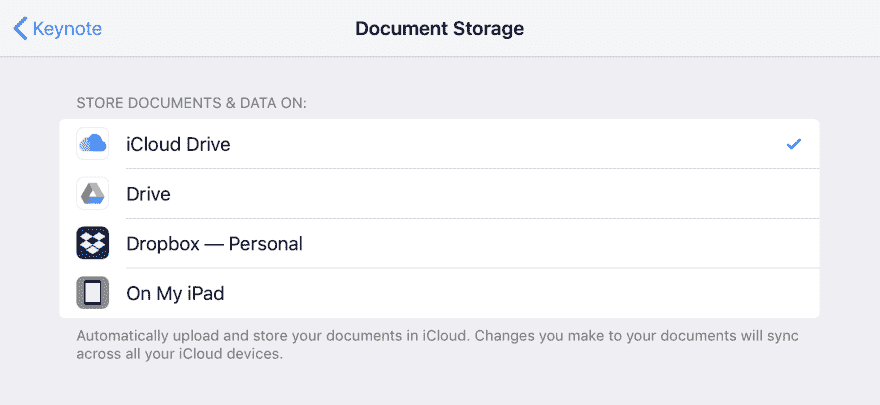

# ipad itools

> 原文：<https://dev.to/bmann/ipad-tools-4c62>

我已经把一台 iPad Pro 11 "作为日常用机用了大约 2 个月了。以下是我发现的一些有用的工具。

用了一年的 Chromebook，让我想这么做的东西是 Keynote。我和我的共同创始人布鲁克一直致力于 one pagers 和演示，没有什么比 Keynote 更好的了。

我是说，我知道这个。在我的职业生涯中，我是 PowerPoint 和 Keynote 的专家，但实际上 Keynote 只是一种使用乐趣。我工作效率高，反应快，最终能做更好的报告。

我的意思是，我*也*在 HackMD 中使用 Markdown 来创建演示文稿，所以不要拿走我的极客信誉。

我用新 Apple Pencil 买了 iPad，然后单独得到了一个第三方保护套和一个罗技蓝牙键盘。苹果或罗技的一体机似乎不太适合我，将键盘分开意味着我可以得到一个很棒的 kyeboard，它仍然很小，并将其放置在适合打字的位置。

在使用 iPad 的过程中，我也把它作为一个专业的创作工具来看待。考虑到这一点，为让工作变得更简单的应用付费是显而易见的。当我说为应用程序付费时，我不是指 99:一次性购买的商业应用程序可以很容易地为它们提供的价值收取很多费用。

另一方面，我还希望了解我正在开发的哪些应用程序不是开源的和/或没有使用开源协议。值得自己写一篇博文。

## 为 iPad 编写应用程序

除了大量的电子邮件、演示文稿和在许多不同的网络应用程序中工作，我的第一步是看看如何在 iPad 上设置编码。至少，我的那种编码，就是连接到远程 shells，通过 git 编辑一些 wikis 和 Jekyll 站点。

### 工作副本

我已经在我的 iPhone 上购买了[工作副本](https://workingcopyapp.com/)，这是一个令人难以置信的全功能 git 客户端，它可以从 iOS 上的其他应用程序推送和拉取，具有深度集成。但是自从我发现它之后，我就很少在 iPad 上使用它了...

### 缓冲区编辑器

我没有听说过[缓冲编辑器](https://buffereditor.com/)，但决定试一试。它有 Git 集成，语法高亮，多个打开的编辑器标签。

它可以从许多不同的远程位置打开文件，然后将它们保存回该位置。

[](https://res.cloudinary.com/practicaldev/image/fetch/s--Ao8vxpU6--/c_limit%2Cf_auto%2Cfl_progressive%2Cq_auto%2Cw_880/https://images.bmann.ca/blog/IMG_0064-1560040454.PNG)

在写这篇文章时，我发现它也会打开一个 SSH 终端窗口。现在我只需要它来支持 Mosh。

我没有太多要写的了，因为它很有效。我在其中写了这篇文章，并通过 Git 提交，Git 随后发表了这篇博文。

### 闪烁终端

[Blink](http://www.blink.sh/) 是一个运行在你的 iOS 设备上的终端。比如，shell 工具，Python，TeX，甚至 Lua。MoSH 支持与钥匙和一切。

而且是开源的。这是一次性付款。已购买！

[主页](https://www.blink.sh)有很多信息和应用商店下载链接。GitHub 自述文件`blinksh/blink` 详细介绍了你可以访问的 shell 程序。

在这里，我连接到一个 ubuntu 系统。不是很刺激，毕竟是全面屏终端！

[](https://res.cloudinary.com/practicaldev/image/fetch/s--tDM-ITk7--/c_limit%2Cf_auto%2Cfl_progressive%2Cq_auto%2Cw_880/https://images.bmann.ca/blog/IMG_0062-1560040455.PNG)

* * *

顺便说一句， [MoSH](https://mosh.org) 又名“移动外壳”,是 SSH 的替代品，用于永不掉线的移动连接。它通过 SSH 连接，然后使用一个 Mosh 应用程序，您可以很容易地将其安装在您的服务器上。

### 白蚁

Termius 是一个 SSH/SFTP/Mosh/Telnet 客户端...它还能做很多事情，比如[端口转发](https://docs.termius.com/termius-handbook/port-forwarding)。

我最初在我的 iPhone 上使用它，最近它得到了升级和一些高级/付费订阅功能。如果没有订阅，您的服务器设置不会在设备之间同步。目前，就我的目的而言，免费/基础版工作得很好。

我将做一些端口转发实验，因为这可能是能够在远程服务器上开发的最后一块，远程服务器有一个在浏览器中运行的预览应用程序，我可以将它转发到我的本地 iPad？我们走着瞧！

[](https://res.cloudinary.com/practicaldev/image/fetch/s--_6nUtGap--/c_limit%2Cf_auto%2Cfl_progressive%2Cq_auto%2Cw_880/https://images.bmann.ca/blog/IMG_0061-1560040455.PNG)

### 亚马逊 Lightsail VPS 带 xrdp 和跳转桌面

仍然有许多应用是桌面应用，尤其是我正在尝试的分散式 p2p 应用。所以除了一台远程机器用于全 shell 访问，我还使用本文为 Ubuntu 安装了 xrdp。归结起来就是:

```
sudo apt-get install xrdp
sudo apt-get install xfce4
sudo sed -i.bak '/fi/a #xrdp multiple users configuration \n xfce-session \n' /etc/xrdp/startwm.sh 
```

一个小调整(一旦我解决了创建新用户的用户名/密码问题)是从控制台编辑`/etc/X11/Xwrapper.config`允许用户设置为任何人。

跳转桌面是一个 RDP / VNC 的客户端，可以让你连接到这些远程桌面，它甚至支持 Apple Pencil 作为指点设备。

下面是连接到运行 Xfce 的 Ubuntu 的 Jump Desktop:

[](https://res.cloudinary.com/practicaldev/image/fetch/s--bI7kYcis--/c_limit%2Cf_auto%2Cfl_progressive%2Cq_auto%2Cw_880/https://images.bmann.ca/blog/IMG_0063-1560040454.PNG)

微软 RDP 客户端可能也适合你——它的功能较少，但是免费的。

注意:我在 Amazon Lightsail VPS 实例上运行这个程序，所以你需要编辑防火墙设置来允许 RDP 连接。

## 我的新应用

除了编写特定的应用程序，我最近还研究了一些其他的应用程序。

### iA 作家

我听说过很多关于作家的好消息，但是很长一段时间以来我都很喜欢 Markdown 编辑这个别名，因为它主要是快速编辑。对于较长的写作和大量的写作，iA Writer 是很棒的。

令人惊喜的是，它直接支持了由[运营裂变博客](https://blog.fission.codes)的[幽灵博客应用](https://ghost.org)。你可以用 iA writer 写，然后把草稿推送到你的 Ghost 博客。

我失去了图像支持，但这将是棘手的集成。一个开源的 Markdown 编辑器，具有可配置的图像文件上传支持和到不同系统的连接？是的，请！

在作为原生应用的 Joplin 和 iA Writer 以及浏览器中的 Ghost 和 Discourse 之间，我写了很多 Markdown。更不用说编辑博客帖子或维基页面了，它们都是降价的。

### 好笔记

我去寻找与铅笔一起工作的应用程序。我一直希望能够将笔记和涂鸦全部数字化，看起来 [GoodNotes](https://www.goodnotes.com/) 是最适合我的。

我用它来完成一些个人任务，比如导入一个 PDF 格式的 RPG 角色表，你可以在上面书写或打字来填写，并无限地重复使用。

目前 GoodNotes 使用 iCloud 自动同步。我希望看到它支持可配置的文档存储。

我喜欢更多值得推荐的铅笔友好型应用程序。

### 勇敢

在 iOS 上，所有浏览器都使用相同的 WebKit 引擎，但我仍然认为在我的 iPad 上安装 [Brave 是个好主意。我在 iPhone 上用浏览器做的事情比较少，所以用 Safari 就行了。同样，有了 iPad SplitView，这意味着我可以将一个或两个浏览器接入不同的应用程序。](https://brave.com/ios/)

除了致力于不同的同步/身份系统之外，看看 iOS 浏览器实现的真正区别会很有趣。有人对重大差异有见解吗？

### AWS S3 经理

我想写这个已经有一段时间了，所以它将被推到这篇 iOS 应用程序的文章中:)

我之前写过一篇关于从 iOS 到 S3 同步文件的文章。档案员从来都不是完美的，现在它在我所有的设备上启动时都会崩溃。看起来没有太多更新。Dropshare 有效，但实际上只适用于单个文件。

我测试了大量不同的应用程序，这些应用程序声称可以与 S3 合作，没有每月订阅，我不敢相信这是唯一一个可以工作的应用程序，但它确实可以，如果你想从你的 iOS 设备上传文件到 S3，这是一个可以得到的应用程序: [AWS S3 管理器](https://itunes.apple.com/ca/app/aws-s3-manager/id1352683230?mt=8.)

## 文件上的注释

有趣的是，虽然布鲁克是苹果，但她不使用 iCloud，所以 Keynote 共享编辑比它需要的更痛苦一些。我确实发现您可以为 Keynote(以及其他实现了这一功能的应用程序)设置默认的文档存储，因此您可以使用任何与该 API 挂钩的文件存储系统。

[](https://res.cloudinary.com/practicaldev/image/fetch/s--_Kd3pyKd--/c_limit%2Cf_auto%2Cfl_progressive%2Cq_auto%2Cw_880/https://images.bmann.ca/blog/IMG_0066-1560280244.PNG)

所以，是的，我肯定会和[纺织](https://textile.io)团队就合作开发 iOS 版 IPFS 文件插件进行长时间的讨论。

## 其他应用

我个人/ [在工作中使用的其他一些应用程序](https://fission.codes)包括:

*   没有这个应用程序，我无法使用 Twitter。每当他们有付费升级时，我都会为其付费，最近还增加了一个应用内“提示”
*   [Missive](https://missiveapp.com/) :是电子邮件客户端把电子邮件变成了一项团队运动；我们在工作中用它来分享、委托、复制、编辑和评论电子邮件。在 Chromebooks 以及桌面和移动设备的原生应用程序上运行得非常好。
*   Joplin :一个个人笔记/待办事项应用，是 Evernote 的克隆版，但由你自己控制。它是开源的，你可以自带后台来存储笔记，笔记是用你自己的密钥/密码加密的。我用 Dropbox 存储我的文件。
*   [不和](https://discordapp.com/):我们看中的社区+公司内部聊天信息系统。它不是开源的，但是它有一个完整的 API 和专门为访问控制和调节而构建的特性。当然，我也安装了已知世界中的所有其他消息平台客户端，但我们选定了 Discord。我期待着在我们的[裂变论坛 talk .裂变. codes](https://talk.fission.codes) 上整合和更多的长篇内容
*   GitHawk :开源的 GitHub 客户端，这样你就可以在手机上浏览你所有的通知、回复、问题分类等等

## 接下来

无论是 Chromebook 还是 iPad，我都可以在任何地方完成工作。对[华硕 Flip C434 系列](https://www.asus.com/ca-en/Laptops/ASUS-Chromebook-Flip-C434TA/)的一款新 Chromebook 还是很感兴趣的。

随着 iPadOS 的发布，我们将看到 iPads 的发展方向。有了 touch、pencil、**和**通过 USB-C 和蓝牙进行外部连接的能力，就有了很多选择。

我受到了 [Ink & Switch 的 Muse 原型 iPad 应用](https://www.inkandswitch.com/muse-studio-for-ideas.html)的启发，同时试图在同一台设备上获得基本的 20 世纪 70 年代终端功能。

告诉我什么在 iPad 上对你有用，什么没用，你最喜欢的应用程序和工作流程是什么！