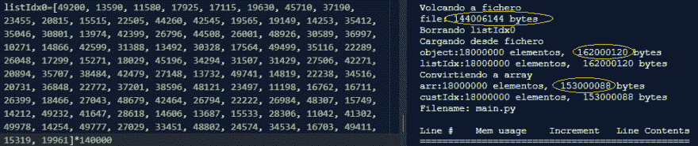
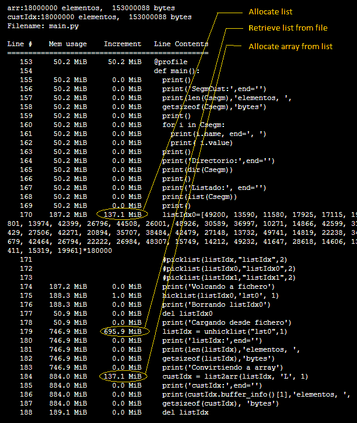

# IronHack BCN 挑战赛 1，代码部分

> 原文：<https://dev.to/sfrias/ironhack-bcn-challenge1-code-part-j4p>

处理客户 ID 的小代码，在 75 秒内至少处理 3000 万个 Id。

[https://repl.it/@sfrias/Challenge1?lite=true](https://repl.it/@sfrias/Challenge1?lite=true)

为了好玩，一个他们坚持用 python 解决的问题。列表，至少要定期处理 2800 万个 id。我从一个包含 1400 万个虚拟测试 id 的列表开始(因此，在 1GB 内存和 1 个 vCPU(剩余存储，而不是 SSD)的云中的实例中，它应该变得宽松)。由于定期更新的 id 列表必须可以被其他应用程序访问，并且我不想屈服于 jSON 的空间和进程，所以我使用 1400 万个 id 的模拟列表进行了一些测试，这些 id 具有允许转储/恢复数据对象的设施(pickle、marshal、树 B 中的 HDF5)。

数据结构所需的空间是清楚的。它们是用 getsizeof()提取的，并且符合 python 中的预期，包括开销。14M id 的列表占用 107MiB，每个元素 8 个字节，就像 18M id 的压力测试一样，其中转储文件占用 138MiB (144006144 个字节)。不再清楚的是，为什么在数据对象的恢复中，内存是原来的 5 倍，选择你所选择的工具。记忆的进化描述如下。

最后，我用 python 在磁盘上制作了自己的兼容的数组读取器/写入器，作为二进制文件。无论如何，它似乎在 75 秒内处理了 3000 万个 id，这已经是留给单线程挑战的了

当您使用具有自管理内存的工具时，可能会发生这些事情，其中存在大量不同的包，并且开销对象明显牺牲了效率。在时间和内存空间的成本已知且稳定的情况下，在改变工具或自己在某个函数中执行低级操作之间存在两难选择。在这种情况下，我们牺牲读/写对象数据文件的兼容性，以换取时间和存储空间的效率，而不使用压缩。

仅此而已。