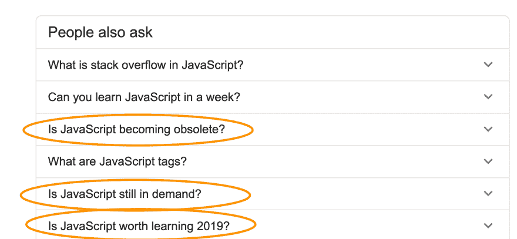

# JavaScript 还值得学习吗？

> 原文：<https://dev.to/flaviocopes/is-javascript-still-worth-learning-51ci>

当我在谷歌上搜索一些与 JavaScript 相关的问题时，我注意到谷歌在“人们也会问”框中向我建议了一些我认为非常有趣的问题:

这些引起了我的注意。

点击的答案让我得到了一个令人放心的答案，正如我所料，毫无疑问。但是我也有自己对这个话题的想法，所以我想“让我来写吧”！

直说吧: **JavaScript 比以往任何时候都更有活力**。

JavaScript 从未像今天这样流行。它从未像今天这样强大。

当我在 90 年代末开始学习 JS 的时候，绝大多数的开发者都用它在圣诞节的时候在网站上制造雪雨，显示警告和对话框，以及做各种奇怪的效果。这很有趣，但只有专业人士会用它来创建比投票或其他事情更复杂的东西。

2012-2013 年我认真进 JS 的时候，JS 认真多了。Gmail、谷歌地图和其他胖客户端应用向我们展示了 JavaScript 的所有可能。Node.js 刚刚开始流行，但是在生产中使用它的人很少。

现在许多人学习 JavaScript 作为他们第一个也是唯一的编程语言。他们可能几年内都不会再学习另一种语言，因为我要说，由于 JavaScript 是唯一一种在网络浏览器中工作的语言，所以它是全世界最流行、最强大的语言。

如果有人告诉你有什么不同，可能是因为他们最喜欢的编程语言不太受欢迎，他们希望有一天人们不再使用 JS，而使用他们投入大量资金的那个:)