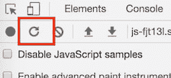
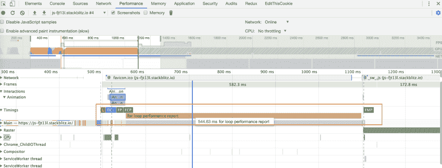

# 你的代码够快吗？让我们在 Chrome 开发工具中找到答案

> 原文：<https://dev.to/ayusharma_/is-my-code-fast-enough-let-s-find-out-in-chrome-dev-tools-of2>

我们都有好奇心去足够快地发现那是我的代码，它在应用程序生命周期中什么时候被加载，执行时间是多少，或者当你只是添加一个功能块时，应用程序中会发生什么。

Chrome 开发工具非常强大，足以找到所有这些问题的答案。您可以使用 [performance](https://developer.mozilla.org/en-US/docs/Web/API/Performance) API 来分析应用程序中代码块的角色。

#### 我们来找出`for`循环执行`1000000000`次迭代的执行时间。

```
 performance.mark("start"); // start marker 

  for(let i = 0; i < 1000000000; i += 1){}

  performance.mark("end"); // end marker 
  performance.measure("for loop performance report", "start", "end");

  const measurements = performance.getEntriesByType("measure");
  console.log(measurements); 
```

当您在浏览器中运行上述代码时，您可以在 chrome dev tools 中找到性能。

*   加载您的应用程序。
*   打开 Chrome 开发者工具。
*   选择`Performance`选项卡。
*   点击`reload`图标，记录新的分析。
    [](https://res.cloudinary.com/practicaldev/image/fetch/s--wRrSloWB--/c_limit%2Cf_auto%2Cfl_progressive%2Cq_auto%2Cw_880/https://thepracticaldev.s3.amazonaws.com/i/9dmniwpoz0jeund3734x.png)

*   检查计时部分的执行时间。
    [T3】](https://res.cloudinary.com/practicaldev/image/fetch/s--W4AIIGOo--/c_limit%2Cf_auto%2Cfl_progressive%2Cq_auto%2Cw_880/https://thepracticaldev.s3.amazonaws.com/i/ylb9h4r3iskvk4z4xipq.png)

你可以清楚地注意到`for`循环是在`FMP(First meaningful paint)`事件之前和`onload`事件之后对`544ms`执行的。

希望你觉得这篇文章有用。快乐学习。☺️