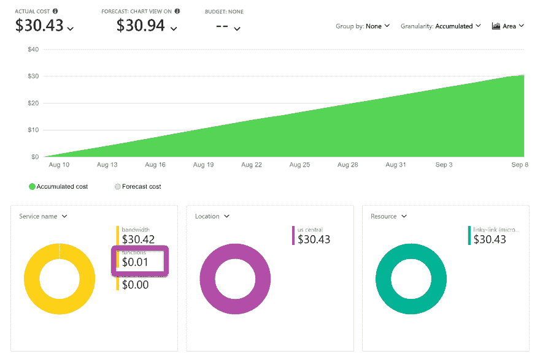

# 无服务器真的像大家宣称的那么便宜吗？

> 原文：<https://dev.to/azure/is-serverless-really-as-cheap-as-everyone-claims-4i9n>

*本文是[#无服务器九月](https://dev.to/azure/serverless-september-content-collection-2fhb)的一部分。在这个无服务器的内容集合中，您可以找到其他有用的文章、详细的教程和视频。9 月份，每天都有来自社区成员和云倡导者的新文章发布，没错，每天都有。在 https://docs.microsoft.com/azure/azure-functions/了解更多关于微软 Azure 如何实现你的无服务器功能。*

> 摘要:除非你正在大规模运营，否则无服务器不仅仅是便宜，而是便宜。你应该[今天](https://docs.microsoft.com/azure/azure-functions/?WT.mc_id=servsept_devto-blog-buhollan)就开始。

人们经常给出的使用无服务器的最有说服力的理由之一是成本。

在无服务器应用中，你只需在应用运行时付费。听起来棒极了！如果你可以在一个应用程序忙的时候付费，为什么还要为它付费呢？

我是说，你不能让水在你家一直流着。需要的时候打开，不需要的时候关闭。除非你们是我的孩子。然后你洗手，让水开着，因为你有 3 秒钟的注意力时间，我们去玩 MINECRAFT 吧！

[](https://res.cloudinary.com/practicaldev/image/fetch/s--fEbN_WdK--/c_limit%2Cf_auto%2Cfl_progressive%2Cq_auto%2Cw_880/https://thepracticaldev.s3.amazonaws.com/i/akftugr3s1rdo2cspc9d.png)

无服务器听起来很便宜。就像在有人意识到发生了什么并改变规则之前达成这笔交易。但是无服务器真的有多便宜？

我的意思是，来吧；有什么条件。

## 分解 Azure 功能的成本

当你看到无服务器的成本时，它绝对显得非常便宜。就像，任何人如何从这种廉价中赚钱。例如，Azure Functions 消费计划(每月)向你收取三项费用:

*   实行
*   执行时间
*   储存；储备

执行很容易理解:你的函数执行了多少次？每执行 100 万次死刑，你要支付 20 美分。哇哦。那看起来好像是免费的。最重要的是，你每个月都可以免费执行第一个一百万次死刑。

客观地说，你函数每天可以运行 32，258 次，而你却不用花一分钱。也就是每分钟 22 次。如果你每天每秒执行一次函数，那就是 2.628e+6 次，或者 2，628，000 次。这还不到 40 美分。

但是死刑并不是你被指控的唯一罪名。你还需要支付执行时间的费用。

执行时间在你的头脑中很难量化。它基本上是对函数执行时使用的资源量和使用时间的收费。这被称为千兆字节秒。

它是这样工作的:每当你的函数执行时，Azure 计算它使用了多少内存，四舍五入到最接近的 128MB。所以如果你的函数只使用了 25MB 的内存，就算作 128。它还计算它运行了多长时间，精确到 100 毫秒。

因此，如果你有一个非常简单的“Hello World”无服务器功能，每次运行它都要占用 128MB 内存，或者说. 125 千兆字节。要获得执行成本，您需要执行的总次数，并乘以函数执行的时间。对于“Hello World”，这将是 100ms，因为这是最小的时间量。

现在假设您每天每秒都在运行这个函数。我们已经说过是 2628000 次了。你用这个数字乘以函数运行的毫秒数(100 毫秒)。

```
2,628,000 * .100 
```

我们得到了 **262，280** 。我们现在必须用这个数字乘以函数每次运行时使用的内存量，我们已经说过是. 125。

```
262,800 * .125 
```

这等于**32850**。好的，那么总的执行时间是 32，850 GB-s。我们要花多少钱？

没什么。因为你可以免费获得第一个 40 万 GB-s。

好吧。好的。所以所有这些执行花费了我们 40 美分，而执行时间没有花费我们任何东西。这似乎是一个完全的双赢。这种商业模式是谁创造的？

存储是你的代码使用了多少存储。在幕后，Azure 使用一个 [Azure 存储](https://azure.microsoft.com/pricing/details/storage/?WT.mc_id=servsept_devto-blog-buhollan)帐户来存放你的代码、任何触发逻辑和你可能正在写入的任何队列。

如果你只是存储你的代码，那基本上什么都不是。Azure 存储成本甚至不会开始生效，直到你达到第一个千兆字节。如果你要在队列中存储很多很多的数据，它可能会开始上升，但即使这样，你也需要使用其中的**很多**。请记住，存储不是免费的，但它*几乎*是免费的。

在这种规模下，无服务器几乎是付费给我们使用它。但是当我们扩大规模时会发生什么呢？比如很高？

## 脸书标度

让我们假设我们正在处理脸书大小的交通流量。这是一个很难确定的数字，但是[脸书报告](https://zephoria.com/top-15-valuable-facebook-statistics/)每秒有 51 万条评论被发布，29.3 万条状态更新和 13.6 万张照片被上传。这还不算全部流量，但如果我们只考虑这三个因素，那就是每秒执行 93.9 万次。

一个月处决多少人？

```
939,000 * 60 (seconds in a minute) * 60 (minutes in an hour) * 24 (hours in a day) * 30 (days in a month) 
```

这给了我们 2.43389e12。我甚至不知道现在如何向*说出*那个数字。每百万执行 20 美分(第一个百万免费)...

```
(2.43389e12 - 1,000,000 free executions ) / 1,000,000 ) * .20 cents per execution 
```

准备好了吗？**$ 486777.40**。别忘了四十美分。

那只是执行成本。现在让我们加上执行时间。

为此，我们需要知道这些操作需要多长时间。发表评论可能不到一秒钟，但上传照片可能需要几秒钟。对于所有 939K 的执行，让我们用 1 秒作为一个好的、四舍五入的、任意的数字。算出每月有多少死刑..

```
2.43389e12 * 1 
```

你可以在脑子里想想。我几乎可以。

现在这些操作消耗了多少内存？这取决于有多少代码被加载到服务器的内存中。这很难知道，但我们就让它保持在 128MB 吧。这似乎是一个很大的数字。我觉得你可以在这个尺寸上加载一个强大的函数。

所以我们最后的等式是...

```
2.43389e12 * .125 
```

这为我们提供了 3.04236e11 GB-s。我们免费获得了第一个 400K GB-s。之后是 0.000016/GB-s.

```
(3.04236e11 - 400,000 free GB-s) * 0.000016 per GB-s 
```

这给了我们**4，867，769.60 美元**的执行时间成本。所以总账单是...

```
486,777.40 execution cost + 4,867,769.60 execution time 
```

总计高达**$ 5354547**。每个月。每个月。我们甚至没有接近脸书实际在做什么。

所以每月 500 多万？就这些吗？

不，还没完。

## 关于带宽的一切

带宽费用适用于你在云中所做的一切。这包括无服务器功能。如果你有自己的数据中心，你是在为带宽付费。如果你在云中运行它，你是在为带宽付费。不管怎样，带宽。

那么带宽是多少呢？Azure 按滑动比例收取带宽费用。你用得越多，就越便宜。你得到第一个 5 GB 的免费空间。那么 5GB - 10TB 每 GB 带宽 8.7 美分。接下来的 40 TB 会下降到 8.3 美分，直到超过 150 TB，每 GB 下降到 5 美分。

你认为脸书用了多少带宽？呃。我想我连这个计算都不会。我甚至不知道从哪里开始。但我敢打赌，这将远远超过每月 530 万美元的执行成本。

这就是为什么脸书有自己的数据中心。在某些时候，你变得如此之大，以至于你成为自己的云是有意义的。

但是你很可能*不是*你自己的云，所以回到现实吧。我们仍然没有回答无服务器对于一个“典型”应用来说到底有多贵的问题。就这么办吧。

## 典型的无服务器成本

我和我的朋友不久前编写了一个应用程序，有一些人在使用，但总体来说并不是一个使用量很大的应用程序。它每个月都会收到大约 2 万个请求。

甚至不用看我们就知道我们执行的成本是免费的。我们离百万大关还远着呢。

这是我们过去 30 天的成本图表。

[](https://res.cloudinary.com/practicaldev/image/fetch/s--dxl4WmlR--/c_limit%2Cf_auto%2Cfl_progressive%2Cq_auto%2Cw_880/https://thepracticaldev.s3.amazonaws.com/i/jyrgkxo8dbsmvmsb5ipj.png)

事实上，我们没有为托管和执行这个应用程序支付任何费用。没什么。它是完全免费的。

我们正在承受的带宽费用。这是因为我们的无服务器应用程序是一个 API，所以它从 Azure 的发送数据*。如果这是一个微服务，只是在 Azure 的同一个区域内移动数据，我们的带宽成本也将为零。这就是无服务器是**真正的**一个惊人的交易。*

## 真正的交易

那么无服务器的成本是否被过分炒作了呢？

不。是真的。直到你达到一个相当大的规模，你将支付很少，如果有的话。无服务器是在相当长的一段时间内最引人注目的技术之一。再加上自动无限扩展和您甚至不必再处理运行时的事实，这是一个显而易见的事情。

*   [创建无服务器应用程序演练](https://docs.microsoft.com/en-us/learn/paths/create-serverless-applications/?WT.mc_id=servsept_devto-blog-buhollan)
*   [用 Azure 函数创建无服务器逻辑教程](https://docs.microsoft.com/learn/modules/create-serverless-logic-with-azure-functions/?WT.mc_id=servsept_devto-blog-buhollan)
*   [用 VS 代码](https://code.visualstudio.com/tutorials/functions-extension/getting-started?WT.mc_id=servsept_devto-blog-buhollan)构建和部署 Azure 功能