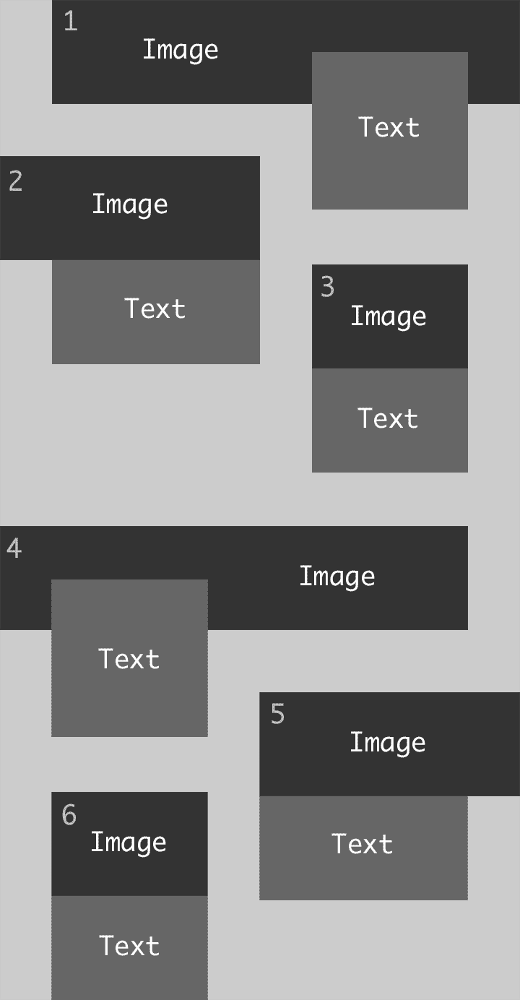
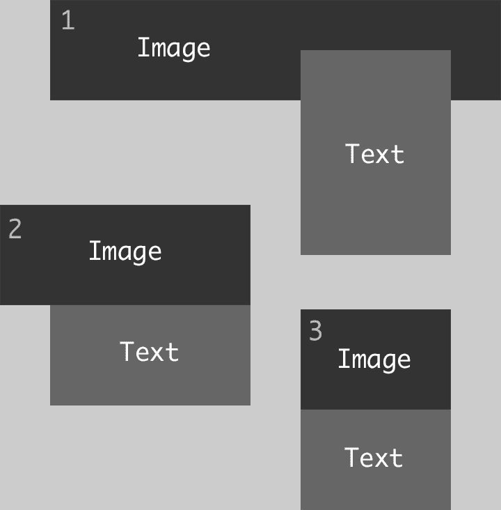
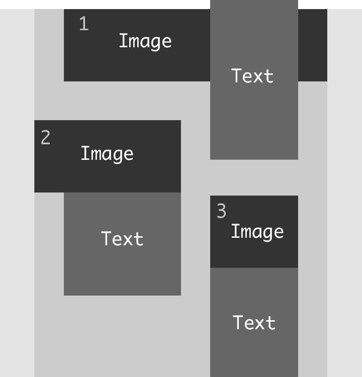

# 它不需要总是最时髦的代码

> 原文：<https://dev.to/mgrsskls/it-does-not-always-need-to-be-the-hippest-code-202o>

前端开发永远不会变得无聊的一个原因是现有技术发展迅速。浏览器厂商每隔几周就会发布新的功能，这就很难保持最新。同时，这也使得开发变得更加容易，因为新的浏览器版本引入了许多功能。

当我在做一个项目时，现在用 Flexbox 实现它的布局或功能是完全正常的——或者在某些情况下(仍然很少)用 CSS Grid。两者都使得实现大多数布局更加容易。

我参与的上一个项目似乎就是这样一个案例。它的一个主要元素是一个预告列表，大概是这样的:

<source type="image/webp">
T6】

这里重要的一点是，预告片之间的垂直间距与水平间距相同。

我的一个同事开始使用 CSS Grid 实现它，将它分成 12 列，重复行，内容跨越多列等等..它工作得很好，使用 CSS Grid 似乎是一个显而易见的选择，但不幸的是，我们意识到 Internet Explorer(是的，我们仍然必须支持它)不支持所使用的一些 CSS Grid 特性。当我的同事去度假时，我接手并尝试调整网格解决方案，这样 IE 就可以支持它，我们也不必扔掉所有的代码。但是我意识到这是行不通的，所以我修改了代码来使用 Flexbox，这实际上并不是一个很大的改变。主要的原则是一样的:我只需要使用一些其他的属性，做一些小的调整，很快就完成了。

后来我意识到，两个广告之间的水平间距还不正确。在我的解决方案中，小标题(2、3、5 和 6)总是与大标题(1 和 4)的底部对齐。然后，我调出了页边距为负的第 2 个和第 5 个摘要，将它们放在正确的位置。它看起来很完美，但只是由于一些坏的虚拟数据和其他巧合，使所有的文本框具有相同的高度。当然，他们的高度需要灵活。所以，有了更真实的数据，它看起来有点像这样:

<source type="image/webp">
T6】

正如您在这里看到的，因为预告 1 中的文本框向下推了所有内容，所以预告 1 和预告 2 之间的空间变得太大了。

我的下一个想法是从流程中取出第 1 个和第 4 个文本框，使用`position: absolute`将其对齐到大图的底部，然后将其下拉一个固定值。这样，所有的小预告将与大图像的底部对齐，我可以将预告 3 和 6 下拉与我下拉预告 1 和 4 的文本框相同的值。

设计者对这个解决方案很满意，但是在预告 1 和 4 中文本框的可变高度又是一个问题，因为它们理论上会变得越来越高。尤其是在较小的视口中，文本框会很快变得过高，因为它会变窄并扩展到顶部:

<source type="image/webp">
T6】

我想了很久，确信没有办法用 flexbox 实现这种布局。

既然肯定有办法，我就试图寻找另一种方法将文本框从元素流中移除——直到`float`出现在我的脑海中。

多年来，我几乎每一个设计都使用它，现在我几乎完全忘记了它。尝试了一下，只花了几分钟就有了完整的解决方案。大致步骤如下:

*   将摘要 1 的文本框向右浮动。这样，文本框对其包含的摘要的高度没有任何影响，并且后面的摘要会自动与图像的底部对齐(技术上正确:与摘要的底部对齐)。
*   现在将`float: left`设置在预告 2 上，将`float: right`设置在预告 3 上。这样，预告 3 将紧挨着预告 2 放置。但最重要的是，它与摘要 1 中的文本框底部对齐。这是因为浮动元素仍然保留空间(不像有`position: absolute`的元素)，它只是不影响它的容器高度。
*   现在，我可以对第 4、5 和 6 题做同样的事情，但是要反过来。

就这样。一个看起来很现代的布局，带有很老的学校代码，在所有浏览器中完全支持，没有任何聚合填充或供应商前缀。

您可以在这里找到一个基本实现:

参见 [CodePen](https://codepen.io) 上 Michael Groklaus([@ mgrsskls](https://codepen.io/mgrsskls))的笔[浮动布局](https://codepen.io/mgrsskls/pen/9b1fcbee8879f6f6b6717e8255c286b0/)。

实现这一点让我意识到前端世界发生了太多的事情，以至于我们几乎忘记了一些最基本的功能。了解新的发展是很重要的，因为它们可以使开发者的生活变得更容易。但是，尽管新技术通常仍然需要围绕它们的工具，了解基础知识对于编写可访问的、简单的和广泛支持的代码是至关重要的。