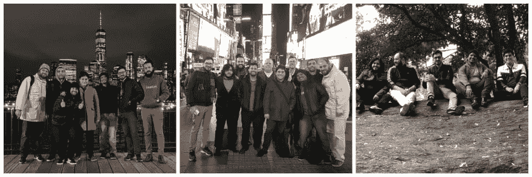
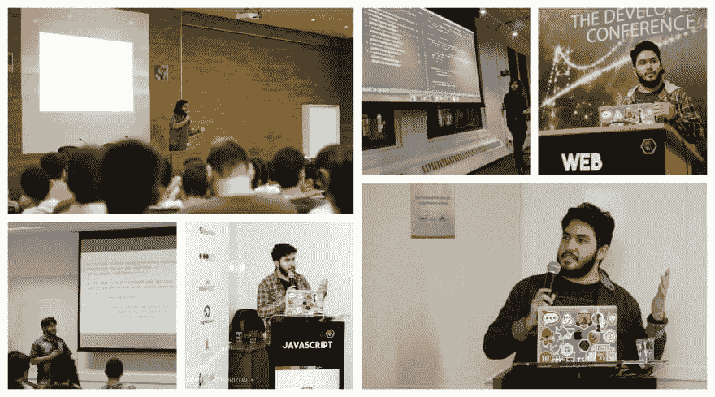

# 这都是关于信任开始的魔力

> 原文：<https://dev.to/ythecombinator/it-s-all-about-trusting-the-magic-of-beginnings-3flf>

> 原发表[此处](https://www.ythecombinator.space/posts/it-s-all-about-trusting-the-magic-of-beginnings)。

在经历了近两年令人兴奋的挑战后，是时候继续前进了。

### 概括地说我的旅程

当我开始在 [Beakyn](https://beakyn.com) 工作时，最有趣的事情之一是意识到我写的每一段代码都可以在美国成千上万台计算机上运行。在我职业生涯的那个时刻之前，我只在小型本地创业公司工作过，那里他们的产品的影响力要小得多。

在 Beakyn，我有机会参与几个项目，这些项目影响了我们的客户 [Outfront Media](https://www.outfrontmedia.com) (美国最大的户外媒体公司之一)的整个资产库存管理和受众人口统计分析生命周期，同时帮助塑造了一种共享和开放的文化。我为我们取得的成就感到骄傲！

<figure>

<figcaption>Dope team; always doing some crazy dope shit 👊 in the city that never sleeps 🗽</figcaption>

</figure>

我也有机会在会议和聚会上展示我在做项目时学到的一些很酷的东西。这让我提高了我的演讲技巧(我知道这里总是有很大的改进空间)，并在我们的社区中创建了一个巨大的联系网络。

<figure>

<figcaption>I had never traveled that much to attend conferences 🛫</figcaption>

</figure>

个人方面，感觉自己成长了这么多！我的远程工作程序不仅允许我在我的国家旅行更多的时间——不在任何城市停留太久——而且允许我访问新的城市，这使我结识了许多伟大的人，了解了令人惊叹的文化，体验了伟大的事情——并用照片捕捉所有这些时刻(顺便说一下，这让我知道摄影是成为我一直在寻找的爱好的有力候选人📸).

<figure>

<figcaption>Watching the 🌅 by the window in a plane became one of my greatest moments of peace 🙏</figcaption>

</figure>

### 改变的需要

然而，今年早些时候，我发现自己在 LinkedIn 上漫不经心地寻找新工作，这让我觉得是时候继续前进了。你知道他们说什么吗...当你感觉被其他机会吸引时，这是你需要改变的一个大信号。然后，我申请了一些公司，在面试中遇到了很多优秀的人，但其中一家公司真的让我大吃一惊...

### 即将到来

在接下来的几天里，我将加入 STRV 公司的前端部门，这是一家移动&网络应用开发公司，为世界各地的初创企业提供在 Y Combinator、500 Startups 等知名孵化器中开发的应用。

我必须说我对此非常兴奋，但是在我最终转会到捷克之前还有很多事情要做。同时，我会远程工作。

我对即将发生的事情非常感兴趣。我真的希望对这些项目产生影响，结交许多新朋友，并为这家公司及其所有客户和合作伙伴带来最好的我。

我还希望继续将伟大的东西推向生产，参加会议，开源东西，并帮助发展 React.js(和前端)社区。

对于那些坚持到这篇文章结尾，并以某种方式成为这段旅程的一部分的人，非常感谢你们所做的一切。在这段时间里，我学到了前所未有的东西。我真的很感谢你们给我提供的各种学习和经验。

祝我好运！🤞🎆