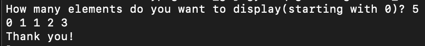
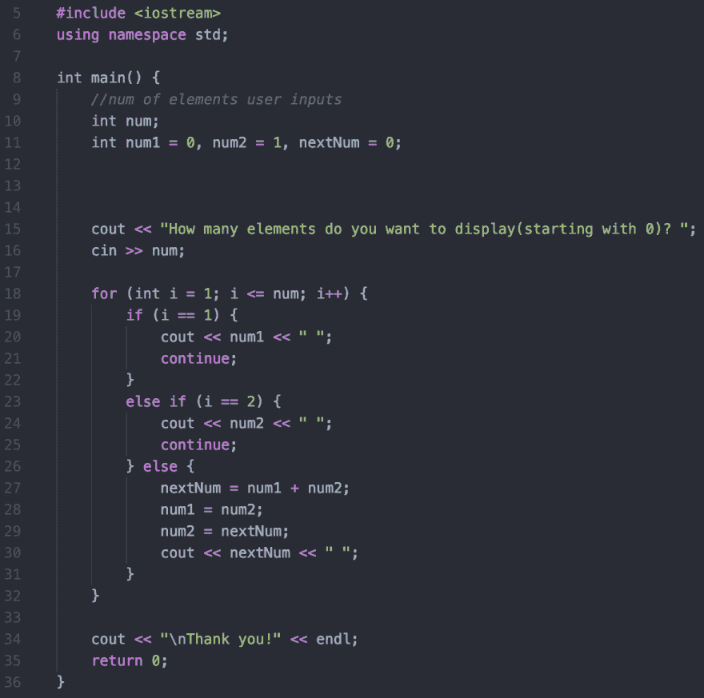

# C++中的迭代斐波那契

> 原文：<https://dev.to/maytd/iterative-fibonacci-in-c-1828>

斐波纳契数列是由最后两个数字组成的一系列数字。大概是这样的:
`0, 1, 1, 2, 3, 5, 8, 13, 21, 34, 55, 89... and so on to infinity`你可以看到，从第一个 1 开始，1 + 1 会变成 2 然后 2 + 1 会变成 3。这是我们将用来创建显示序列的程序的模式。但是在我们这样做之前，让我们向用户询问一个数字，这样我们就不会以一个无限循环结束！这个数字将决定我们迭代序列的次数。两者的预期结果应该是这样的:

我们将设置前两个数字，0 和 1，这样我们就有一些起始数字可以加在一起。此外，创建一个保存 fib 序列号的变量。
`int num1 = 0, num2 = 1, nextNum = 0;`
在我们询问用户他们想要序列中有多少个数字之后，我们将使用一个从 1 开始的 for 循环，检查他们输入的数字是 1 还是 2，因为序列中的前两个数字是 0 和 1，而 1 没有前两个数字。
`for (int i = 1; i <= num; i++) {
if (i == 1) {
cout << num1 << " ";
continue;
}
if (i == 2) {
cout << num2 << " ";
continue;
}
}`
如果数字是别的什么，我们就接着使用前面提到的模式。
`nextNum = num1 + num2;
num1 = num2;
num2 = nextNum;
cout << nextNum << " ";`
nextNum 将保存前两个数之和。num1 现在将等于序列中的下一个数字，num2 将等于当前总和。假设用户想要查看 4 个 fib 序列号。程序将循环 4 次，并显示当前为 0 的 num1 和当前为 1 的 num2。当 I 大于 2 时，nextNum 将是 0 + 1 的和。现在 num1 会是 1，num2 会是 1。对于第四个循环，将为下一个数字添加的先前数字将是 1 + 1 的和。虽然我们在这种情况下不使用它，但 num1 将被设置为 1，num2 将被设置为 2，以便为下一次迭代做好准备。
迭代斐波那契到此结束！用于该程序的代码如下。
